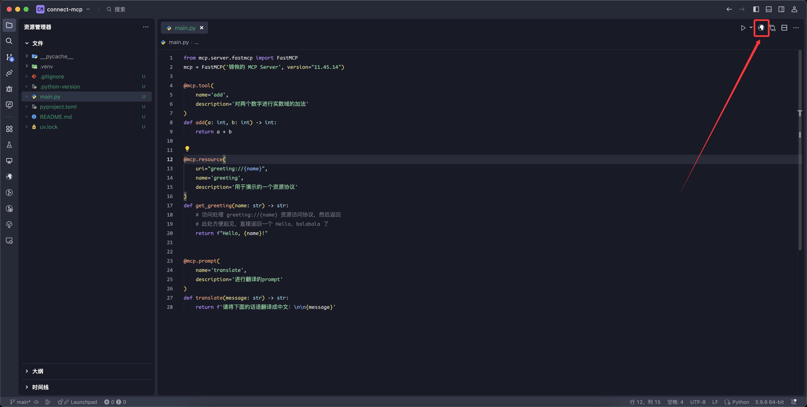
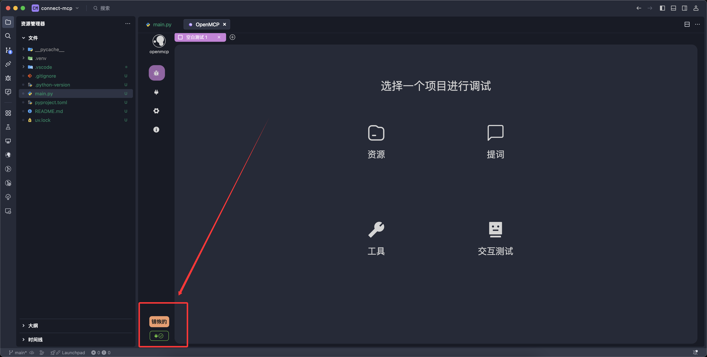
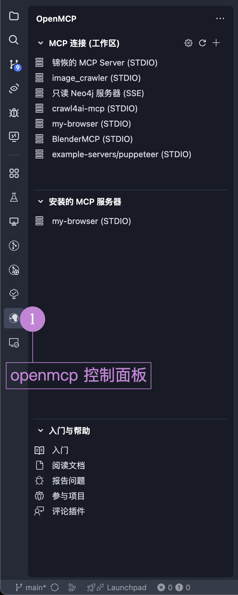

# 连接 mcp 服务器

不同于 Claude Desktop 和其他的 MCP 客户端类产品，OpenMCP 进行 MCP 服务器连接的步骤是相当丝滑的。

:::info MCP客户端
MCP 客户端是指能够通过 MCP 协议进行通信的大模型对话客户端，通常是一个运行在本地的应用程序（因为网页没有文件IO的权限）。它的产品形式目前几乎都是聊天机器人的形式，类似于你在网页使用的 chat.deepseek.com 或者 chat.openai.com
:::

首先，打开你的 VLE，在 [[acquire-openmcp|获取 OpenMCP]] 中完成 OpenMCP 的安装后，我们先用 python 创建一个最简单的 mcp 服务器，来测试 mcp 客户端的连接。

## 使用 OpenMCP 一键连接

在 [[first-mcp|你的第一个 MCP]] 这个例子中，我们申明了三个函数，用作 mcp 的 tool，resource 和 prompt。在 OpenMCP 中启动它们非常简单，点击右上角的 OpenMCP 图标即可连接：

如果登录完成后，如图显示连接成功，则代表当前已经成功启动并连接 mcp 服务器。

## STDIO 连接的启动

对于 STDIO 为连接选项的开发方案，我们提供了一键式的快速启动，您不需要额外启动 mcp 的进程。OpenMCP 会自动连接和销毁。

目前支持的编程语言和它们对应的启动参数为：

|语言|连接参数|启动目录|
|:-|:-|:-|
|python|uv run mcp run $\{file\} | 往上追溯，第一个找到的 pyproject.toml 的目录|
|nodejs|node $\{file\}| 往上追溯，第一个找到的 package.json 的目录|
|go|go run $\{file\}| 往上追溯，第一个找到的 go.mod 的目录|

## SSE & Streamable HTTP 连接的启动

对于 SSE 和 Streamable HTTP 这两种远程连接的方式，由于我们并不知道您到底在哪个端口启动的服务器（因为你有可能把启动的 host 和 port 写在不可见的配置文件里或者写在环境变量里），因此，对于远程连接的情况，我们不支持自动创建服务器，您需要手动配置启动选项。

点击 VLE 左侧插件栏目的 OpenMCP，在 「MCP 连接（工作区）」 视图中，点击 + ，就可以创建一个新的连接。

选择你需要的通信方式。

输入MCP Server的地址。

:::info
需要注意的是，不同的通信方式一般使用不同endpoint，目前的MCP server大多遵循下面的原则：

如果是以 SSE 启动，那么默认使用 /sse 作为endpoint，比如 http://localhost:8001/sse

如果是以 Streamable Http 启动，那么默认使用 /mcp 作为endpoint，比如 http://localhost:8001/mcp

当然，允许MCP Server使用两个不同的endpoint同时支持两种连接方式，这对于想要迁移到Streamable Http但短时间又不能放弃SSE的情况特别有效
:::

## openmcp 插件的控制面板

在 VLE 的左侧可以找到 openmcp 的图标，点击后就是 openmcp 的控制面板。

当前工作区曾经连接过的 mcp 服务器会出现在这里，这是因为 openmcp 默认将工作区启动的 mcp 的连接信息存储在了 `.openmcp/tabs.{server-name}.json` 中，其中 `{server-name}` 就是 mcp 服务器连接成功的服务器名称。

:::warning
注意，同一个项目中，你不应该有两个名字完全相同的 mcp 服务器，这会导致 `.openmcp/tabs.{server-name}.json` 连接信息存储冲突，发生未知错误。
:::

如果你想要在任意工作区都能使用同一个 mcp 服务器，可以考虑在「安装的 MCP 服务器」中添加成熟耐用的 mcp 服务器，这个位置添加的 mcp 服务器全局可用。

在「入门与帮助」中，我们准备了一些可供入门的参考资料，还请阁下善加利用。
