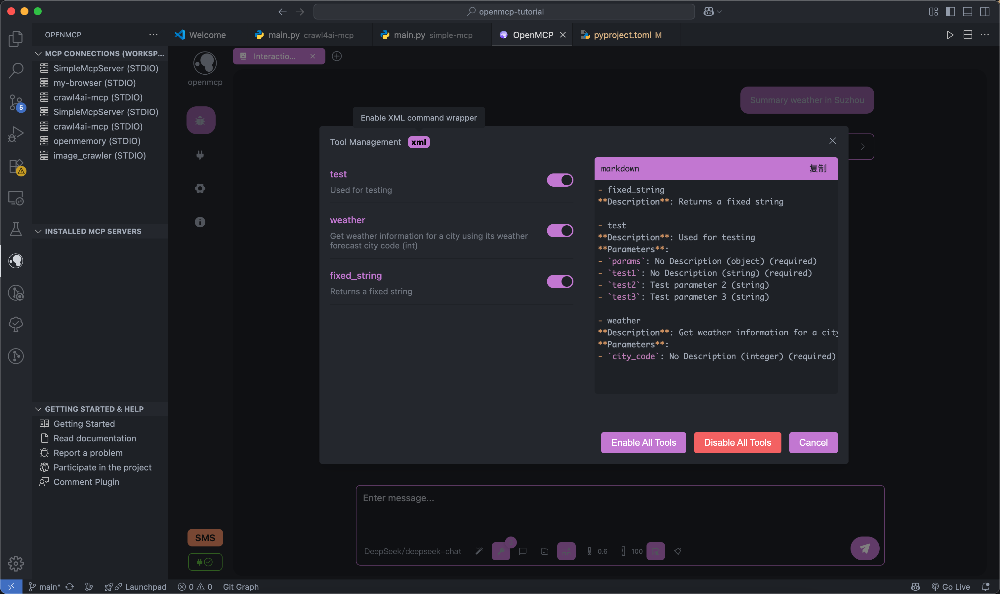

<NewHomeHero />

<!-- Features Section - 功能特性展示 -->
<section class="features-section">

<h2 class="section-title">
Stay productive and manage your MCP
without leaving the editor
</h2>

  <button class="feature-tab active">Debug Panel</button>
  <button class="feature-tab">Chat Interface</button>
  <button class="feature-tab">Resource Manager</button>

  

    <svg class="check-icon" viewBox="0 0 24 24" fill="none" stroke="currentColor" stroke-width="2">
      <polyline points="20 6 9 17 4 12"/>
    </svg>
    Real-time debugging
  

  

    <svg class="check-icon" viewBox="0 0 24 24" fill="none" stroke="currentColor" stroke-width="2">
      <polyline points="20 6 9 17 4 12"/>
    </svg>
    Multi-server support
  

  

    <svg class="check-icon" viewBox="0 0 24 24" fill="none" stroke="currentColor" stroke-width="2">
      <polyline points="20 6 9 17 4 12"/>
    </svg>
    One-click reproduction
  

  

    <svg class="check-icon" viewBox="0 0 24 24" fill="none" stroke="currentColor" stroke-width="2">
      <polyline points="20 6 9 17 4 12"/>
    </svg>
    Performance metrics
  

  

    <svg class="check-icon" viewBox="0 0 24 24" fill="none" stroke="currentColor" stroke-width="2">
      <polyline points="20 6 9 17 4 12"/>
    </svg>
    Git version control
  

  

</section>

<!-- Who is it for Section - 目标用户 -->
<section class="audience-section">

<h2 class="section-title">
Who is OpenMCP for?
The Development of OpenMCP is for ...
</h2>

  

    
👨‍💻

    <h3>Professional Software Engineers</h3>
    
Shift testing left integrates development and testing seamlessly with rich features, no third-party tools needed.

    <ul class="audience-features">
      <li>Manage agents via left panel</li>
      <li>Monitor LLM tool details</li>
      <li>Track performance metrics</li>
      <li>Build apps with MCP servers</li>
    </ul>
  

  

    
🌟

    <h3>Open Source Community</h3>
    
Fully open-source with transparent technical details. Share and collaborate on MCP projects.

    <ul class="audience-features">
      <li>Free to use and contribute</li>
      <li>Git version control for all tests</li>
      <li>Share prompts with community</li>
      <li>Zero-cost project replication</li>
    </ul>
  

  

    
🔬

    <h3>AI Research Scientists</h3>
    
Convert research into MCP servers with minimal code. Auto-track experiments in Git.

    <ul class="audience-features">
      <li>Quick demo building</li>
      <li>Research reproducibility</li>
      <li>Academic collaboration</li>
      <li>Paper result replication</li>
    </ul>
  

</section>

<!-- Templates Section - 模板展示 -->
<section class="templates-section">

<h2 class="section-title">
Start building in seconds
Kickstart your MCP development with built-in templates and examples
</h2>

  <a href="/plugin-tutorial/examples/python-simple-stdio.html" class="template-card">
    

      

        🐍
      

    

    

      <h3>Python MCP Starter</h3>
      
A minimal Python MCP server template with stdio transport, perfect for getting started quickly.

      
        View Template
        <svg class="arrow-icon" viewBox="0 0 24 24" fill="none" stroke="currentColor" stroke-width="2">
          <path d="M7 17L17 7M17 7H7M17 7V17"/>
        </svg>
      
    

  </a>

  <a href="/plugin-tutorial/examples/typescript-crawl4ai-stdio.html" class="template-card">
    

      

        📘
      

    

    

      <h3>TypeScript MCP Starter</h3>
      
Modern TypeScript MCP server template with proper tooling and best practices built-in.

      
        View Template
        <svg class="arrow-icon" viewBox="0 0 24 24" fill="none" stroke="currentColor" stroke-width="2">
          <path d="M7 17L17 7M17 7H7M17 7V17"/>
        </svg>
      
    

  </a>

  <a href="/plugin-tutorial/examples/java-es-http.html" class="template-card">
    

      

        ☕
      

    

    

      <h3>Java MCP Starter</h3>
      
Java MCP server template with Elasticsearch integration via HTTP transport.

      
        View Template
        <svg class="arrow-icon" viewBox="0 0 24 24" fill="none" stroke="currentColor" stroke-width="2">
          <path d="M7 17L17 7M17 7H7M17 7V17"/>
        </svg>
      
    

  </a>

  <a href="/plugin-tutorial/examples/mcp-examples.html" class="btn-secondary">
    <svg class="btn-icon" viewBox="0 0 24 24" fill="none" stroke="currentColor" stroke-width="2">
      <rect x="3" y="3" width="7" height="7"/>
      <rect x="14" y="3" width="7" height="7"/>
      <rect x="14" y="14" width="7" height="7"/>
      <rect x="3" y="14" width="7" height="7"/>
    </svg>
    View all examples
  </a>
  <a href="https://github.com/LSTM-Kirigaya/openmcp-client" target="_blank" class="btn-secondary">
    <svg class="btn-icon" viewBox="0 0 24 24" fill="currentColor">
      <path d="M12 0c-6.626 0-12 5.373-12 12 0 5.302 3.438 9.8 8.207 11.387.599.111.793-.261.793-.577v-2.234c-3.338.726-4.033-1.416-4.033-1.416-.546-1.387-1.333-1.756-1.333-1.756-1.089-.745.083-.729.083-.729 1.205.084 1.839 1.237 1.839 1.237 1.07 1.834 2.807 1.304 3.492.997.107-.775.418-1.305.762-1.604-2.665-.305-5.467-1.334-5.467-5.931 0-1.311.469-2.381 1.236-3.221-.124-.303-.535-1.524.117-3.176 0 0 1.008-.322 3.301 1.23.957-.266 1.983-.399 3.003-.404 1.02.005 2.047.138 3.006.404 2.291-1.552 3.297-1.23 3.297-1.23.653 1.653.242 2.874.118 3.176.77.84 1.235 1.911 1.235 3.221 0 4.609-2.807 5.624-5.479 5.921.43.372.823 1.102.823 2.222v3.293c0 .319.192.694.801.576 4.765-1.589 8.199-6.086 8.199-11.386 0-6.627-5.373-12-12-12z"/>
    </svg>
    Official GitHub
  </a>

</section>

<!-- FAQ Section -->
<section class="faq-section">

<h2 class="section-title">
FAQ
Waiting for Your Questions
</h2>

<el-collapse>
  <el-collapse-item title="What is OpenMCP suitable for?" name="1">
    As its name suggests, OpenMCP is an MCP debugger and SDK for developers, committed to reducing the full - chain development cost of AI agents and the mental burden of developers. Our mission is to create MCP tools that can solve real - life problems and save working time through OpenMCP, or help engineers and research scientists deliver demos more quickly and make this vision visible to the public.
  </el-collapse-item>
  <el-collapse-item title="Is OpenMCP free?" name="2">
    Yes, OpenMCP is completely open - source. You can not only use this product for free but also join us to realize your creative ideas about agents. The task of OpenMCP is to build an ecosystem around MCP. We believe that MCP development will be a highly customized task in the future, so our current focus is not to rush to create an all - purpose agent, but to steadily build the relevant ecosystem and infrastructure.
  </el-collapse-item>
  <el-collapse-item title="What is OpenMCP not suitable for?" name="3">
    If you try to develop an all - purpose, general AI agent through OpenMCP, you should invest all your money in the research and development of quantum computers instead of visiting this website. Remember, in this era, developing a full - domain general AI agent is likely to be equivalent to telecom fraud.
  </el-collapse-item>
  <el-collapse-item title="Who is developing OpenMCP?" name="4">
    
OpenMCP was initially led by LSTM - Kirigaya (Jinhui) for building MCP testing tools related to 3D work. Its main participants include employees from large companies, students majoring in computer - related fields at universities, and some active contributors from the open - source community.

    
Identity is not important. I'd like to share a quote with you: "Don't tell me if you can do it. Tell me if you like it."

    
  </el-collapse-item>
  <el-collapse-item title="How can I join you or participate in discussions?" name="5">
    You can learn how to participate in the maintenance and development of OpenMCP through <a href="https://kirigaya.cn/openmcp/preview/join.html" target="_blank">Participate in OpenMCP</a>. Obtain our contact information through <a href="https://kirigaya.cn/openmcp/preview/channel.html" target="_blank">Resource Channel</a>. Currently, there are three main communities: QQ group: 782833642, <a href="https://discord.com/invite/SKTZRf6NzU" target="_blank">OpenMCP Discord Channel</a>, and <a href="https://www.zhihu.com/ring/host/1911121615279849840" target="_blank">Zhihu Circle [OpenMCP Museum]</a>
  </el-collapse-item>
  <el-collapse-item title="How to contact us for cooperation?" name="6">
    For cooperation, please contact Jinhui's personal email: 1193466151@qq.com
  </el-collapse-item>
</el-collapse>

</section>

