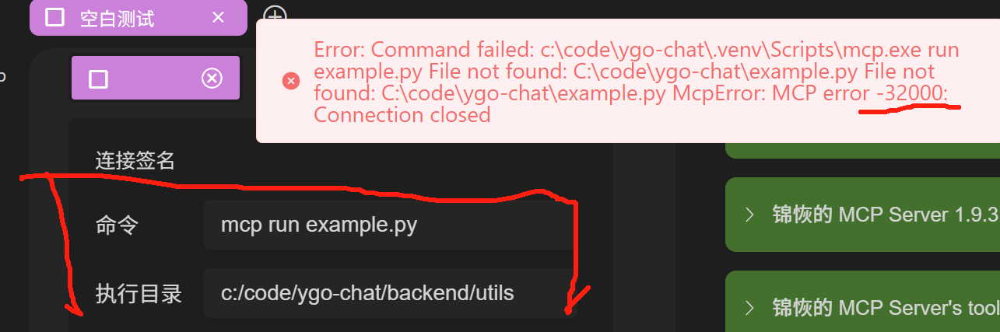

# 仮想環境とエントリーファイルが異なるディレクトリにある場合の設定方法

## 問題の説明

OpenMCPを使用する際、仮想環境（venv）とPythonファイルが同じディレクトリにない場合があり、仮想環境がプロジェクトフォルダの外にあることもあります。このような場合、右上の接続ボタンをクリックするとMCP接続失敗（エラーコード：32000）が発生する可能性があります。

## 解決策

### 1. 実行ディレクトリの調整

接続オプションで、実行ディレクトリを仮想環境がある場所に調整する必要があります：



### 2. 実行コマンドの変更

同時に、実行コマンドを適切に変更する必要があります：


### 3. インタプリタパスの直接指定

特定の場合には、コマンドでPythonインタプリタのフルパスを直接指定できます。例：

```bash
C:\code\ygo-chat\.venv\Scripts\python.exe example.py
```

> 注意：この方法はnodeやmcp指令の【コマンド】、その他のmcp clientのmcp設定ファイルにも適用できます。