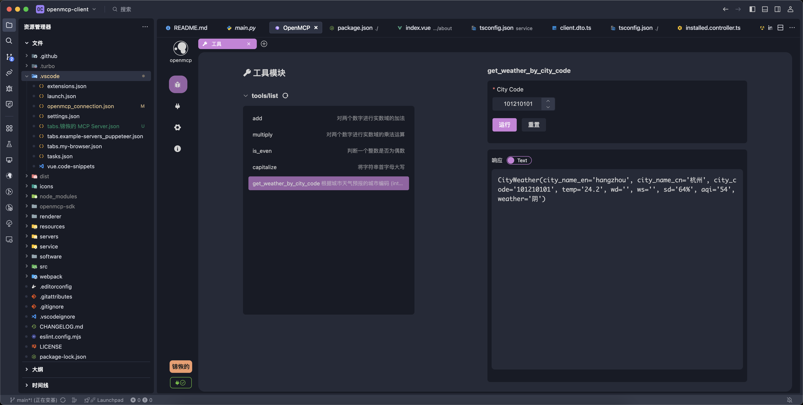
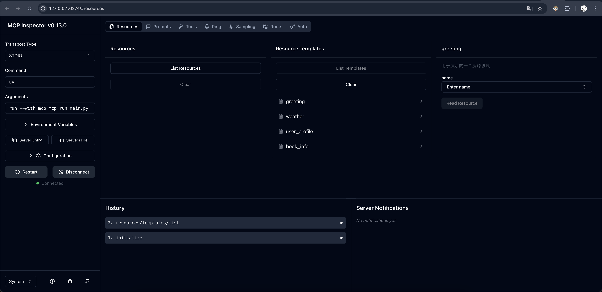

---
next:
  text: MCPとは？
  link: '/plugin-tutorial/what-is-mcp'
---

# OpenMCP 概要

:::warning
OpenMCPの学習を開始する前に、MCPの基本概念を理解することを強くお勧めします：[エージェント時代のインフラストラクチャ | MCPプロトコル紹介](https://kirigaya.cn/blog/article?seq=299)
:::

## OpenMCPとは

OpenMCPは開発者向けのMCPデバッガーおよびSDKであり、AI Agentの全リンク開発コストと開発者の認知的負荷を軽減することを目的としています。

OpenMCPは2つの部分に分かれていますが、このセクションではOpenMCPデバッガーの部分の使用方法について説明します。この部分はOpenMCP Clientとも呼ばれています。OpenMCP Clientの本体は、vscodeのようなエディタ上で動作するプラグインです。現在のMCPプロトコルのすべての機能と互換性があり、開発者にとって便利な豊富な機能を提供しており、Claude Inspectorの上位互換として使用できます。

:::info vscodeのようなエディタ (VLE)
vscodeのようなエディタ（vscode-like editor、略称VLE）とは、Vscodiumカーネルをベースに開発された汎用コードエディタのことで、大部分のvscodeプラグインエコシステムと互換性があり、vscodeと同様の機能（LSP3.7プロトコルのサポート、remote sshによるリモート開発機能、エディター間で設定ファイルを共有する機能など）を備えています。

代表的なVLEには、vscode、trae、cursor、およびvscodiumの各種ディストリビューションがあります。
:::

## Claude Inspectorとは

Claude Inspectorは、Claude公式（つまりMCPプロトコルの提案者）がリリースしたオープンソースのMCPデバッガーです。開発者はMCPサーバーの開発後に、このデバッガーを使用して機能の完全性をテストできます。

ただし、Inspectorツールには以下のような欠点があります：

- 使用が面倒：Inspectorを使用するたびに、mcp devでWebフロントエンドとバックエンドのアプリケーションを起動する必要があります。
- 機能が少ない：Inspectorは最も基本的なMCPのtool属性などのデバッグのみを提供しています。ユーザーが開発したMCPサーバーが大規模モデルとの相互作用でどのように動作するかをテストしたい場合、Claude Desktopに接続してクライアントを再起動する必要があり、連続的なデバッグシナリオでは非常に不便です。
- いくつかのバグが存在：SSEやstreamable httpなどのリモート接続シナリオでは、Inspectorに既知のバグがあり、実際の産業レベルの開発に大きな影響を与えています。
- デバッグ内容を保存または記録できない：大規模なマイクロサービスMCP化プロジェクトでは、これは非常に重要です。
- 複数のMCPサーバーを同時にデバッグできない：MCPの原子化水平展開シナリオでは、これは必要な機能です。

OpenMCP Clientが作成された理由の1つは、Inspectorの上記の課題を解決し、MCPサーバーの開発ハードルを下げ、ユーザーがビジネス自体に集中できるようにすることです。

<!--  -->