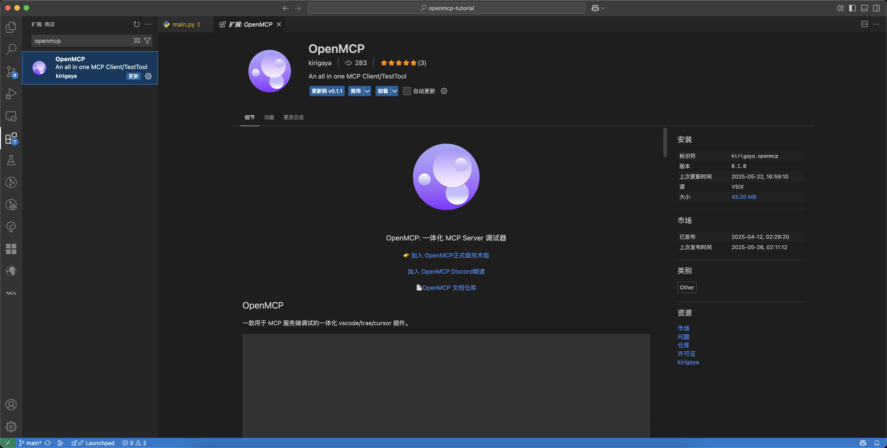
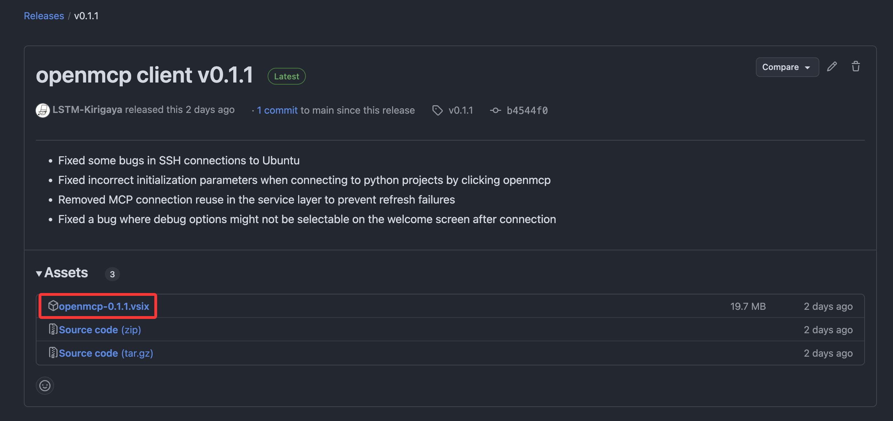
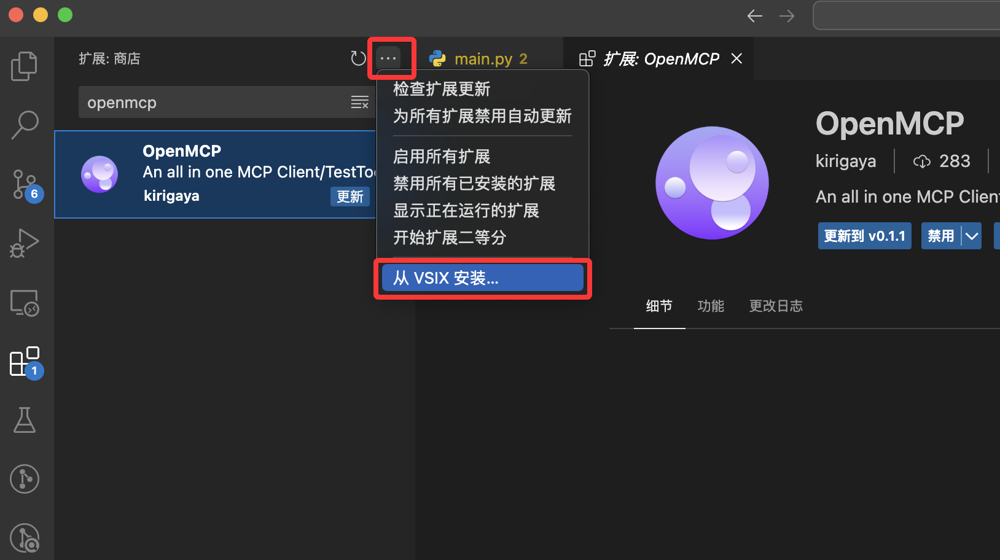

# OpenMCPの入手方法

## プラグインストアからOpenMCPをインストール

主要なVLEのプラグインストアで直接OpenMCPプラグインを入手できます。例えばVSCodeでは、左側のプラグインストアをクリックし、検索ボックスに`OpenMCP`と入力するとOpenMCPプラグインが見つかります。



## オフラインインストール

VLEのプラグインは本質的にzip圧縮ファイルであり、拡張子はvsixで全プラットフォーム共通です。私たちのCI/CDボットは各バージョンリリース後に自動的にビルドし、vsixをGitHub Releaseにアップロードします。以下のリンクから対応バージョンのGitHub Releaseページにアクセスできます:

```
https://github.com/LSTM-Kirigaya/openmcp-client/releases/tag/v{バージョン番号}
```

例えばバージョン0.1.1の場合、リリースページのリンクはこちらです: [https://github.com/LSTM-Kirigaya/openmcp-client/releases/tag/v0.1.1](https://github.com/LSTM-Kirigaya/openmcp-client/releases/tag/v0.1.1)

`Assets`の下に対応するvsix圧縮ファイルがあります



その他にも、以下のストアウェブサイトから最新のopenmcpのvsixを入手できます

- https://open-vsx.org/extension/kirigaya/openmcp
- https://marketplace.visualstudio.com/items?itemName=kirigaya.openmcp

vsix拡張子のファイルをクリックしてダウンロードし、ダウンロードが完了したら直接インストールできます。VLEで外部のvsixファイルをインストールする方法は2つあります。

### 方法1: VLE内でインストール

VLEのプラグインストアページには3点リーダーボタンがあり、クリックすると以下のリスト内の赤くマークされたボタンが表示されます



クリック後、先ほどダウンロードしたvsixファイルを見つけ、クリックするとインストールが完了します。

### 方法2: コマンドラインを使用

VLEがグローバルにインストールされている場合、自動的にコマンドラインツールが利用可能になります。コマンドは以下の通りです:

::: code-group
```bash [vscode]
code --install-extension /path/to/openmcp-0.1.1.vsix
```

```bash [trae]
trae --install-extension /path/to/openmcp-0.1.1.vsix
```

```bash [cursor]
cursor --install-extension /path/to/openmcp-0.1.1.vsix
```
:::

`/path/to/openmcp-0.1.1.vsix`はダウンロードしたvsixファイルの絶対パスを表します。これでもプラグインをインストールできます。