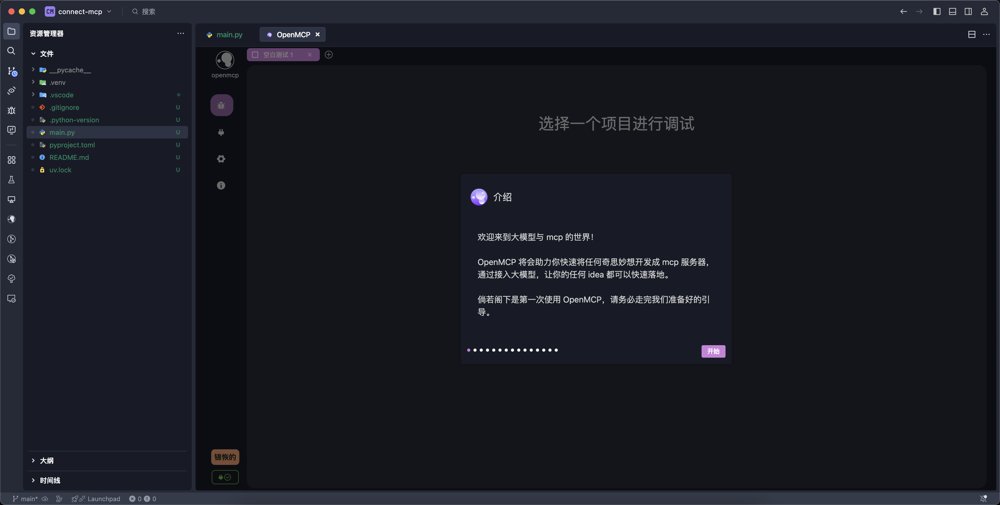
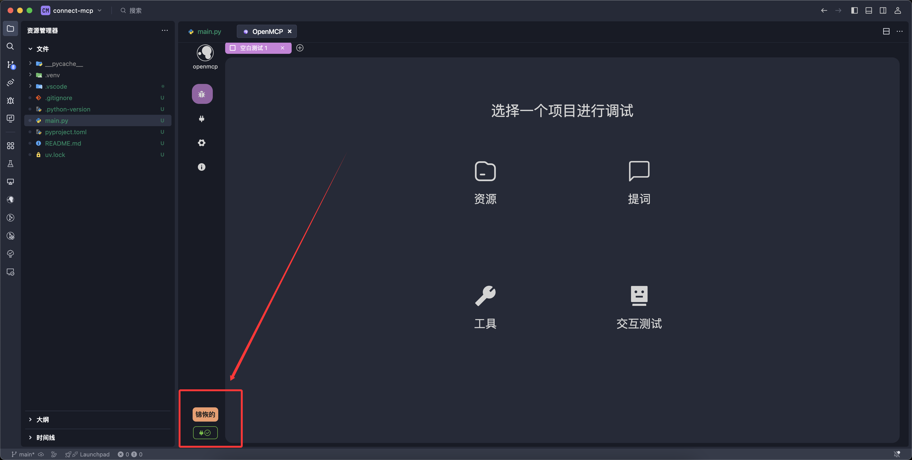

# あなたの最初のMCP

MCPを実装するプログラミング言語は多く、一般的なほぼすべてのプログラミング言語に公式・非公式のサポートがあります。「プログラミング言語 + MCP」で検索すれば対応するライブラリが見つかります。[[mcp-examples|MCPサーバー開発事例]]では、さまざまなプログラミング言語の異なる例も提供しています。

すべてのプログラミング言語の中で、PythonでのMCP開発は間違いなく最も簡単で、初心者にも取り組みやすいものです。そのため、最初のMCPはPythonで実装します。他のプログラミング言語での実装も大同小異です。

## uvのインストール

Pythonでmcpサーバーを書く際には、パッケージマネージャーとしてuvを使用することを強く推奨します。uvについて知っておくべきことは、高性能なパッケージマネージャーであり、pipとcondaのすべての利点を備えていることです。uvがインストールされていない場合は、まずpipでuvをインストールしてください：

```bash
pip install uv
```

:::warning anacondaまたはminicondaを使用している方へ！
非base環境にuvをインストールしないでください。base環境でuvをインストールしてください。uv自体が環境の分離を適切に行いますので、uvがbase環境を汚染する心配はありません。base環境以外にインストールしたり、グローバルなpipでインストールしたりすると、uvがどこにインストールされたのかわからなくなります！base環境でpipを使用してインストールしたスクリプトは`~/anaconda/bin/uv`にインストールされますので、`~/anaconda/bin/`が`$PATH`に含まれていることも確認してください。
:::

uvのバージョンを確認します：

```bash
uv version
```

私の出力は次の通りです：
```
uv 0.6.9 (3d9460278 2025-03-20)
```

実際に操作する際には、このバージョンよりも低くならないようにしてください。

## 最もシンプルなmcpサーバーの作成

プロジェクトディレクトリに移動し、最もシンプルなmcpサーバーを作成する準備をします。

```bash
mkdir -p ~/codes/my-first-mcp
cd ~/codes/my-first-mcp
uv init --no-workspace
```

この時点で、プロジェクト内には以下の3つのファイルがあるはずです：

```
README.md      main.py        pyproject.toml
```

次に、現在のフォルダでvscodeまたはtraeを開き、最もシンプルなmcpサーバーを作成します。その機能は次の通りです：
- 2つの数字を加算するための「add」というツールを提供
- 挨拶メッセージを返す「greeting」というリソースを提供

まず、mcp関連のライブラリをインストールします：

```bash
uv add mcp "mcp[cli]"
```

`main.py`の内容を以下のように変更します：

```python
from mcp.server.fastmcp import FastMCP
mcp = FastMCP('錦恢の MCP Server', version="11.45.14")

@mcp.tool(
    name='add',
    description='2つの数字を実数領域で加算する'
)
def add(a: int, b: int) -> int:
    return a + b

@mcp.resource(
    uri="greeting://{name}",
    name='greeting',
    description='デモンストレーション用のリソースプロトコル'
)
def get_greeting(name: str) -> str:
    return f"Hello, {name}!"

@mcp.prompt(
    name='translate',
    description='翻訳を行うプロンプト'
)
def translate(message: str) -> str:
    return f'以下の文章を中国語に翻訳してください：\n\n{message}'
```

## OpenMCPでワンクリック接続

上記のように、mcpのtool、resource、promptとして使用する3つの関数を宣言しました。OpenMCPでこれらを起動するのは非常に簡単で、右上のOpenMCPアイコンをクリックするだけで接続できます：


OpenMCPを初めて使用する場合、ガイド画面が表示されますので、ぜひ最後までご覧ください。



ログインが完了し、以下のように接続成功と表示されれば、mcpサーバーの起動と接続が成功したことを意味します。



おめでとうございます。最初の一歩が最も難しいですが、あなたはすでに最も難しいmcp接続を完了しました！

OpenMCPを使用したmcpサーバー接続に関する詳細情報は、マニュアルのこの章[[connect-mcp|MCPサーバーへの接続]]を参照してください。

## 付録：uvでmcpを起動する際に知っておくべきこと

OpenMCPはすでに多くのことを行ってくれていますが、uvでmcpサーバーを起動する方法は1つだけではありません。より基本的な原理を理解することで、あらゆる状況に対応できるようになります。OpenMCPはPythonプロジェクトに対してデフォルトで`uv run mcp run main.py`を実行してmcpサーバーを起動しますが、GitHub上の一部のプロジェクトはこの方法では起動できません。

まず、上記の例のPythonコードをコマンドラインからどのように起動するかを理解しましょう！

### 方法1：mcp-cliを使用する

mcp自体がスキャフォールディングを提供しており、宣言されたPythonコードを直接起動してmcpサーバーとして実行できます。以下のコードで実行します：

```bash
uv run mcp run main.py
```

### 方法2：コード内で明示的に起動する

コード内で明示的にmcpサーバーを起動することもできます。`main.py`の末尾に以下を追加します：

```python
if __name__ == '__main__':
    mcp.run()
```

その後、以下のコードを実行すればmcpサーバーが起動します：

```bash
uv run main.py
```

:::warning
`python main.py`を実行しないでください。`uv run`は現在の仮想環境のライブラリを使用しますが、これらのライブラリは外部のPythonからは見えません。また、`mcp.run()`で起動コードを使用せずに`uv run main.py`を直接使用することも避けてください。私たちがこれまでに書いたコードは関数を宣言しただけで、実際には何の機能も実行していません。
:::