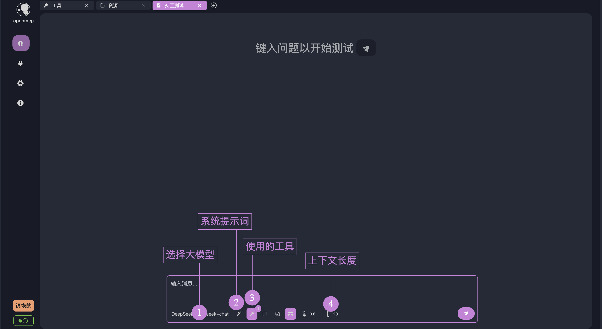
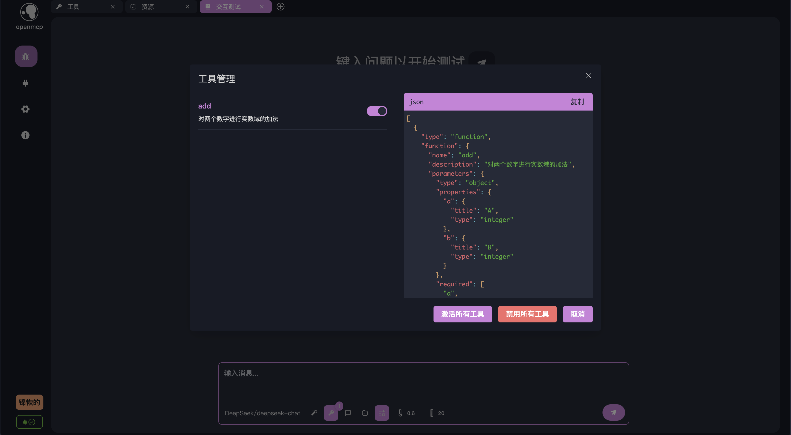
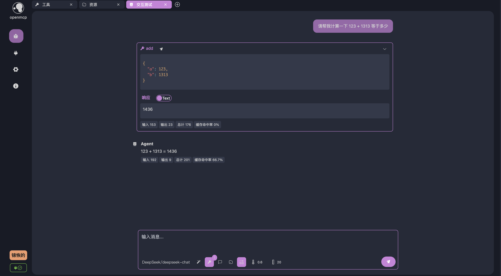
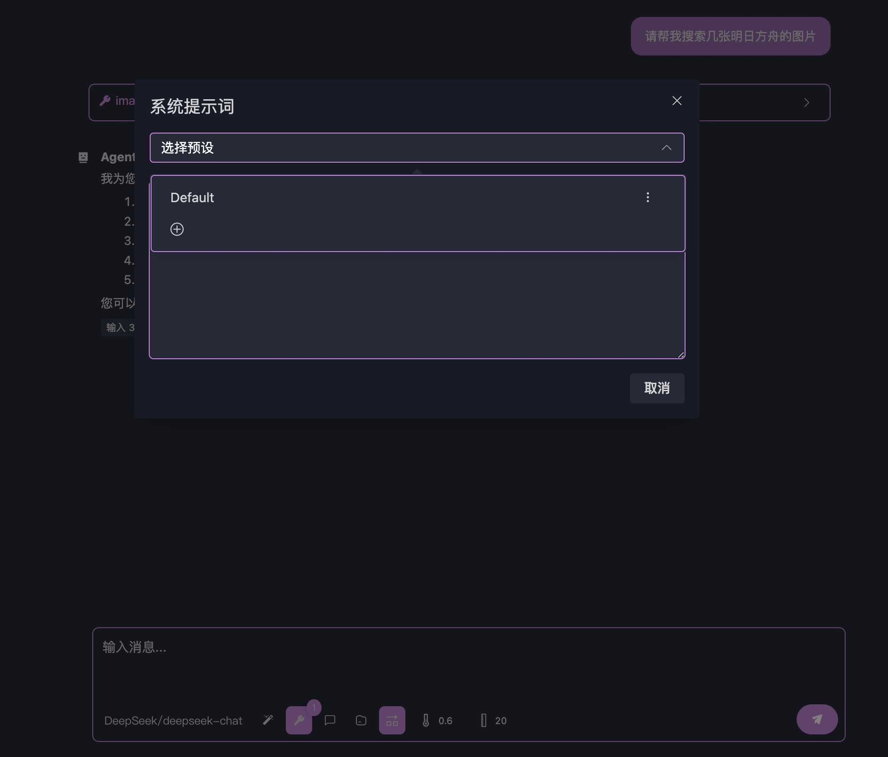

# 大モデルで性能をテストしよう！

[[quick-debug|前章]]では、mcpサーバーへの接続と各機能のデバッグを無事完了し、openmcpの基本的なデバッグ機能を紹介しました。次は、mcpを大規模モデル環境でテストする段階です。そもそもmcpが提案された目的は、誰もが自分で書いた機能を低コストで大規模モデルに統合できるようにするためでした。

本格的な対話を始める前に、[[connect-llm|大モデル接続]]を参照して大モデルAPIの設定を完了し、あなたの大モデルサービスが利用可能かどうかテストしてください。

## 大モデルとの対話

新しいデバッグプロジェクトを作成し、「インタラクティブテスト」を選択すると、大モデルとの対話ウィンドウが開きます。OpenMCPが提供する対話ウィンドウの基本構成は以下の通りです：



重要なボタンがいくつか表示されています。初めて使用する際は、デフォルト設定のまま進めても構いません。「使用するツール」をクリックすると、現在有効なツールが表示されます。OpenMCPはデフォルトで接続されているmcpサーバーが提供する全てのツールを有効にします。特定のツールを無効にしたい場合は、「使用するツール」から選択的に無効化できます：



それでは、mcpプロトコルに基づいて大モデルがどのようにツールを呼び出すか見てみましょう。デフォルト設定のまま、次の質問を入力します：<mark>123 + 1313 の計算結果を教えてください</mark>

入力後、Enterキーを押して結果を待つと、以下のような出力が得られます：



大モデルが提供されたaddツールを使用して加算を実行したことがわかります。OpenMCPでは、大モデルが各ツールをどのように呼び出し、ツールからどのような結果が返されたかを確認できます。現在の質問とmcpが提供するツールは比較的単純ですが、複雑な問題の場合、大モデルは1回の応答で複数のツールを同時に呼び出して特定のタスクを完了することがあります。大モデルに毎回1つのツールのみを使用させたい場合は、デフォルトで点灯している「モデルが単一応答で複数ツールを呼び出すことを許可」をクリックしてこの機能を無効にできます。

## システムプロンプト

[bing-images](/Users/bytedance/projects/openmcp-tutorial/bing-images)のような特殊なケースでは、キーワードに基づいてbingの画像を返すmcpサーバーです。

次の質問を直接投げかけてみましょう：<mark>アークナイツの画像をいくつか検索してください</mark>。デフォルト設定では、以下のような応答が得られる可能性があります：


大モデルは取得した画像をリンク形式で返しましたが、時には画像形式で画面にレンダリングして表示してほしい場合もあります。大モデルの応答スタイルを制約・誘導したり、要求したテンプレートに従って応答させるためには、システムプロンプトを設定することで実現できます。

まず、下部の「システムプロンプト」をクリックします：



新しいシステムプロンプトを追加し、タイトルに「bing image」と入力し、本文に以下を記入します：

```
あなたはbing画像検索が得意なAIです。画像を見つけたら、markdown形式で画像を返す必要があります。例えば 
```

保存をクリックします。


次に、最初のユーザーダイアログにカーソルを移動させると、いくつかのボタンが表示されます。再実行ボタンを選択すると、openmcpはこの対話を再実行します。


すると、画像が正常にレンダリングされていることが確認できます：


system promptやその他のより精密な方法でagentを制御するテクニックについてさらに学びたい場合は、[[go-neo4j-sse|goで実装するneo4jの読み取り専用mcpサーバー (SSE)]]を参照してください。

## まとめ

おめでとうございます！openmcpの基本チュートリアルを完了しました。次は、何か面白いことに取り組む時です！[[mcp-examples|MCPサーバー開発事例]]では、openmcpを使用したmcpサーバー開発のさらなる例を見つけることができます。

様々な驚きがあなたをお待ちしています。どうぞご自由にお取りください。