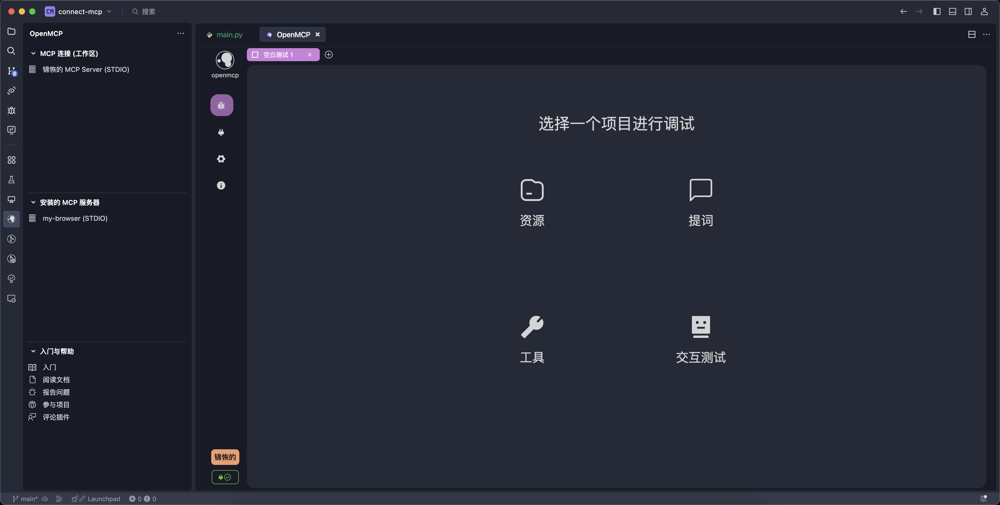
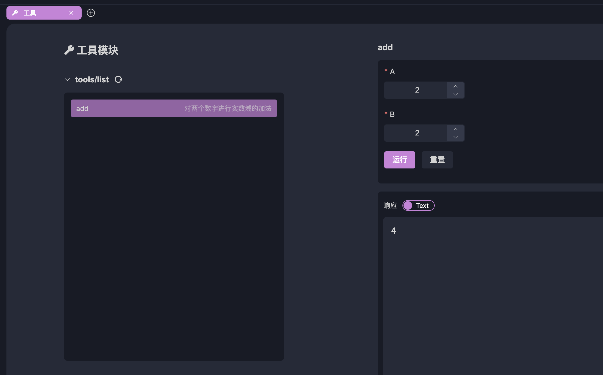

# MCPの迅速なデバッグ

[[first-mcp|最初のMCP]]では、MCPサーバーの最小インスタンスを作成し、openmcpを使ってこのサーバーに接続することに成功しました。

次に、このサーバーの機能をデバッグできます。結局のところ、Jeaf Deanのように誰もが一度で全てのコードを正しく書けるわけではありません。私たちが作成するMCPサーバーも、最初から自信を持って公開できるものばかりではなく、常に私たちが気付かない問題が存在します。想像してみてください、後でmcpを大規模モデルに接続して全リンクのデバッグを行う際に問題が発生した場合、その時には非常に多くのエラー要因が考えられることに気付くでしょう：MCPサーバーの問題？大規模モデルベンダーの問題？OpenMCPの問題？可能性のあるエラーを分類し、一つずつ調査することが、エンジニアリングの直感(Engineering Instuition)に適った方法です。

## パネルの理解

初めてopenmcpに入ると、パネルが表示され、4つのボタンがあり、4種類のデバッグ項目を表しています：

私たちが現在確認する必要があるのは、tool、resource、promptの3つの機能が正常に動作しているかどうかです。実際のプロジェクトでは、toolが最も頻繁に使用される項目であるため、まずtoolをデバッグします。

## Toolのデバッグ

toolをデバッグするために、パネルの「ツール」ボタンをクリックし、toolデバッグインターフェースに入ります。toolパネルの基本説明は以下の通りです：

ツールをデバッグするには、まず「ツールリスト」からツールを選択する必要があります（展開されていない場合はまずツールリストを展開し、右側のボタンをクリックして更新できます）。次に、右側の「パラメータ入力と実行」でテストするパラメータを入力し、実行をクリックすると結果が表示されます：

例えば、ここで最も簡単な2 + 2を計算すると、結果は4であることがわかります。これは、私たちのmcp接続が正常で、正しく結果を返すことができることを示しています。将来的には、簡単なテストを通じてmcpサーバーの可用性を検証できます。これは複雑なagentシステムのデバッグプロセスにおいて非常に重要です。自己診断プログラムの一部としてコード化することも可能です。

## テスト項目の追加

1つの項目のテストが完了したら、上部の+をクリックして追加のテスト項目を追加できます：

ここでは、「リソース」を選択してリソース項目のデバッグ作業を行います。「リソース」は他の2つの項目とは少し異なり、MCPプロトコルにおけるリソースアクセスには2つのタイプがあります：

- resources/templates/list: テンプレートリソース。アクセスパラメータを持ちます。例えば、ファイルシステムmcp内のファイルアクセスで、ファイルパスを入力し、リソースプロトコルに従ってファイル内容を返します。
- resources/list：通常のリソース。アクセスパラメータを持ちません。例えば、ブラウザmcp内のconsoleで、直接コンソールのstdioを返します。この場合、パラメータは必要ありません。

`resources/templates/list`の使用方法は以前のtoolと同じで、パラメータを入力して実行をクリックするとリソース結果が表示されます：

一方、`resources/list`はパラメータがないため、左側のリソースを直接クリックするだけで内部データを確認できます。

## まとめ

この章では、主にopenmcpを使用してMCPサーバーをデバッグする方法を紹介しました。toolとresourceのデバッグ方法を含み、promptの方法もこれらと似ていますので、各自で試してみてください。次の章では、最もエキサイティングな章を開始します。開発したmcpサーバーを大規模モデルに投入してテストを行い、作成したmcpが本当に面白く、価値があるかどうかを確認します。