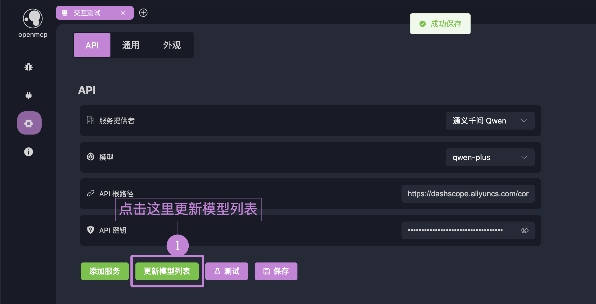

# 大モデルの接続

「インタラクションテスト」を使用して大モデルとの対話中にMCPツールの性能をテストする場合、まずOpenMCPで大モデルを設定する必要があります。

:::warning プロトコル互換性に関する警告
現在OpenMCPはOpenAIインターフェース仕様に準拠した大モデルサービスのみをサポートしています。他の大モデルを呼び出す必要がある場合は、[newApi](https://github.com/QuantumNous/new-api)を介して転送するか、独自に実装してください。

現在市場で主流の以下のモデルはすべてサポートしています。大モデルの接続に問題が発生した場合は、いつでも[[channel|お問い合わせください]]。
:::

「設定」-「API」で大モデルの接続設定画面に入ることができます。

## デフォルトでサポートされているモデル

OpenMCPはデフォルトで市場で一般的な大モデルを事前に設定しています。以下はサポートされているモデルです。

| 大モデル名          | プロバイダー                 | baseUrl                                      | デフォルトモデル       |
|----------------------|-----------------------------|---------------------------------------------|-----------------------|
| DeepSeek             | DeepSeek                   | `https://api.deepseek.com/v1`               | `deepseek-chat`       |
| OpenAI               | OpenAI                     | `https://api.openai.com/v1`                 | `gpt-4-turbo`        |
| 通義千問 Qwen        | Alibaba                    | `https://dashscope.aliyuncs.com/compatible-mode/v1` | `qwen-plus`          |
| 豆包 Seed            | ByteDance                  | `https://ark.cn-beijing.volces.com/api/v3`  | `doubao-1.5-pro-32k` |
| Gemini               | Google                     | `https://generativelanguage.googleapis.com/v1beta/openai/` | `gemini-2.0-flash`   |
| Grok                 | xAI                        | `https://api.x.ai/v1`                       | `grok-3-mini`        |
| Mistral              | Mistral AI                 | `https://api.mistral.ai/v1`                 | `mistral-tiny`       |
| Groq                 | Groq                       | `https://api.groq.com/openai/v1`            | `mixtral-8x7b-32768` |
| Perplexity           | Perplexity AI              | `https://api.perplexity.ai/v1`              | `pplx-7b-online`     |
| Kimi Chat            | 月の暗面 (Moonshot AI)     | `https://api.moonshot.cn/v1`                | `moonshot-v1-8k`     |

## 大モデルの設定

対応するサービスプロバイダーのapiTokenをopenmcpに入力するだけです。その後「テスト」をクリックし、以下の応答が表示されれば接続成功です。インタラクションテストで大モデルを使用できるようになります！

:::warning
一部のユーザーはアクセスできない問題に遭遇する可能性があります。baseUrlが正しく入力されていることを確認してください。国内でGeminiやOpenAIなどの国外プロバイダーのサービスを使用する場合、ネットワーク環境がこれらのサービスにアクセスできることを確認してください。「設定」-「一般」でプロキシサーバーを設定できます。
:::

## モデルの追加

使用したい特定のプロバイダーのモデルがデフォルトでサポートされていない場合、2つの方法で追加できます。

### 方法1：モデルリストの更新

ここでは通義千問を例にします。apitokenが正しく入力されていることを確認した上で、「モデルリストを更新」をクリックします。プロバイダーがOpenAI標準を厳密に実装していれば、すべての更新されたモデルが表示されます。

### 方法2：手動でのモデル追加

サーバーがOpenAI標準をサポートしていない場合、「方法1」を使用できません。このように手動でモデルリストを追加できます。ここではGrokを例にします。プロバイダーリストからgrokを探し、図に示す編集をクリックします。

モデルをクリックし、モデル名を入力してEnterキーを押し、確認をクリックします：

APIページに戻り、保存をクリックします。

## サービスの追加

リストにないプロバイダーサービス（クラウドプロバイダーのサービスや自分でデプロイしたサービス）を使用する場合、「サービスの追加」ボタンでカスタムモデルを追加できます。使用方法は「モデルの追加」「方法2：手動でのモデル追加」と同様なので、ここでは繰り返しません。