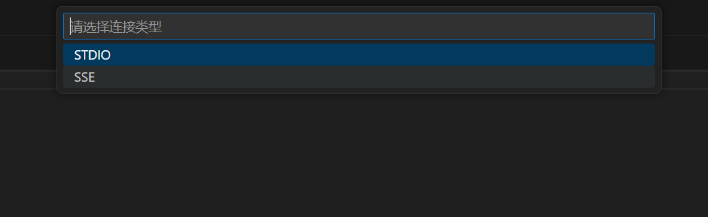

# MCPサーバーへの接続

Claude Desktopや他のMCPクライアント製品とは異なり、OpenMCPによるMCPサーバー接続の手順は非常にスムーズです。

:::info MCPクライアント
MCPクライアントとは、MCPプロトコルを通じて通信可能な大規模言語モデル対話クライアントのことで、通常はローカルで動作するアプリケーション（ウェブページにはファイルIOの権限がないため）です。その製品形態は現在ほぼチャットボット形式で、chat.deepseek.comやchat.openai.comのようなウェブサイトで使用するものと類似しています。
:::

まず、VLEを開き、[[acquire-openmcp|OpenMCPの取得]]でOpenMCPのインストールを完了した後、pythonで最も簡単なmcpサーバーを作成し、mcpクライアントの接続をテストします。

## OpenMCPでワンクリック接続

[[first-mcp|最初のMCP]]の例では、mcpのtool、resource、promptとして3つの関数を宣言しました。OpenMCPでこれらを起動するのは非常に簡単で、右上のOpenMCPアイコンをクリックするだけで接続できます：

ログインが完了し、図のように接続成功が表示されれば、現在mcpサーバーが正常に起動・接続されたことを意味します。

## STDIO接続の起動

STDIOを接続オプションとする開発方案では、ワンクリックでの迅速な起動を提供しており、mcpプロセスを追加で起動する必要はありません。OpenMCPが自動的に接続と破棄を行います。

現在サポートされているプログラミング言語とそれに対応する起動パラメータは以下の通りです：

|言語|接続パラメータ|起動ディレクトリ|
|:-|:-|:-|
|python|uv run mcp run $\{file\} | 遡って最初に見つかったpyproject.tomlのディレクトリ|
|nodejs|node $\{file\}| 遡って最初に見つかったpackage.jsonのディレクトリ|
|go|go run $\{file\}| 遡って最初に見つかったgo.modのディレクトリ|

## SSE & Streamable HTTP接続の起動

SSEとStreamable HTTPという2つのリモート接続方式については、どのポートでサーバーが起動されているか分からない（起動hostとportが見えない設定ファイルや環境変数に書かれている可能性があるため）ため、リモート接続の場合、自動サーバー作成はサポートしておらず、手動で起動オプションを設定する必要があります。

VLE左側のプラグインメニューにあるOpenMCPをクリックし、「MCP接続（ワークスペース）」ビューで+をクリックすると、新しい接続を作成できます。

必要な通信方式を選択します。

MCP Serverのアドレスを入力します。

:::info
注意が必要なのは、異なる通信方式は一般的に異なるendpointを使用することです。現在のMCP serverの多くは以下の原則に従っています：

SSEで起動する場合、デフォルトで/sseをendpointとして使用します。例：http://localhost:8001/sse

Streamable Httpで起動する場合、デフォルトで/mcpをendpointとして使用します。例：http://localhost:8001/mcp

もちろん、MCP Serverが2つの異なるendpointを使用して両接続方式を同時にサポートすることも可能で、Streamable Httpに移行したいが短期的にSSEを放棄できない状況に特に有効です
:::

## openmcpプラグインのコントロールパネル

VLEの左側にopenmcpのアイコンがあり、クリックするとopenmcpのコントロールパネルが表示されます。

現在のワークスペースで以前接続したmcpサーバーはここに表示されます。これは、openmcpがデフォルトでワークスペース起動時のmcp接続情報を`.openmcp/tabs.{server-name}.json`に保存しているためで、`{server-name}`はmcpサーバー接続成功時のサーバー名です。

:::warning
注意：同じプロジェクト内で、名前が完全に同じmcpサーバーを2つ持つべきではありません。これにより`.openmcp/tabs.{server-name}.json`の接続情報保存が衝突し、未知のエラーが発生する可能性があります。
:::

任意のワークスペースで同じmcpサーバーを使用したい場合は、「インストール済みMCPサーバー」に成熟した耐久性のあるmcpサーバーを追加することを検討してください。この場所に追加されたmcpサーバーはグローバルに使用可能です。

「入門とヘルプ」では、入門用の参考資料をいくつか準備しています。ぜひご活用ください。