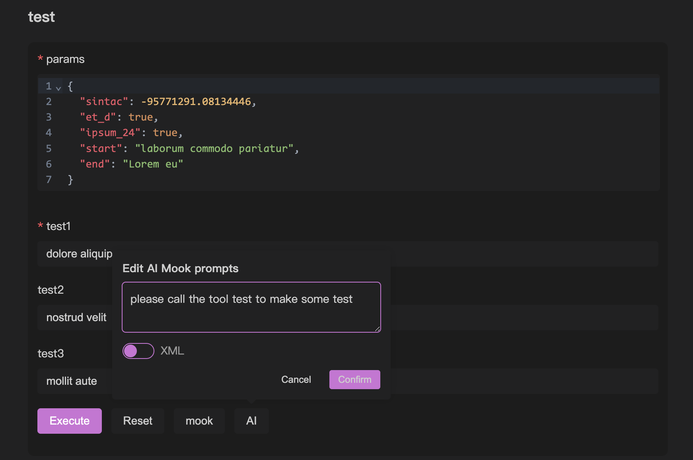

# MCP 基本デバッグ

## 基本デバッグ

[[quick-debug.md|クイックデバッグ]]では、mcpのデバッグ方法について簡単に説明しました。この章では、openmcpにおけるデバッグモジュールの特徴と高度な機能に焦点を当てます。

## タブ

openmcpはタブをデバッグプロジェクトの最小単位としており、バーの+をクリックすると新しいタブを作成できます。OpenMCPのtools、resources、promptsの基本使用はInspectorとほぼ同じですが、OpenMCPは自動的に左側のリソースリストを初期化します。Inspectorではこの手順を手動で行う必要があります。

## デバッグ内容の自動保存

openmcpにはテスト結果を自動保存する機能があります。以下の動作が発生すると、openmcpはタブとその内容を保存します：

- タブを作成し、有効なデバッグプロジェクトを選択する
- デバッグページでデバッグ操作を行う（ツールの選択、ツールの実行、大規模モデルへの質問など）

現在のmcpプロジェクトのテストデータは`.openmcp/tabs.{server-name}.json`に保存されます。ここで`{server-name}`はmcpサーバーが正常に接続されたサーバー名です。

:::warning
注意：同じプロジェクト内で、名前が完全に同じmcpサーバーバーを2つ持つべきではありません。これにより`.openmcp/tabs.{server-name}.json`の接続情報保存が衝突し、未知のエラーが発生する可能性があります。
:::

## インタラクティブテストでの迅速な再現

デバッグプロセスでは、大規模モデルの回答が不十分で、これがあるツールのエラーによるものである場合が避けられません。問題がツールにあるかどうかを迅速に特定するために、下部の小さな飛行機アイコンをクリックできます。


クリックすると、OpenMCPは新しいテストtoolプロジェクトを作成し、当時大規模モデルが使用したパラメータを自動的に右側のフォームに記入します：


あなたがする必要があるのは、実行をクリックしてエラーオプションを確認または排除することだけです。

## Mookデータ

一連のmcp toolの応答を迅速にテストするために、mook data機能を提供しています。これにより、mcp toolのschemaに基づいて使用可能なパラメータのセットを迅速に生成し、mcp toolの機能をテストできます。

2種類のmook方法を提供しています。1つ目はmookボタンで、クリックすると実際の意味はないがフォームを埋めることができるmookデータが自動生成されます。下図の`mook`ボタンがこの機能のトリガーポイントです。


また、AI mook機能も提供しており、AIを使用してmookデータを生成できます。このデータはより現実的で信頼性がありますが、まず[[connect-llm|大規模モデルの接続]]で大規模モデルを設定する必要があります。下図の`AI`ボタンがこの機能のトリガーポイントで、mookデータを生成するpromptをカスタマイズすることもできます。



## pydanticサポート

pythonのfastmcpを使用してtoolを作成する場合、インターフェースのタイプを宣言する方法は2つあります。1つはpythonのデフォルトtypingライブラリを使用して複雑なデータ構造を宣言する方法、もう1つはpydanticを使用して複雑な変数を宣言する方法です。以下は例です：

```python
from mcp.server.fastmcp import FastMCP
from pydantic import BaseModel, Field
from typing import Optional, Union, List, NamedTuple

mcp = FastMCP('錦恢の MCP Server', version="11.45.14")

class PathParams(BaseModel):
    start: str
    end: str

@mcp.tool(name="test",description="用来测试")
def test(
    params: PathParams,
    test1: str,
    test2: Union[str, List[str]] = Field("", description="测试参数2"),
    test3: Optional[str] = Field(None, description="测试参数3")
):
    return [test1, test2, test3, params]
```

これら2種類の宣言方法に対して内部変換を実装しているため、openmcpはどちらもサポートしています。特に、宣言した変数がオブジェクトである場合（上記の`PathParams`など）、openmcpのtoolデバッグウィンドウは「オブジェクト入力ボックス」を生成します。この入力ボックスは基本的な形式チェックとオートコンプリートをサポートしています：


:::info オブジェクトとは？
ここでの「オブジェクト」はjavascriptの概念で、シリアライズ可能なデータタイプの中で基本データタイプを除いた部分を指します。例えば{ "name": "helloworld" }はオブジェクトです。オブジェクトはpythonではdictやnamedTupleに似ています。
:::

:::warning
openmcpは可能な限り多くの状況をサポートしていますが、生産環境ではmcp toolのパラメータをオブジェクトとして定義することは推奨しません。シンプルなデータタイプとして定義することで、大規模モデルがツールを呼び出す際の安定性をより高めることができます。
:::