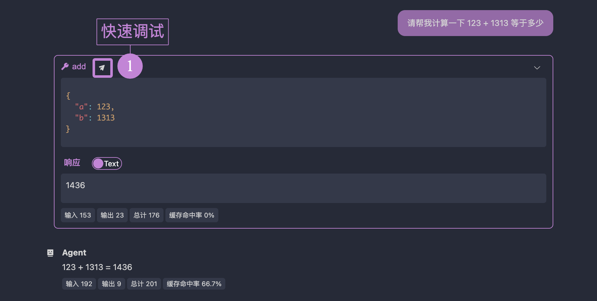
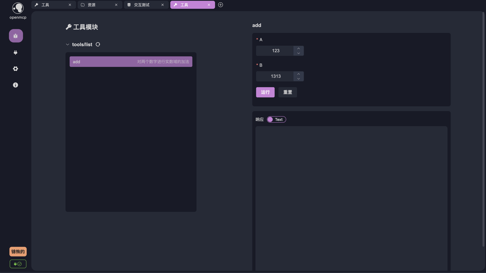
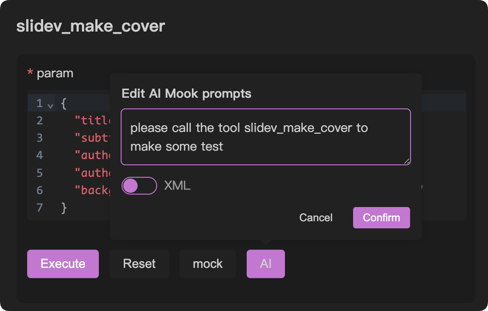
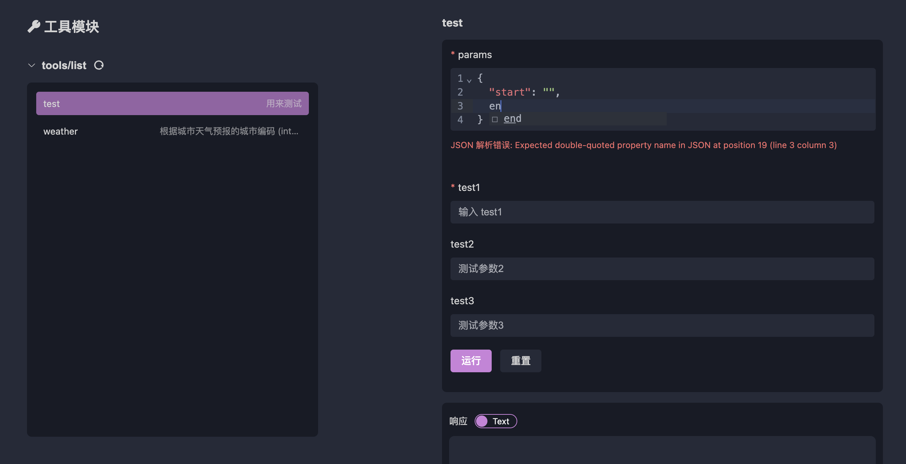

# MCP 基礎デバッグ

## 基本デバッグ

[[quick-debug.md|クイックデバッグ]]では、mcpのデバッグ方法について簡単に紹介しました。この章では、openmcpにおけるデバッグモジュールのいくつかの特徴と高度な機能に焦点を当てます。

## タブ

openmcpはタブをデバッグプロジェクトの最小単位としており、バーの+をクリックすると新しいタブを作成できます。OpenMCPのtools、resources、promptsの基本的な使用方法はInspectorとほぼ同じですが、OpenMCPは自動的に左側のリソースリストの初期化を行います。Inspectorではこの手順を手動で行う必要があります。

## デバッグ内容の自動保存

openmcpはテスト結果を自動保存する機能を備えています。以下の動作がopenmcpによるタブとその内容の保存をトリガーします：

- タブを作成し、有効なデバッグプロジェクトを選択する
- デバッグページでデバッグ動作を行う（ツールの選択、ツールの実行、大規模モデルへの質問など）

現在のmcpプロジェクトのテストデータは`.openmcp/tabs.{server-name}.json`に保存されます。ここで`{server-name}`はmcpサーバー接続が成功したサーバー名です。

:::warning
注意：同じプロジェクト内に名前が完全に同じmcpサーバーを2つ持つべきではありません。これにより`.openmcp/tabs.{server-name}.json`の接続情報保存が衝突し、未知のエラーが発生する可能性があります。
:::

## インタラクティブテストでの迅速な再現

デバッグ過程では、大規模モデルの回答が不十分で、これが特定のツールのエラーによって引き起こされる場合があります。問題がツールにあるかどうかを迅速に特定するために、下部の小さな飛行機アイコンをクリックできます。



クリックすると、OpenMCPは新しいテストtoolプロジェクトを作成し、当時大規模モデルが使用したパラメータを自動的に右側のフォームに入力します：



あなたがするべきことは、実行をクリックしてエラーオプションを確認または排除することだけです。

## Mockデータ

一連のmcp toolの応答を迅速にテストするために、mock data機能を提供しています。これにより、mcp toolのschemaに基づいて使用可能なパラメータのセットを迅速に生成し、mcp toolの機能をテストできます。

2種類のmock方法を提供しています。1つ目はmockボタンで、クリックすると実際の意味はないがフォームを埋めることができるmockデータが自動生成されます。下図の`mock`ボタンがこの機能のトリガーポイントです。


また、AI mock機能も提供しており、AIを使用してより現実的で信頼性の高いmockデータを生成できます。ただし、まず[[connect-llm|大規模モデルの接続]]で大規模モデルを設定する必要があります。下図の`AI`ボタンがこの機能のトリガーポイントであり、mockデータを生成するpromptをカスタマイズすることもできます。



## pydanticサポート

Pythonのfastmcpを使用してtoolを作成する場合、インターフェースのタイプを宣言する方法は2つあります。1つはPythonデフォルトのtypingライブラリを使用して複雑なデータ構造を宣言する方法、もう1つはpydanticを使用して複雑な変数を宣言する方法です。以下は例です：

```python
from mcp.server.fastmcp import FastMCP
from pydantic import BaseModel, Field
from typing import Optional, Union, List, NamedTuple

mcp = FastMCP('錦恢の MCP Server', version="11.45.14")

class PathParams(BaseModel):
    start: str
    end: str

@mcp.tool(name="test",description="テスト用")
def test(
    params: PathParams,
    test1: str,
    test2: Union[str, List[str]] = Field("", description="テストパラメータ2"),
    test3: Optional[str] = Field(None, description="テストパラメータ3")
):
    return [test1, test2, test3, params]
```

これら2種類の宣言方法に対して内部変換を実装しているため、openmcpは両方をサポートしています。特筆すべきは、変数がオブジェクト（上の例の`PathParams`など）として宣言されている場合、openmcpのtoolデバッグウィンドウは「オブジェクト入力ボックス」を生成し、この入力ボックスは基本的な形式チェックとオートコンプリートをサポートすることです：



:::info オブジェクトとは？
ここでの「オブジェクト」はjavascriptの概念であり、シリアライズ可能なデータ型の中で基本データ型を除いた残りの部分を指します。例えば、{ "name": "helloworld" }はオブジェクトです。オブジェクトはPythonではよりdictまたはnamedTupleに似ています。
:::

:::warning
openmcpは可能な限り多くの状況をサポートしていますが、生産環境ではmcp toolのパラメータをオブジェクトとして定義することは推奨しません。可能な限り単純なデータ型として定義することも、大規模モデルがツールを呼び出す際の安定性を向上させます。
:::