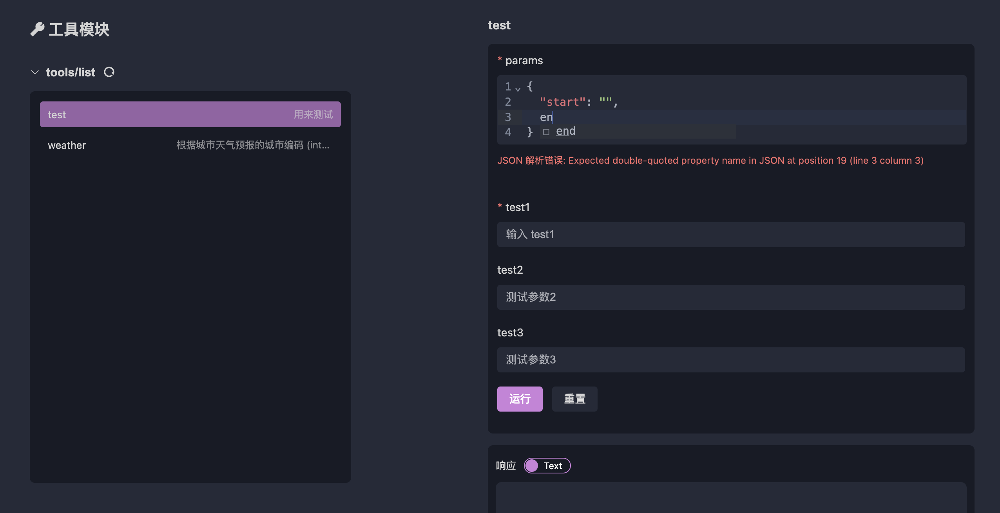

# デバッグ tools、resources、prompts

## タブ

openmcpはタブをデバッグ項目の最小単位としており、ナビゲーションバーの+をクリックすると新しいタブを作成できます。OpenMCPのtools、resources、promptsの基本的な使用方法はInspectorとほぼ同じですが、OpenMCPは自動的に左側のリソースリストの初期化を行います。Inspectorではこの手順を手動で行う必要があります。

## デバッグ内容の自動保存

openmcpにはテスト結果を自動保存する機能があります。以下の動作が発生すると、openmcpはタブとその内容を保存します：

- タブを作成し、有効なデバッグ項目を選択した場合
- デバッグページでデバッグ操作（ツールの選択、ツールの実行、大規模モデルへの質問など）を行った場合

現在のmcpプロジェクトのテストデータは`.openmcp/tabs.{server-name}.json`に保存されます。ここで`{server-name}`はmcpサーバーが正常に接続されたサーバー名です。

:::warning
注意：同じプロジェクト内で名前が完全に同じmcpサーバーを2つ持つべきではありません。これにより`.openmcp/tabs.{server-name}.json`の接続情報保存に競合が発生し、未知のエラーが発生する可能性があります。
:::

## クイックデバッグ

デバッグプロセス中に、大規模モデルの回答が不十分で、これが特定のツールのエラーによるものである場合、問題がツールにあるかどうかを迅速に特定するために、下部の小さな飛行機アイコンをクリックできます。


クリックすると、OpenMCPは新しいテストツールプロジェクトを作成し、大規模モデルが使用したパラメータを自動的に右側のフォームに入力します：


あなたがするべきことは、実行をクリックしてエラーオプションを確認または除外することだけです。

## pydanticサポート

Pythonのfastmcpを使用してtoolを作成する際、インターフェースのタイプを宣言する方法は2つあります。1つはPythonのデフォルトのtypingライブラリを使用して複雑なデータ構造を宣言する方法、もう1つはpydanticを使用して複雑な変数を宣言する方法です。以下は例です：

```python
from mcp.server.fastmcp import FastMCP
from pydantic import BaseModel, Field
from typing import Optional, Union, List, NamedTuple

mcp = FastMCP('錦恢の MCP Server', version="11.45.14")

class PathParams(BaseModel):
    start: str
    end: str

@mcp.tool(name="test",description="用来测试")
def test(
    params: PathParams,
    test1: str,
    test2: Union[str, List[str]] = Field("", description="测试参数2"),
    test3: Optional[str] = Field(None, description="测试参数3")
):
    return [test1, test2, test3, params]
```

これら2種類の宣言方法に対して内部変換を実装しているため、openmcpはどちらもサポートしています。特に、宣言した変数がオブジェクト（上記の`PathParams`など）の場合、openmcpのtoolデバッグウィンドウは「オブジェクト入力ボックス」を生成します。この入力ボックスは基本的な形式チェックとオートコンプリートをサポートします：



:::info オブジェクトとは？
ここでの「オブジェクト」はJavaScriptの概念で、シリアライズ可能なデータ型の中で基本データ型を除いた部分を指します。例えば{ "name": "helloworld" }はオブジェクトです。Pythonでは、オブジェクトはdictやnamedTupleに似ています。
:::

:::warning
openmcpは可能な限り多くのケースをサポートしていますが、生産環境ではmcp toolのパラメータをオブジェクトとして定義することは推奨しません。シンプルなデータ型として定義することで、大規模モデルがツールを呼び出す際の安定性を向上させることができます。
:::