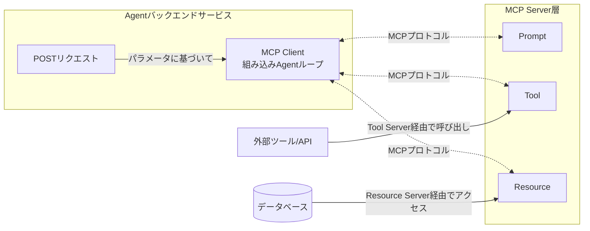

# MCPサーバーのエクスポート

これまでの手順で、MCPの開発と検証が完了したなら、MCPを本番環境にデプロイする時が来ました。

現在、Node.jsは世界で最も人気のあるフルスタック開発エコシステムであるため、このチュートリアルではNode.jsを例に今後の手順を説明します。他のバックエンド言語（Java、Go、Python）も同様です。

## Agentバックエンドサービスの基本構造

MCPサーバーの基本概念をすでに読み終えていると仮定すると、エージェントサービスにとって以下のアーキテクチャ図も見覚えがあるはずです。



現在、ユーザーがXiaohongshu（小红书）でバズるプロモーション記事を推敲するのを支援するエージェントサービスを開発する必要があると仮定します。この要件はバックエンドの観点から2つの部分に分けられます：

1. Agentバックエンドサービス：ユーザーのリクエストを受け付け、ユーザーのログイン状態を維持し、データベースに対してCRUD操作を行います。
2. MCP Server層：具体的なAgent機能タスクを実行します。この例では、その機能は「ユーザーがXiaohongshuでバズるプロモーション記事を推敲するのを支援し、ユーザーに返す」ことです。

## 基本的なコード例

上記の例で、あなたが熟練のバックエンドプログラマーとして、「ユーザーがXiaohongshuでバズるプロモーション記事を推敲するのを支援する」という機能のバックエンドPOSTリクエストを既に書いていると仮定します。コードは以下のようになります：

```ts
@Controller('word')
export class WordController {
    
    @UseGuards(JwtAuthGuard)
    @Sse('make-red-book-word-doc/:id')
    makeRedBookWordDoc(
        @Param('id') id: number,
        @Request() req: ExpressRequest,
    ): Observable<any> {
        const user = req.user as User;
        return new Observable(subscriber => {
            this.wordService.redBookHandler(id, user, subscriber);
        });
    }

}
```

ここで、`this.wordService.redBookHandler`が実際のビジネス関数です。では、openmcpでデバッグ済みのmcpサーバーを上記のバックエンドコードにどのように接続すればよいでしょうか？

非常に簡単で、3つのステップに分かれます。

## ステップ1：mcpconfig.jsonをエクスポートする

「インタラクティブテスト」インターフェースで、ツールバーの下にある小さなロケットアイコン（下図の1️⃣の場所）をクリックすると、ウィンドウがポップアップ表示されます。


コピーまたはエクスポートをクリックして、現在のデバッグのすべての情報（mcpサーバー、使用する大規模モデルなど）を記録したこのファイルをローカルに保存します。`/path/to/mcpconfig.json`に保存したと仮定します。

:::tip

素晴らしい点は、現在のデバッグ環境で複数のmcpサーバーを使用している場合、openmcpはこれらの複数のサーバーに関連する設定情報も変更せずにmcpconfig.jsonに保存することです。追加で使用する付属のmcpサーバーのデプロイについて、バックエンドプログラムで心配する必要はまったくありません。

> 複数サーバーの接続については、[複数サーバーの接続](./multi-server.md)をご覧ください。

:::

## ステップ2：openmcp-sdkをインストールする

openmcpは、Node.jsで使用できる配套のSDKを提供しており、インストール方法は以下のとおりです：

::: code-group
```bash [npm]
npm install openmcp-sdk
```

```bash [yarn]
yarn add openmcp-sdk
```

```bash [pnpm]
pnpm add openmcp-sdk
```
:::

コアクラス`OmAgent`は以下の方法でインポートします：

```typescript
import { OmAgent } from 'openmcp-sdk/service/sdk';
```

## ステップ3：mcpconfig設定を読み込み、サービスを簡単に実装する

これで、以下のコードを通じて、mcpサーバーをバックエンドサービスに迅速に接続できます：

```ts
@Injectable()
export class SlidesService {

    /**
     * @description markdownタスクを作成し、途中の進捗を返す
     */
    async redBookHandler(id: number, user: User, subscriber: Subscriber<any>) {
        // 設定を読み込む
        agent.loadMcpConfig('/path/to/mcpconfig.json');

        // ドキュメントデータベースから現在のユーザーのコンテンツを取得する
        const content = await this.documentService.getContent(id, user);

        // redbook_style_promptを使用してagentを導く
        const prompt = await agent.getPrompt('redbook_style_prompt', { content });    

        // タスクループを実行する
        const res = await agent.ainvoke({ messages: prompt });
        
        subscriber.next(toSseData({ done: true, data: res }));
    }

}
```

openmcp-sdkの詳細については、[openmcp-sdkドキュメント](../../sdk-tutorial/index.md)をご覧ください。