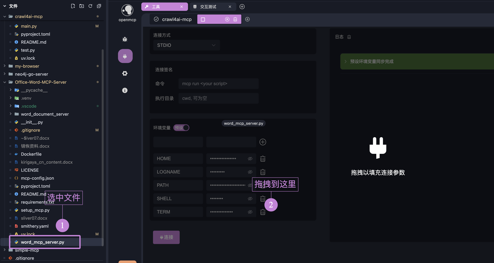

# 複数のMCPサーバーに接続する

openmcpは複数のMCPサーバーへの接続をサポートしています。

例えば、資料を自動的に検索しWord文書にまとめるagentを実装したい場合、以下のようにできます：

1. ウェブ検索可能なmcpを探す：[crawl4ai mcp](https://github.com/LSTM-Kirigaya/openmcp-tutorial/tree/main/crawl4ai-mcp)
2. Word操作可能なmcpを探す：[Office-Word-MCP-Server](https://github.com/GongRzhe/Office-Word-MCP-Server)  
3. openmcpでこれらを組み合わせる
4. タスクを自動完了！

最初のmcp（crawl4ai mcp）に既に接続している場合、追加のmcpサーバーを接続できます：

## 追加方法1：ドラッグ&ドロップ

接続したいmcpサーバーファイルをShiftキーを押しながらopenmcpインターフェースにドラッグすると、パラメータが自動入力されます。

:::warning
自動入力されたコマンドが常に正確とは限りません。[STDIO接続の起動](http://localhost:5173/openmcp/plugin-tutorial/usage/connect-mcp.html#stdio-%E8%BF%9E%E6%8E%A5%E7%9A%84%E5%90%AF%E5%8A%A8)で説明した通りです。具体的な接続方法は[付録：uvによるmcp起動の必須知識](http://localhost:5173/openmcp/plugin-tutorial/quick-start/first-mcp.html#%E9%99%84%E5%BD%95-%E5%85%B3%E4%BA%8E-uv-%E5%90%AF%E5%8A%A8-mcp-%E4%BD%A0%E5%BF%85%E9%A1%BB%E7%9F%A5%E9%81%93%E7%9A%84)を読んで判断してください。
:::

## 追加方法2：手動パラメータ入力

手動でパラメータを入力します。特に説明はありません。

## 複数サーバーの使用

複数サーバー接続後の使用方法は単一サーバーと大きく変わりません。openmcpが内部でツールのスケジューリングと選択を自動的に行います。唯一の注意点は、複数サーバー間でtool名が重複しないようにすることです。重複すると競合が発生します。

tool名の重複が必要なシナリオがある場合は、[issue](https://github.com/LSTM-Kirigaya/openmcp-client/issues)で使用ケースとアイデアを教えてください。議論を経て対応を検討します。