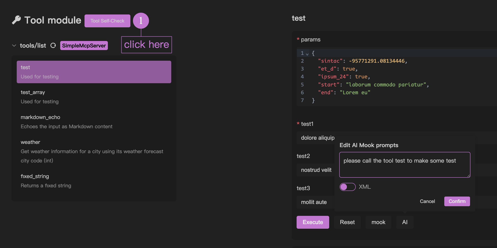
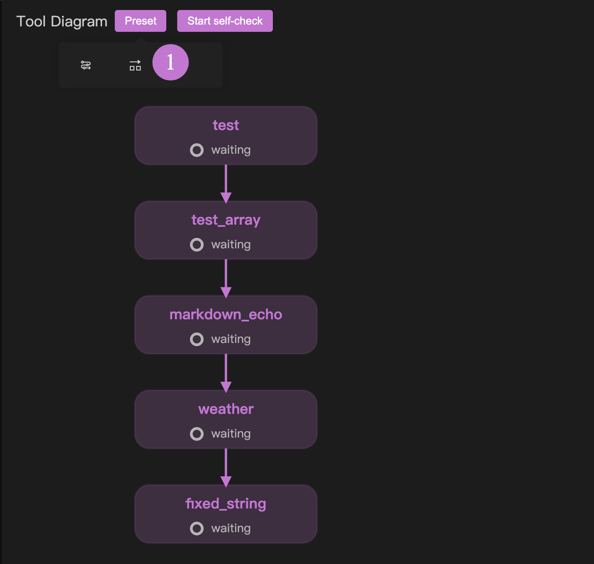
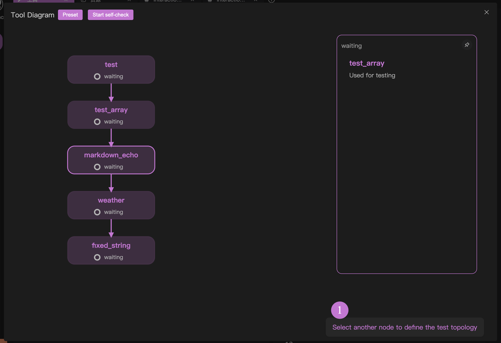
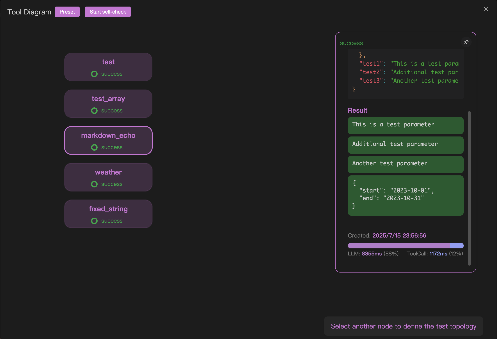

# MCPツール自己診断プログラム

デバッグ機能では、mookを使用してmcpツールのテストを補助する以外に、現在すべてのツールに対して迅速にクローズドループテストを行う方法があります。これはMCPサーバー開発の初期段階で非常に役立ちます。

MCPサーバーの開発を実践する場合、初めてプログラムを作成し、「インタラクティブテスト」に進む前に、自己診断プログラムを使用してインタラクティブテストで発生する可能性のある問題を回避することを強くお勧めします。

MCPツール自己診断プログラムの概要は、この動画で確認できます：[OpenMCP 0.1.9 更新ログ | MCPツール自己診断 & カスタムトポロジーソートをサポート](https://www.youtube.com/watch?v=QoAhHv1IAuw)

## 基本的な使い方

「ツール」テストプロジェクトを作成後、下図の1の位置にあるボタンをクリックすると自己診断プログラムに入ります。

## 実行順序の定義 | プリセット

自動診断プログラムでは、テスト順序を定義する必要があります。これにより、自己診断プログラムは設定したテスト順序（後で実行トポロジーと呼びます）に従って自動実行します。これは、ほとんどの場合、MCPサーバーのツールには一定の依存関係があるためです。例えば、PPTを作成するMCPを開発した場合、「ページを追加」というツールは「PPTを作成」というツールの後に実行する必要があります。

提供されている2つのプリセットを使用して、実行トポロジーを迅速に設定できます。下図の1の場所に示されています：

最初のプリセットはシリアル実行を表し、宣言された順序に従ってMCPツールを1つずつ実行します。

2番目のプリセットは並列実行を表し、すべてのMCPツール間にトポロジー依存関係がなく、並列実行されます。

## 実行順序の定義 | クリック操作

高度にカスタマイズされたトポロジー依存関係が必要な場合は、以下の簡単な操作で実現できます：

1. ノードAをクリックし、別のノードBを選択すると、AからBへの接続を作成できます
2. AからBへの接続線をクリックすると、AからBへの接続を切断できます

これら2つの自由度の操作により、カスタム実行トポロジーを簡単に作成できます。

特筆すべきは、合法な操作を行うたびに、右下隅に次の実行ヒントが表示されることです：

## 自己診断プログラムの実行

自己診断プログラムを開始するには、クリックして実行します。ただし、先に[[connect-llm|大規模モデルの接続]]で大規模モデルを設定する必要があります。

テストが完了すると、テスト結果とパフォーマンス評価が表示されます。

