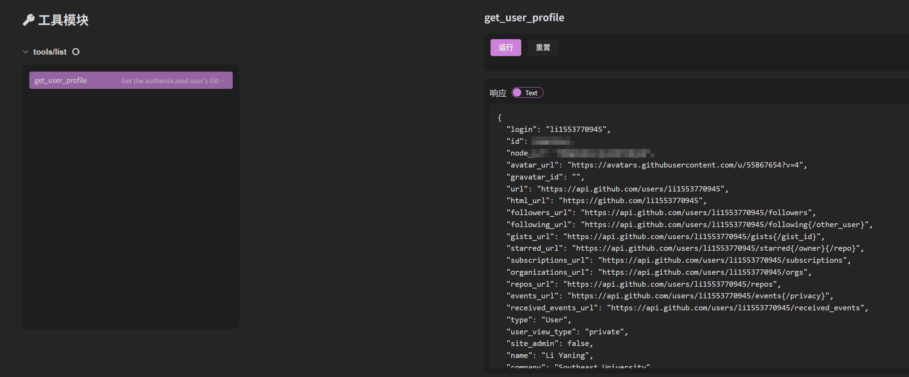

# MCPサーバーのOAuth認証実装

**SSE**または**Streamable HTTP**を使用して接続する際、セキュリティを強化するためにインターフェースに認証メカニズムを設計できます。MCP公式ではOAuthプロトコルの採用を推奨しています。以下ではGitHubユーザー情報の取得を例に、openmcp-clientを使用してOAuth認証付きのインターフェースデバッグを完了する方法を説明します。

## 1. Github OAuth認証IDとsecretの取得

GitHubユーザー情報関連APIを使用するため、まずGitHub OAuthアプリのClient IDとClient secretを取得する必要があります。

[Github Developers](https://github.com/settings/developers)にアクセスし、`New OAuth App`をクリックして新しいOAuth APPを作成します。アプリケーション名は任意で入力し、`Homepage URL`には`http://localhost:8000`、`Authorization callback URL`には`http://localhost:8000/github/callback`を入力します。その後、`Register application`ボタンをクリックすると、アプリケーションが正常に登録されます。


登録が成功したら、`Client ID`を記録し、`Generate a new client secret`をクリックして`secret`を生成します。secretは生成時にのみ表示されるので注意してください。

## 2. 環境変数の設定

`Client ID`と`secret`を取得した後、それらを環境変数として設定する必要があります：

::: code-group
```bash [bash]
export MCP_GITHUB_GITHUB_CLIENT_ID={{Client ID}}
export MCP_GITHUB_GITHUB_CLIENT_SECRET={{secret}}
```

```bash [PowerShell]
$env:MCP_GITHUB_CLIENT_ID = "your_id"
$env:MCP_GITHUB_CLIENT_SECRET = "your_secret"
```

```bash [CMD]
set MCP_GITHUB_GITHUB_CLIENT_ID={{Client ID}}
set MCP_GITHUB_GITHUB_CLIENT_SECRET={{secret}}
```
:::

注意：cmdで環境変数を設定する際は引用符を付けないでください。

## 3. ソースコードのクローン

次に、OAuth認証付きのMCPサーバーをデプロイします。[公式python案例](https://github.com/modelcontextprotocol/python-sdk/tree/main/examples/servers/simple-auth)を参照してください。

まず公式python-sdkのソースコードをクローンします：

```bash
git clone https://github.com/modelcontextprotocol/python-sdk/ # ソースコードをクローン
cd examples/servers/simple-auth # 対応するディレクトリに移動
```

## 4. MCP Serverの起動

必要に応じて仮想環境を作成し依存関係をインストールした後、`uv`を使用して実行するか、直接`python main.py`を実行します。環境変数を設定していないと、起動時に`2 validation errors for ServerSettings`エラーが発生するので注意してください。

## 5. openmcp-clientの起動

これで、起動したばかりのserverにopenmcp-clientを使用して接続できます。ウェブ版でもVSCodeでも可能です。

プラス記号をクリックして接続を追加し、serverコードの`--transport`パラメータに基づいてSSEかStreamable HTTPかを決定します。SSEの場合、URLは`http://localhost:8000/sse`を入力します。Streamable HTTPの場合、URLは`http://localhost:8000/mcp`を入力します。認証署名は入力不要です。

次に現在のserverに接続すると、自動的にウェブページが開き認証が行われます。初回アクセス時は認証をクリックする必要があり、認証が成功するとウェブページは自動的に閉じます。


認証が成功すると、ツールページに移動し、`get_user_profile`ツールが表示されるはずです。クリックして使用すると、GitHubの個人情報を取得できます。

