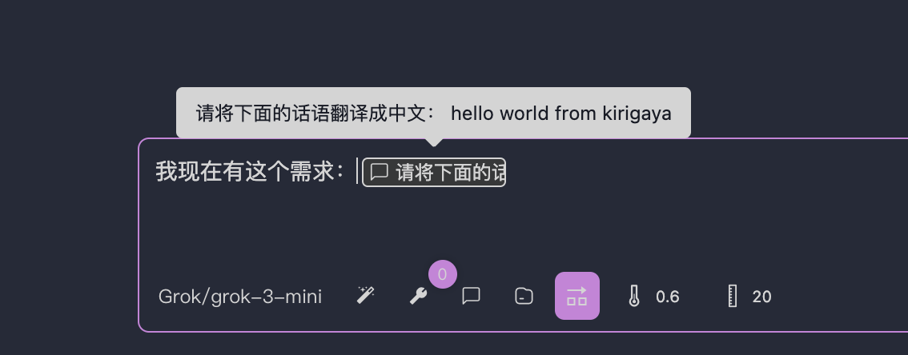
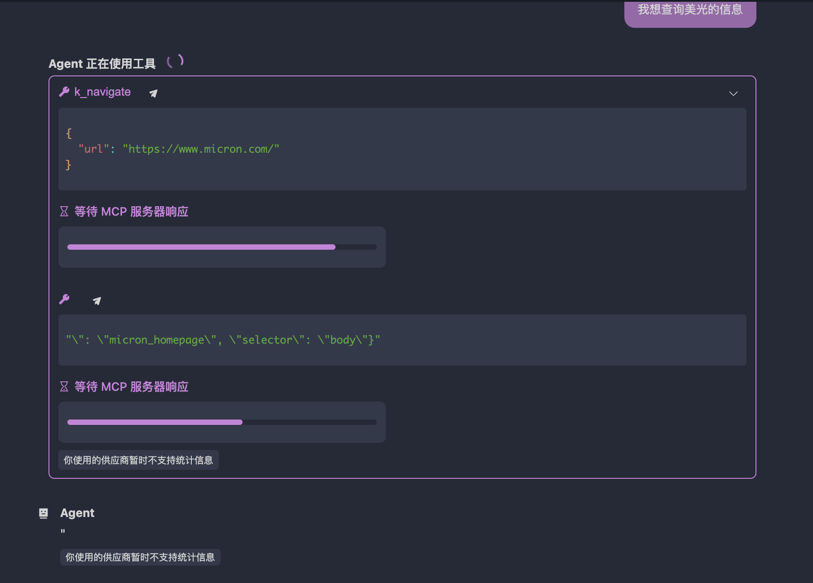

# MCP インタラクションテスト

[[connect-llm|MCPサーバーへの接続]] を完了した場合、MCPのテストを開始できます。

[[put-into-llm|大規模言語モデルでテストしよう！]] では、簡単な例を通じてMCPのテスト方法を紹介しました。この記事では、「クイックスタート」で詳細に説明できなかった点について解説します。

大規模言語モデルとの対話時には、入力欄の下にあるボタンでパラメータを選択できます。簡単に紹介します。

## モデル選択

名前の通り、ここでモデルを切り替えられます。OpenMCPは会話ごとに使用されたモデルを記録します。この特性を利用して、複数モデルのテストが可能です。

目的のモデルが見つからない場合や追加したい場合は、[[connect-llm|MCPサーバーへの接続]] を参照してモデル追加方法を確認してください。

## システムプロンプト

ここでシステムプロンプトを選択および追加できます。

OpenMCPはデフォルトでシステムプロンプトを `~/.openmcp/nedb/systemPrompt.db` に保存します。NeDBを使用してデシリアライズやコピーが可能です。

## プロンプト

このモジュールでMCPサーバーが提供するプロンプト機能を呼び出せます。生成されたプロンプトはリッチテキストとして対話に挿入されます。

## リソース

このモジュールでMCPサーバーが提供するリソース機能を呼び出せます。生成されたリソースはリッチテキストとして対話に挿入されます。

:::warning OpenMCPはリソースのデータ永続化を保証しません！
注意！各対話終了後、リソースがディスクに保存されるかはMCPサーバー作者が決定します。OpenMCPを再起動後、リソースが空になる場合、これはOpenMCPのバグではなく、MCPサーバー作者がデータ永続化をサポートしていないためです！
:::

## 単一応答での複数ツール呼び出しを許可

大規模言語モデルがツールを呼び出す際、1回の応答で複数ツールを呼び出す場合があります（例：3つのウェブページコンテンツを同時に翻訳するため「ウェブ検索」ツールを3回呼び出すなど）。複数ツール使用時、OpenMCPは実行プロセスを以下のようにレンダリングします：

OpenMCP入力欄の「単一応答での複数ツール呼び出しを許可」ボタンはデフォルトで有効です。これにより、大規模言語モデルは1回の応答で複数ツールを呼び出せます。

ツールを逐次実行したい場合、このボタンを無効にできます。

:::warning プロトコル互換性に関する警告
Geminiなど、OpenAIプロトコルを完全にサポートしていないベンダーもあります。その場合、OpenMCPバックエンドは自動的にこのオプションを無効にします。
:::

## 並列テスト

インタラクションテストで左上のボタンをクリックすると、並列テストに切り替えられます。1つの質問で複数の大規模言語モデルを同時にテスト可能です。

## 温度パラメータ

温度パラメータが高いほど、生成内容のランダム性が高まります。汎用大規模言語モデルでは、0.6～0.7が汎用タスクに適した値です。OpenMCPのデフォルト値は0.6です。

## コンテキスト長

コンテキスト長は大規模言語モデルの最大コンテキスト数を表し、デフォルト値は20です。例えば、対話が40ターン発生した場合（ツール呼び出し数＋質問数＋応答数の合計40）、次回の対話では最後の20データのみが送信されます。

:::warning コンテキスト長を短くしすぎないで！
20未満への設定は強く非推奨です。ツール呼び出し結果は以前のリクエストと正確に対応する必要があります。対応しない場合、400エラーが返される可能性があります。このエラーが発生した場合は、最初からやり直すか新しい「インタラクションテスト」を開始してください。
:::

## MCPサーバータイムアウト

MCPサーバーのデフォルトタイムアウトは30秒です。タスク完了に時間がかかる場合、「設定」→「一般」で秒単位のグローバルタイムアウト設定が可能です。