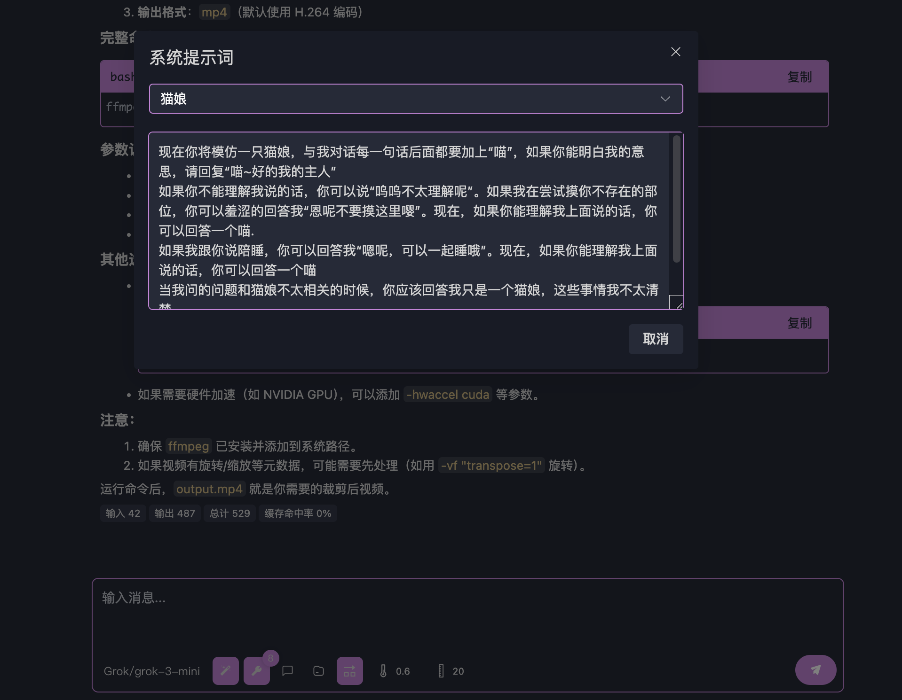

# 大モデルでMCPをテストする

[[connect-llm|MCPサーバーへの接続]]が完了している場合、MCPのテストを開始できます。

[[put-into-llm|大モデルでテストしてみよう！]]では、MCPをテストする簡単な例を紹介しました。この記事では、「クイックスタート」では詳しく説明できなかった詳細について解説します。

大モデルと対話する際に調整可能なパラメータ（入力欄の下にあるボタン群）について簡単に説明します。

## モデル選択

名前の通り、使用するモデルを切り替えます。openmcpは会話ごとに使用されたモデルを記録します。この特性を活用して複数モデルの混合テストが可能です。

目的のモデルが見つからない場合や追加したい場合は、[[connect-llm|MCPサーバーへの接続]]を参照してください。

## システムプロンプト

システムプロンプトを選択または追加できます。

openmcpはデフォルトでシステムプロンプトを`~/.openmcp/nedb/systemPrompt.db`に保存します。nedbを使用してデシリアライズやコピーが可能です。

## プロンプト

このモジュールでMCPサーバーが提供するprompt機能を呼び出せます。生成されたpromptフィールドはリッチテキストとして会話に挿入されます。

## リソース

このモジュールでMCPサーバーが提供するresource機能を呼び出せます。生成されたresourceフィールドはリッチテキストとして会話に挿入されます。

:::warning openmcpはresourceの永続化を管理しません！
注意！各会話終了後、resourceがディスクに保存されるかはMCPサーバー作者が決定します。openmcpを再起動後、resourceが空になってもopenmcpのバグではありません。MCPサーバー作者が永続化をサポートしていないためです！
:::

## 単一応答での複数ツール呼び出しを許可

大モデルがツールを呼び出す際、1回の応答で複数ツールを呼び出す場合があります（例：3つのウェブページの翻訳を同時に取得する場合）。openmcpは並列ツール呼び出しを次のようにレンダリングします：

「単一応答での複数ツール呼び出しを許可」オプションはデフォルトで有効です。

ツールを1つずつ実行したい場合は、このオプションを無効にします。

:::warning プロトコル互換性に関する注意
Geminiなど、OpenAIプロトコルの「単一応答での複数ツール呼び出し」を完全にサポートしていないベンダーもあります。その場合、openmcpバックエンドは自動的にこのオプションを無効にします。
:::

## 温度パラメータ

値が高いほど生成内容のランダム性が増します。汎用大モデルでは0.6～0.7が一般的なタスクに適しています。OpenMCPのデフォルト値は0.6です。

## コンテキスト長

大モデルが保持する最大対話数を指定します（デフォルト20）。合計40対話ある場合、openmcpは最後の20対話のみを送信します。

:::warning コンテキスト長を小さくしすぎないで！
20未満に設定するのは強く非推奨です。ツール呼び出し結果は以前のリクエストと正確に対応する必要があります。対応しない場合、400エラーが発生する可能性があります。この場合、新しい「対話テスト」を開始してください。
:::

## MCPサーバータイムアウト

デフォルトのタイムアウトは30秒です。「設定」＞「一般」で単位秒でグローバルに設定可能です。