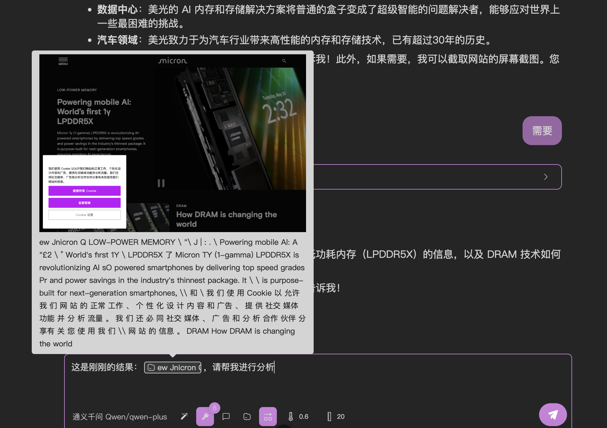

# 用大模型测试您的 mcp

如果您完成了 [[connect-llm|连接 mcp 服务器]] 这一步，那么您就可以开始测试您的 mcp 了。

在 [[put-into-llm|扔进大模型里面测测好坏！]] 中，我们已经通过一个简单的例子来展示来如何使用大模型测试您的 mcp。因此，这篇文章更多是讲解不便在「快速开始」中赘述的细节。

和大模型交互时，有一些参数可以选择，也就是输入框下面那一排按钮，我来简单介绍一下。

## 选择模型

顾名思义，你可以在这里切换你的模型。值得一提的是，openmcp 会以单条对话为粒度来记录每一条对话使用的模型。您可以利用这一特性来进行混合模型测试。

如果你没有找到你想要的模型，或是想要添加额外的模型，请移步 [[connect-llm|连接 mcp 服务器]] 来了解如何添加模型。

## 系统提示词

您可以在这里选择和添加系统提示词。

openmcp 默认将您的系统提示词保存在 `~/.openmcp/nedb/systemPrompt.db` 中。您可以通过 nedb 来进行反序列化和拷贝。

## 提词

您可以利用该模块来调用 mcp 服务器提供的 prompt 功能，生成的 prompt 字段会作为富文本被插入您的对话中。

## 资源

您可以利用该模块来调用 mcp 服务器提供的 resource 功能，生成的 resource 字段会作为富文本被插入您的对话中。

:::warning openmcp 不负责 resource 的数据持久化！
请注意！每次对话完成后 resource 是否会被保存到磁盘完全由 mcp server 作者决定，openmcp 不负责 resource 的数据持久化！如果您发现关闭 openmcp 再打开，resource 彩蛋为空，这不是 openmcp 的 bug，而是 mcp server 作者没有支持数据持久化！
:::

## 允许模型在单轮回复中调用多个工具

大模型在进行工具调用时，有时候会将在一次回复中要求调用多次工具，比如你想要同时获取三个网页的内容翻译，大模型可能会同时调用三次「网络搜索」工具（如果你提供了的话）。多次工具使用时，openmcp 会如此渲染调用执行过程：

openmcp 输入框的按钮中的「允许模型在单轮回复中调用多个工具」默认是点亮的。也就是允许大模型可以在一次回复中调用多次工具。

有的时候，我们希望命令一条条执行，就可以选择把这个按钮熄灭。

:::warning 协议兼容性警告
有的厂商（比如 gemini）不一定严格支持了 openai 协议，对于不支持 「允许模型在单轮回复中调用多个工具」的厂商，openmcp 的后端会自动将该选项关闭。
:::

## 温度参数

温度参数越高，生成内容的随机性越强，对于通用大模型，个人建议参数为 0.6 ~ 0.7，会是一个适用于通用型任务的数值。OpenMCP 提供的默认值为 0.6。

## 上下文长度

上下文长度代表了大模型的最大上下文轮数，默认值为 20。举个例子，如果你和大模型对话产生了 40 轮数据（工具调用条数+你的问题数量+大模型回答的次数总共 40 个），那么下一次对话 openmcp 只会发送最后 20 条数据给大模型。

:::warning 上下文长度不要太小！
我们强烈不推荐你将这个数值设置低于 20，因为大模型接受工具调用的结果需要和之前的调用请求一一对应。如果不对应，大模型会返回注入 400 这样的错误。遇到这样的错误，请从最初一句话重启或者新开一个「交互测试」。
:::

## MCP 服务器超时

MCP 服务器默认超时时间为 30 秒，如果您的 mcp 服务器需要更长的时间才能完成任务，您可以通过「设置」「通用」来设置超时时间，单位为秒，该设置全局生效。

