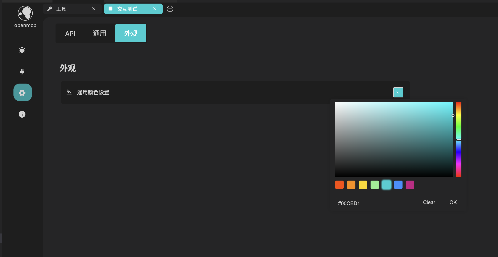

# UI 配色

## openmcp のテーマカラーは vscode に連動

openmcp のテーマカラーは完全に vscode に連動しています。openmcp のテーマカラーを変更したい場合、vscode のテーマカラーを変更するだけでOKです。

例えば、コミュニティで有名なテーマ「One Dark Pro」に切り替えた時の openmcp の表示:

## テーマカラーの切り替え

ここで openmcp のテーマカラーを切り替えられます（デフォルトはピンク）

## Trae への特別サポート

openmcp は trae のデフォルトテーマカラーに対して追加サポートを提供しています。私たちはユーザーに、最適な操作性を得るために vscode、cursor、trae などの様々な VLE を試すことを推奨しています。

openmcp 公式ドキュメントのデモ例の多くは、trae の「深藍」デフォルトテーマをベースにしています。

