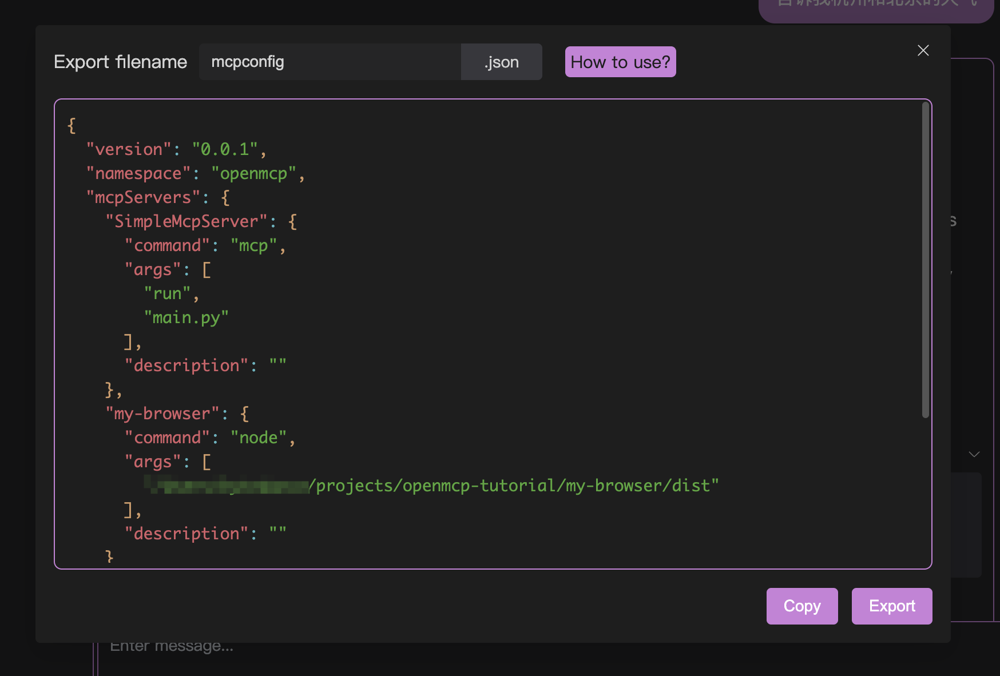

# 迅速なデプロイ

openmcp-sdkのコア機能の1つは迅速なデプロイです。openmcp-clientとの連携を活用することで、MCP Agentのデプロイをわずか10秒で完了できます。

## 1. openmcpからmcpconfig.jsonをエクスポートする

まず、openmcpでデバッグ済みのmcpプロジェクトを開きます。インタラクティブテストで満足のいくデバッグ結果が得られていると仮定します。

ダイアログツールバーの一番右にあるロケットのようなアイコンをクリックすると、次のようなウィンドウが表示されます:



コピーまたはエクスポートをクリックすると、mcpconfig.jsonファイルを取得できます。

## 2. openmcp-sdkにデプロイする

次に、main.tsファイルを作成し、以下の数行のコードで上記の設定をagentとしてデプロイできます:

```typescript
import { OmAgent } from 'openmcp-sdk/service/sdk';

const agent = new OmAgent();
agent.loadMcpConfig('./mcpconfig.json');  
const res = await agent.ainvoke({ messages: '今天杭州的天气是什么样子的？' });

console.log('⚙️ Agent Response', res);
```

`npx tsx main.ts`を使用して実行すると、次の結果が得られます:

```
[2025/6/22 19:05:08] 🚀 [SimpleMcpServer] 1.9.2 connected
[2025/6/22 19:05:11] 🤖 Agent wants to use these tools weather
[2025/6/22 19:05:11] 🔧 using tool weather
[2025/6/22 19:05:11] ✓  use tools success
⚙️ Agent Response 今天杭州的天气是小雨，气温为24.7°C，湿度为95%，空气质量指数（AQI）为26，空气质量良好。
```