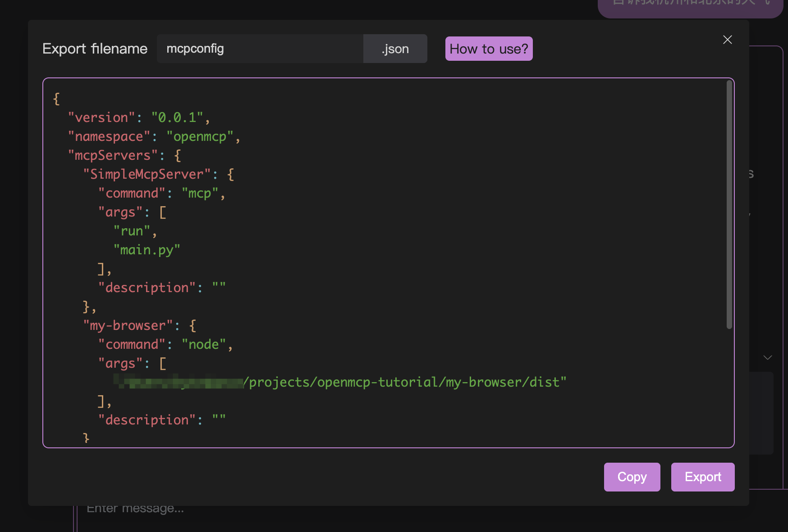

# 高速デプロイ

openmcp-sdkの核となる特徴の一つは高速デプロイです。openmcp-clientとの連携を活用することで、わずか10秒でMCP Agentのデプロイを瞬時に完了できます。

## 1. openmcpからmcpconfig.jsonをエクスポート

まず、openmcpでデバッグ済みのMCPプロジェクトを開きます。対話テストで満足のいくデバッグ結果が得られていることを前提とします。

次に、ダイアログツールバーの最も右側にあるロケットのようなアイコンをクリックすると、以下のようなウィンドウが表示されます：



コピーまたはエクスポートをクリックすると、mcpconfig.jsonファイルを取得できます。

## 2. openmcp-sdkにデプロイ

次に、main.tsファイルを作成し、以下の数行のコードで上記の設定をagentとしてデプロイします：

```typescript
import { OmAgent } from 'openmcp-sdk/service/sdk';

const agent = new OmAgent();
agent.loadMcpConfig('./mcpconfig.json');  
const res = await agent.ainvoke({ messages: '今日の杭州の天気はどうですか？' });

console.log('⚙️ Agent Response', res);
```

`npx tsx main.ts`を使用して実行すると、以下の結果が得られます：

```
[2025/6/22 19:05:08] 🚀 [SimpleMcpServer] 1.9.2 connected
[2025/6/22 19:05:11] 🤖 Agent wants to use tools(1) weather
[2025/6/22 19:05:11] ✅ weather
⚙️ Agent Response 今日の杭州の天気は小雨、気温は24.7°C、湿度は95%、大気質指数（AQI）は26で、大気質は良好です。
```

## MCPサーバー管理

プロジェクトに多数のMCPが存在する場合、nameを使用してインデックス化することを推奨します。そのためには、MCP設定ファイルの検索プログラムを独自に実装する必要があります。以下は簡単な例です：

ファイル名：util.ts

```typescript
import path from 'path';

const __dirname = path.dirname(import.meta.filename);

export const MCP_CONFIG_HOME = path.resolve(__dirname, '..', 'openmcp');

export function useMcpConfig(name: string) {
    return path.join(MCP_CONFIG_HOME, name + '.json');
}
```

ファイル名：main.ts

```typescript
import { useMcpConfig } from './util';

const agent = new OmAgent();
agent.loadMcpConfig(useMcpConfig('word-mcp'));

const prompt = await agent.getPrompt('word_operations_prompt', {});
const query = prompt + '\n' + userInput;

const result = await agent.ainvoke({
    messages: query,
});

console.log('test result: ', result);
```

大規模なMCPの使用において、これは良い習慣となります。もちろん、産業レベルのプロジェクトでは、より専門的なサービスのホスティングとアクセスを実現するために、MCPゲートウェイシステムの開発を検討することもできます。