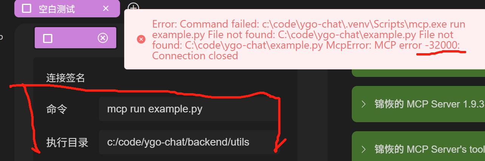
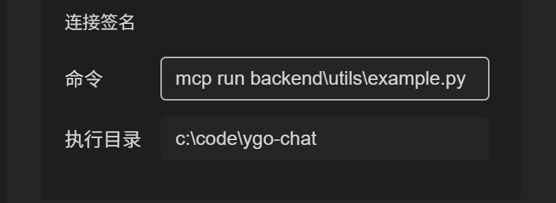

# Configuration When Virtual Environment and Entry File Are in Different Directories

## Problem Description

When using OpenMCP, you may sometimes encounter situations where the virtual environment (venv) and the Python file are not located in the same directory, or the virtual environment might even be outside the project folder. In such cases, clicking the connect button on the top right may result in an MCP connection failure (Error Code: 32000).

## Solution

### 1. Adjust the Execution Directory

In the connection options, you need to set the execution directory to where the virtual environment is located:



### 2. Modify the Execution Command

At the same time, adjust the execution command accordingly:



### 3. Directly Specify the Interpreter Path

For certain cases, you can directly specify the full path of the Python interpreter in the command, for example:

```bash
C:\code\ygo-chat\.venv\Scripts\python.exe example.py
```

> Note: This method also applies to the command field for node or mcp instructions, as well as other MCP client configuration files.
