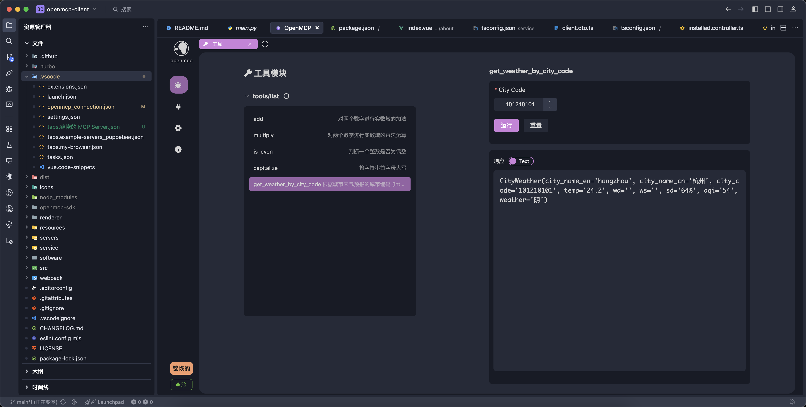

---
---

# OpenMCP 概述

:::warning
在正式开始 OpenMCP 的学习之前，我们强烈推荐您先了解一下 MCP 的基本概念：[Agent 时代基础设施 | MCP 协议介绍](https://kirigaya.cn/blog/article?seq=299)
:::

## 什么是 OpenMCP

OpenMCP 是一个面向开发者的 MCP 调试器和 SDK，致力于降低 AI Agent 的全链路开发成本和开发人员的心智负担。

OpenMCP 分为两个部分，但是本板块讲解的是 OpenMCP 调试器的部分的使用，这部分也被我们称为 OpenMCP Client。OpenMCP Client 的本体是一个可在类 vscode 编辑器上运行的插件。它兼容了目前 MCP 协议的全部特性，且提供了丰富的利用开发者使用的功能，可以作为 Claude Inspector 的上位进行使用。

:::info 类 vscode 编辑器 (VLE)
类 vscode 编辑器 (vscode-like editor，简称 VLE) 是指基于 Vscodium 内核开发的通用型代码编辑器，它们都能够兼容的大部分的vscode插件生态，并且具有类似 vscode 的功能（比如支持 LSP3.7 协议、拥有 remote ssh 进行远程开发的能力、拥有跨编辑器的配置文件）。

比较典型的 VLE 有：vscode, trae, cursor 和 vscodium 各类发行版本。
:::

## 什么是 Claude Inspector

Claude Inspector 是一款 Claude 官方（也就是 MCP 协议的提出者）发布的开源 MCP 调试器，开发者在开发完 MCP 服务器后，可以通过这款调试器来测试功能完整性。

但是 Inspector 工具存在如下几个缺点：

- 使用麻烦：使用 Inspector 每次都需要通过 mcp dev 启动一个 web 前后端应用
- 功能少：Inspector 只提供了最为基础的 MCP 的 tool 等属性的调试。如果用户想要测试自己开发的 MCP 服务器在大模型的交互下如何，还需要连接进入 Claude Desktop 并重启客户端，对于连续调试场景，非常不方便。
- 存在部分 bug：对于 SSE 和 streamable http 等远程连接的场景，Inspector 存在已知 bug，这对真实工业级开发造成了极大的影响。
- 无法对调试内容进行保存和留痕：在大规模微服务 mcp 化的项目中，这非常重要。
- 无法同时调试多个 mcp 服务器：在进行 mcp 原子化横向拓展的场景中，这是一项必要的功能。

而 OpenMCP Client 被我们制作出来的一个原因就是为了解决 Inspector 上述的痛点，从而让 mcp 服务器的开发门槛更低，用户能够更加专注于业务本身。