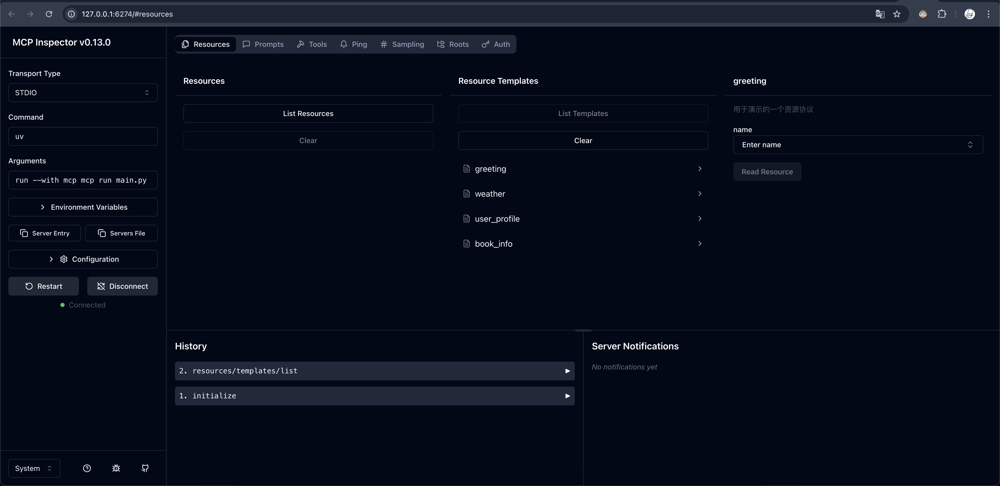

---
next:
  text: What is MCP?
  link: '/plugin-tutorial/what-is-mcp'
---

# OpenMCP Overview

:::warning
Before starting with OpenMCP, we strongly recommend understanding the basic concepts of MCP: [Agent Era Infrastructure | MCP Protocol Introduction](https://kirigaya.cn/blog/article?seq=299)
:::

## What is OpenMCP

OpenMCP is a developer-oriented MCP debugger and SDK, dedicated to reducing the full-chain development costs of AI Agents and developers' cognitive load.

OpenMCP consists of two parts, but this section focuses on using the OpenMCP debugger portion, which we call OpenMCP Client. The OpenMCP Client is a plugin that runs on vscode-like editors. It's compatible with all current MCP protocol features and provides rich developer-friendly functionality, serving as an enhanced replacement for Claude Inspector.

:::info Vscode-like Editors (VLE)
Vscode-like editors (VLE) refer to general-purpose code editors developed based on the Vscodium core. They can mostly support the vscode plugin ecosystem and have similar functionality to vscode (such as supporting LSP3.7 protocol, remote SSH for development, and cross-editor configuration files).

Typical VLEs include: vscode, trae, cursor, and various Vscodium distributions.
:::

## What is Claude Inspector

Claude Inspector is an open-source MCP debugger released by Claude (the proposer of the MCP protocol). Developers can use this debugger to test functionality after developing an MCP server.

However, Inspector has several drawbacks:

- Cumbersome to use: Requires starting a web application via `mcp dev` each time
- Limited features: Only provides basic debugging of MCP tool properties. Testing MCP server interactions with large models requires connecting to Claude Desktop and restarting the client, which is inconvenient for continuous debugging scenarios.
- Contains bugs: Known issues with SSE and streamable HTTP remote connections significantly impact real-world industrial development.
- No debugging content saving/tracing: Critical for large-scale microservice MCP projects.
- Cannot debug multiple MCP servers simultaneously: Essential for MCP atomic horizontal scaling scenarios.

The OpenMCP Client was developed to address these Inspector pain points, lowering MCP server development barriers and allowing users to focus more on business logic.