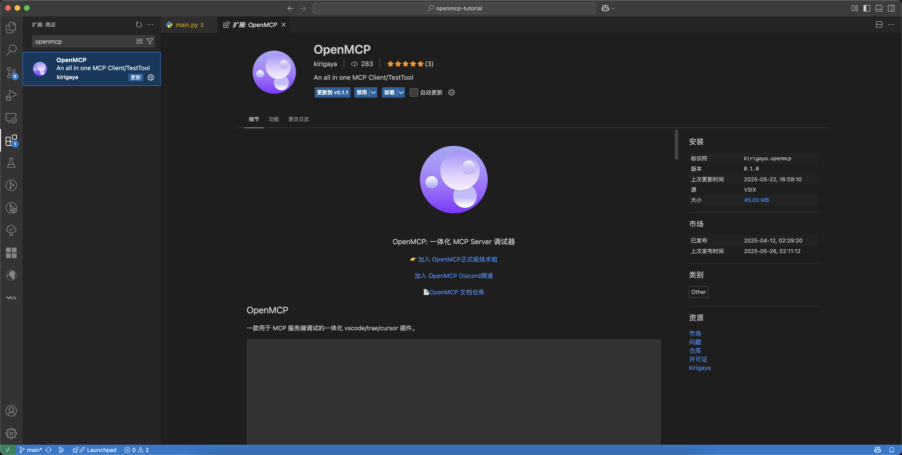
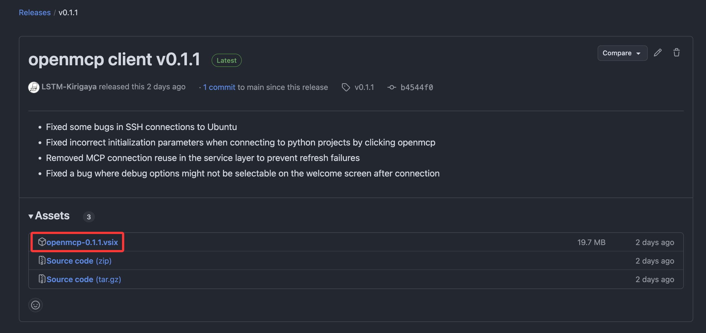
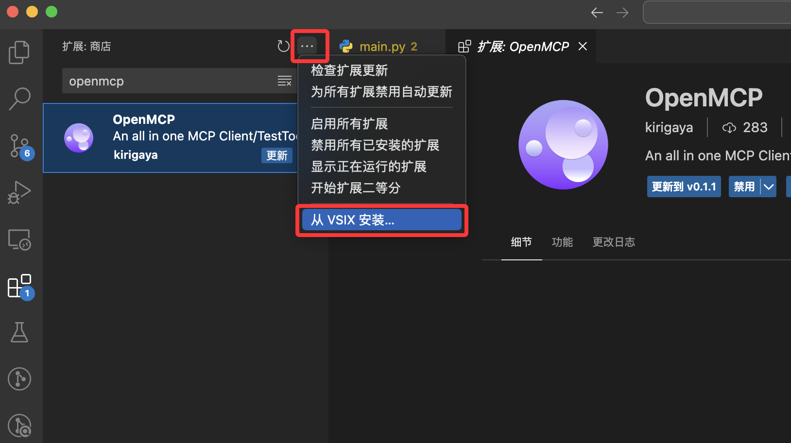

# Getting OpenMCP

## Installing OpenMCP from the Plugin Marketplace

You can directly obtain the OpenMCP plugin from the plugin marketplace of mainstream VLEs. For example, in vscode, click on the left side's plugin marketplace, and then search for `OpenMCP` in the search bar to find the OpenMCP plugin.



## Offline Installation

VLE plugins are essentially zip files with the `.vsix` extension, which are cross-platform. Our CI/CD bot automatically builds and uploads the `.vsix` file to GitHub Releases after every version release. You can access the corresponding GitHub release page for each version through the following link:

```
https://github.com/LSTM-Kirigaya/openmcp-client/releases/tag/v{version_number}
```

For example, for version 0.1.1, its release page link is: [https://github.com/LSTM-Kirigaya/openmcp-client/releases/tag/v0.1.1](https://github.com/LSTM-Kirigaya/openmcp-client/releases/tag/v0.1.1)

Under the `Assets` section, you can find the corresponding `.vsix` file.



In addition, you can also get the latest OpenMCP `.vsix` from the following marketplace web pages:

* [https://open-vsx.org/extension/kirigaya/openmcp](https://open-vsx.org/extension/kirigaya/openmcp)
* [https://marketplace.visualstudio.com/items?itemName=kirigaya.openmcp](https://marketplace.visualstudio.com/items?itemName=kirigaya.openmcp)

Click on the `.vsix` file to download it. After the download is complete, you can directly install it. There are two ways to install an external `.vsix` file in VLE.

### Method 1: Install in VLE

In the VLE plugin marketplace page, there is a button with three dots. After clicking it, you will see a list with a button I have highlighted in red.



Click on it, find the `.vsix` file you just downloaded, and click to complete the installation.

### Method 2: Install via Command Line

If your VLE is globally installed, a command-line tool will be available automatically. The command is as follows:

::: code-group

```bash [vscode]
code --install-extension /path/to/openmcp-0.1.1.vsix
```

```bash [trae]
trae --install-extension /path/to/openmcp-0.1.1.vsix
```

```bash [cursor]
cursor --install-extension /path/to/openmcp-0.1.1.vsix
```

:::

`/path/to/openmcp-0.1.1.vsix` represents the absolute path of the `.vsix` file you just downloaded. This will also install the plugin.
