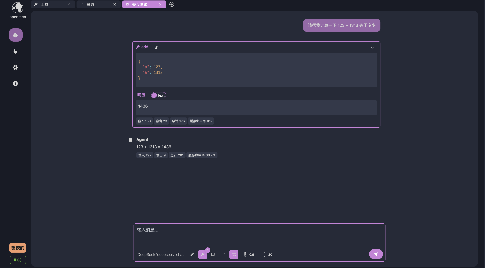
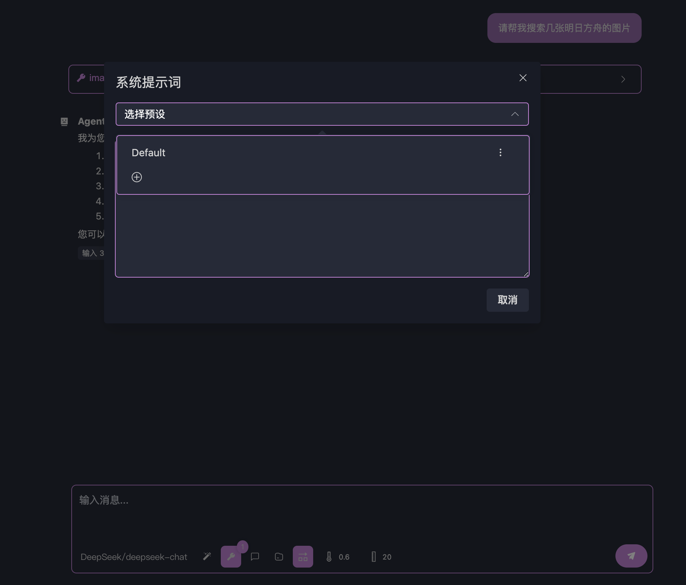

# Throw It into a Large Model to Test Its Effectiveness!

In the [[quick-debug|previous chapter]], we successfully connected to the MCP server and debugged its various features—giving us a good overview of OpenMCP’s basic debugging capabilities. Now, it’s time to place the MCP into a large language model (LLM) environment to test it. After all, the primary goal of MCP is to make it easy and low-cost to integrate your own functionalities into an LLM.

Before we begin the actual interaction, please follow the instructions in [[connect-llm|Connecting to a Large Model]] to configure your LLM API and ensure your LLM service is working correctly.

## Talking to a Large Model

Let’s start by creating a new debug project and choosing **“Interactive Test”**, which opens a chat window for interacting with the LLM. Here’s a basic overview of the chat window provided by OpenMCP:


Several important buttons are marked in the image above. When using it for the first time, you can proceed with the default settings. By clicking “**Tools in Use**,” you’ll see the currently active tools. By default, OpenMCP activates all tools provided by the connected MCP server. If you'd like to disable any tools, you can selectively do so via the same button:


Alright, let’s test how the large model calls our tools via the MCP protocol. Keep the default settings, and ask this question: <mark>Can you help me calculate 123 + 1313?</mark>

Press enter and wait for the result. You should see something like this:



As you can see, the LLM chose to use the `add` tool we provided to perform the addition. OpenMCP also shows exactly how the LLM invoked the tool and the result returned by the tool. While this example is simple, for more complex queries, the LLM may call multiple tools in a single round to complete a task. If you want the model to only use one tool per response, you can disable the default setting **“Allow multiple tools per turn”** by clicking the toggle button below.

## System Prompts

For special cases—such as [bing-images](/Users/bytedance/projects/openmcp-tutorial/bing-images), an MCP server that returns Bing images based on keywords—you may need to guide the model on how to format its output.

Try asking: <mark>Can you help me search for some Arknights images?</mark>

By default, you might get a response like this:


Here, the LLM returns image links. However, what we really want is for the images to be displayed directly on the screen. To instruct the LLM to return Markdown-style image outputs, we can use a **system prompt**.

Click on the “**System Prompt**” button below:



Add a new system prompt with the title **"bing image"** and the content:

```
You are an AI skilled at finding Bing images. When you find images, you should return them in Markdown image format, e.g., 
```

Click save:


Next, move your cursor to the first user message box. Several buttons will appear—click the **Re-run** button to re-execute that conversation turn:


Now you should see the images rendered correctly:


For more tips on using system prompts or other advanced techniques to control the behavior of agents, see [[go-neo4j-sse|Building a Read-only Neo4j MCP Server with Go (SSE)]].

## Conclusion

Great job! You've completed the basic OpenMCP tutorial. Now it’s time to build something fun and meaningful. Check out the [[mcp-examples|MCP Server Development Examples]] for more use cases and inspiration.

The world is full of surprises—take your pick!
