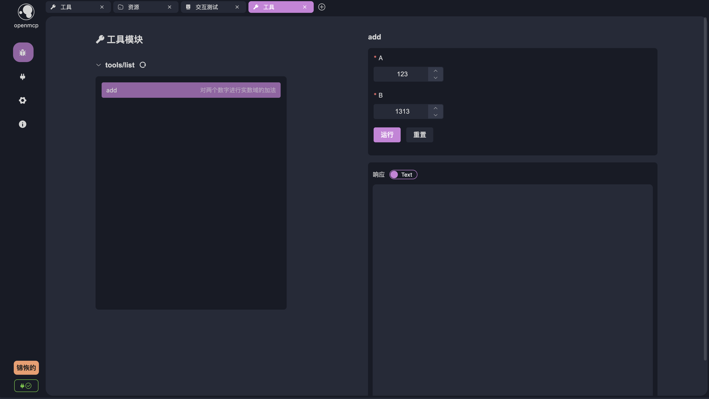

# 扔进大模型里面测测好坏！

在 [[quick-debug|之前的章节]] 中，我们成功完成了 mcp 服务器的连接和各个功能的调试，也算是带大家认识了一下 openmcp 的基本调试功能。接下来，我们需要把 mcp 放到大模型环境中来测试，毕竟，mcp 提出的初衷就是为了让大家可以低成本把自己写的功能接入大模型中。

在正式进行对话前，还请大家先参照 [[connect-llm|连接大模型]] 来完成大模型 API 的配置，并测试完成你的大模型服务是否可用。

## 和大模型进行对话

我们先创建一个新的调试项目，选择「交互测试」，就可以进入一个和大模型对话的窗口。OpenMCP 提供的对话窗口的基本介绍如下：


上面标定了几个比较重要的按钮，初次使用，您可以直接使用默认设置。点击「使用的工具」，可以看到当前激活的工具，OpenMCP 默认激活当前连接的 mcp 服务器的所有提供的工具，如果您希望禁用某些工具，可以点击下方的「使用的工具」来选择性地禁用工具：


好啦，让我们先来看看基于 mcp 协议，大模型会如何调用我们的工具吧，保持默认设置，然后询问如下问题：<mark>请帮我计算一下 123 + 1313 等于多少</mark>

输入后回车等待结果，可以看到如下的输出：


可以看到大模型选择使用了我们提供的工具 add 完成了上述的加法，OpenMCP 中你能看到大模型是如何调用每一个工具的和工具的返回结果。目前我们问的问题和 mcp 提供的工具都比较简单，对于复杂问题，大模型有可能会在一轮内同时调用多个工具来完成特定的任务，如果你希望大模型每次都只使用一个工具，可以点击下方的默认亮着的「允许模型在单轮回复中调用多个工具」 来禁用这个特性。

## 快速调试

在我们调试的过程中，难免会出现大模型回答得不好，而且这是因为某个工具出错导致的，为了快速定位是不是工具的问题，可以点击下方的小飞机图标


点击后，OpenMCP 会一个新的测试 tool 的项目，并自动把当时大模型使用的参数自动填充到右侧的表单中：



你要做的，只是点击运行来确定或者排除一个错误选项。

## 系统提示词

对于一些特殊的情况，比如 [bing-images](/Users/bytedance/projects/openmcp-tutorial/bing-images)，这是一个根据关键词来返回 bing 图片的 mcp 服务器。

我们直接询问如下的问题：<mark>请帮我搜索几张明日方舟的图片</mark>，默认情况下，你有可能会得到如下的回复：


大模型将得到的图片以链接的形式返回了，但是有的时候其实我希望是返回成图片的形式渲染在屏幕中让我看到的，为了约束和引导大模型返回文本的风格、或是按照我们要求的模板进行返回，我们可以通过设置系统提示词的方式来实现。

我们先点击下方的「系统提示词」


我们添加一个新的系统提示词，在标题输入「bing image」，然后主体部分填入：

```
你是一个擅长找 bing 图片的 AI，当你找到图片时，你应该返回图片形式的 markdown，比如 
```

点击保存。


