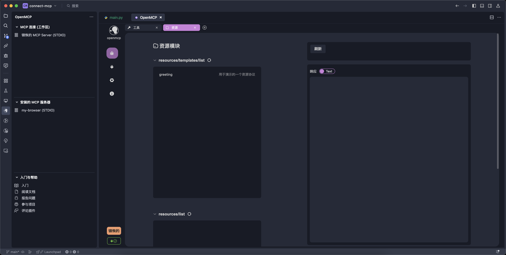

# Quick Debugging of MCP

In [[first-mcp|Your First MCP]], we successfully created a minimal MCP server instance and connected to it using OpenMCP.

Now, it’s time to debug the server's functions. After all, not everyone is Jeff Dean—we don’t always get everything right on the first try. MCP servers are rarely production-ready the moment they're written; there are often hidden issues. Imagine debugging a full-chain setup where your MCP is connected to a large model—if something goes wrong, there are many possible failure points: is it the MCP server? The LLM vendor? OpenMCP itself? Categorizing potential errors and inspecting them one by one is the right way to go—this is **engineering intuition**.

## Getting to Know the Panel

When you first open OpenMCP, you’ll land on a dashboard with four buttons, each representing a different type of debugging project:

Right now, we need to verify that the **tool**, **resource**, and **prompt** functions are working properly. Since **tool** is the most frequently used in real projects, we’ll start by debugging it.

## Debugging Tools

To debug a tool, click the “Tool” button on the dashboard to enter the tool debugging interface. Here's a basic overview of the tool panel:

To debug, first select a tool from the “Tool List” (click the right-side button to expand or refresh the list if needed). Then, on the right side under “Parameter Input & Execution,” enter test parameters and click **Run** to see the result:

For example, testing `2 + 2` yields the result `4`, confirming that our MCP is connected properly and functioning correctly. You can use simple tests like this to verify your server’s availability—this becomes especially important when debugging complex agent systems, and can even be scripted as part of an automated self-check.

## Adding a Test Project

After testing one feature, you can add more test cases by clicking the **+** icon at the top:

Here, select **Resource** to start debugging resources. Note that MCP protocol has two types of resource access:

* `resources/templates/list`: **Template resources**, which accept parameters (e.g., file path) and return resource content accordingly—like a file system MCP.
* `resources/list`: **Basic resources**, which do not accept parameters and simply return static or live data—like the browser console MCP that returns current stdout.

Using `resources/templates/list` is similar to debugging tools—just enter the parameter and click **Run** to view the output:

For `resources/list`, since no parameters are required, just click on the resource name in the list to view its data.

## Summary

In this chapter, we covered how to use OpenMCP to debug an MCP server, including how to test **tools** and **resources**. The process for debugging **prompts** is similar, so feel free to try it on your own.

In the next chapter, we’ll move on to the most exciting part—testing your MCP server with a large model to see whether what you've built is truly fun and valuable.

