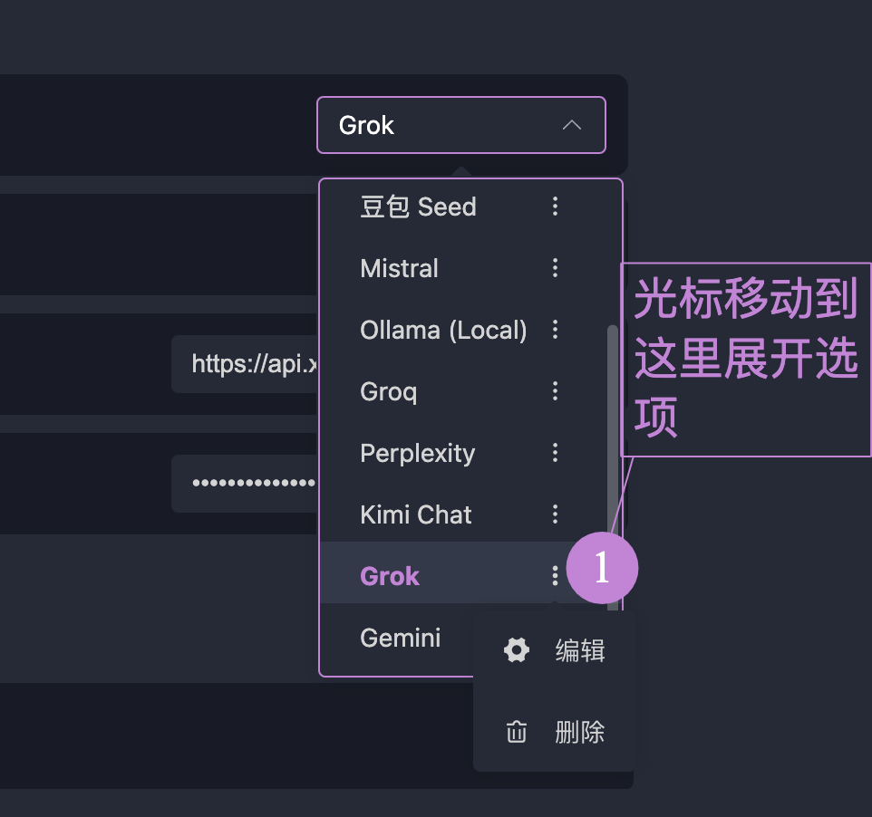

# 连接大模型

如果需要使用「交互测试」来在和大模型的交互中测试 MCP 工具的性能，你需要首先需要在 OpenMCP 配置大模型。

:::warning 协议兼容性警告
目前 OpenMCP 只支持符合 OpenAI 接口规范的 大模型服务，其他大模型的调用需要请通过 [newApi](https://github.com/QuantumNous/new-api) 进行转发或者自行实现。

目前市面上主流的如下模型我们都是支持的，如果遇到大模型连接的问题，请随时 [[channel|联系我们]]。
:::

在 「设置」-「API」 可以进入大模型的连接配置界面。

## 默认支持的模型

OpenMCP 默认填充了市面上常见的大模型，下面是支持的模型

| 大模型 Name          | 提供商                     | baseUrl                                      | 默认模型               |
|----------------------|---------------------------|---------------------------------------------|-----------------------|
| DeepSeek             | DeepSeek                  | `https://api.deepseek.com/v1`               | `deepseek-chat`       |
| OpenAI               | OpenAI                    | `https://api.openai.com/v1`                 | `gpt-4-turbo`        |
| 通义千问 Qwen        | Alibaba                   | `https://dashscope.aliyuncs.com/compatible-mode/v1` | `qwen-plus`          |
| 豆包 Seed            | ByteDance                 | `https://ark.cn-beijing.volces.com/api/v3`  | `doubao-1.5-pro-32k` |
| Gemini               | Google                    | `https://generativelanguage.googleapis.com/v1beta/openai/` | `gemini-2.0-flash`   |
| Grok                 | xAI                       | `https://api.x.ai/v1`                       | `grok-3-mini`        |
| Mistral              | Mistral AI                | `https://api.mistral.ai/v1`                 | `mistral-tiny`       |
| Groq                 | Groq                      | `https://api.groq.com/openai/v1`            | `mixtral-8x7b-32768` |
| Perplexity           | Perplexity AI             | `https://api.perplexity.ai/v1`              | `pplx-7b-online`     |
| Kimi Chat            | 月之暗面 (Moonshot AI)    | `https://api.moonshot.cn/v1`                | `moonshot-v1-8k`     |

## 配置大模型

你需要做的只是把对应服务商的 apiToken 填入 openmcp 中即可。然后点击「测试」，看到下面的响应说明连接成功。您就可以在交互测试里面使用大模型了！

:::warning
有些用户会遇到无法访问的问题，请确保你的 baseUrl 填写正确。如果在国内使用某些国外厂商的服务，比如 gemini，openai，请确保你的网络环境可以访问到这些服务。在 「设置」-「通用」中你可以设置代理服务器。
:::

## 添加模型

如果你想使用的指定服务商的模型不在默认支持的模型中，有两种方法可以添加它们。

### 方法一：更新模型列表

此处以通义千问为例子，确保在 apitoken 填写正确的情况下，点击「更新模型列表」，如果服务商严格实现了 openai 标准，那么就能看到所有更新的模型了。

### 方法二：手动添加模型

如果你的服务器没有支持 openai 标准，你将无法使用「方法一」，你可以如此手动添加模型列表。此处以 Grok 为例，在服务商中找到 grok，点击图中所示的编辑

点击模型，输入模型名称，回车，点击确认：

回到 api 页面，再点击保存。

## 添加服务

如果你要的服务商没有出现我们的列表中（云服务商的服务，或者自己部署的服务），可以通过「添加服务」按钮来添加自定义模型，使用方法和「添加模型」「方法二：手动添加模型」类似，就不赘述了。
