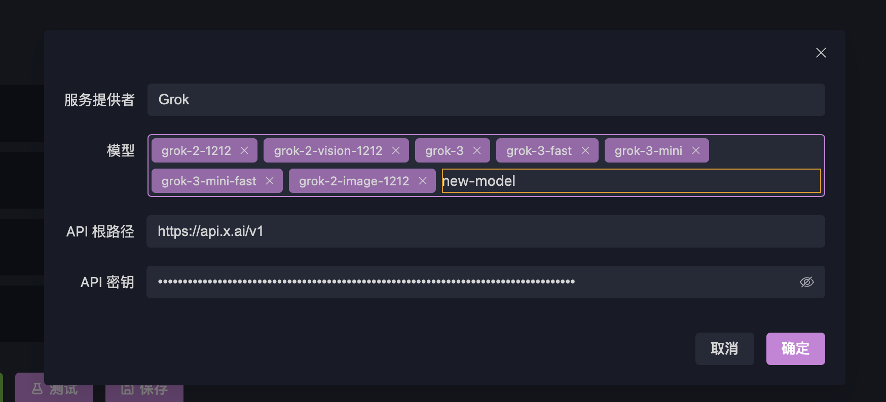

# Connecting to LLMs (Large Language Models)

To use the **"Interactive Testing"** feature for evaluating your MCP tools in conversations with an LLM, you’ll first need to configure an LLM in OpenMCP.

:::warning Compatibility Notice
Currently, OpenMCP only supports LLM services that are **OpenAI API-compatible**. To use other types of LLMs, you can use a proxy like [newApi](https://github.com/QuantumNous/new-api) or implement your own adapter.

We support most mainstream LLMs out of the box. If you encounter issues connecting to an LLM, feel free to [[channel|contact us]].
:::

To configure an LLM, go to **Settings → API**:

## Supported Models (by default)

OpenMCP comes pre-configured with commonly used LLM services. Here is a list of supported models:

| LLM Name              | Provider      | baseUrl                                                    | Default Model        |
| --------------------- | ------------- | ---------------------------------------------------------- | -------------------- |
| DeepSeek              | DeepSeek      | `https://api.deepseek.com/v1`                              | `deepseek-chat`      |
| OpenAI                | OpenAI        | `https://api.openai.com/v1`                                | `gpt-4-turbo`        |
| Qwen (Tongyi Qianwen) | Alibaba       | `https://dashscope.aliyuncs.com/compatible-mode/v1`        | `qwen-plus`          |
| Doubao Seed           | ByteDance     | `https://ark.cn-beijing.volces.com/api/v3`                 | `doubao-1.5-pro-32k` |
| Gemini                | Google        | `https://generativelanguage.googleapis.com/v1beta/openai/` | `gemini-2.0-flash`   |
| Grok                  | xAI           | `https://api.x.ai/v1`                                      | `grok-3-mini`        |
| Mistral               | Mistral AI    | `https://api.mistral.ai/v1`                                | `mistral-tiny`       |
| Groq                  | Groq          | `https://api.groq.com/openai/v1`                           | `mixtral-8x7b-32768` |
| Perplexity            | Perplexity AI | `https://api.perplexity.ai/v1`                             | `pplx-7b-online`     |
| Kimi Chat             | Moonshot AI   | `https://api.moonshot.cn/v1`                               | `moonshot-v1-8k`     |

## Configuring the LLM

All you need to do is enter the corresponding `apiToken` for your provider. Then click the **Test** button. If the connection is successful, you’ll see a response like this:

## Adding More Models

If the model you want to use is not in the default list, you can add it in two ways:

### Method 1: Update Model List Automatically

Using Qwen as an example, after entering a valid `apiToken`, click **Update Model List**. If the provider strictly follows the OpenAI API standard, all available models will be fetched automatically.

### Method 2: Manually Add Model

If your server doesn’t follow the OpenAI standard, you won’t be able to use method 1. You can instead manually add models. For example, to add a Grok model:

1. Locate **Grok** under providers and click **Edit**:

2. Click on the **Models** section, type the model name, press Enter, then click **Confirm**:

3. Return to the API page and click **Save**.

## Adding Custom Services

If the provider you want to use is not listed (e.g., a self-hosted model or a new cloud service), you can add it using the **Add Service** button. The process is similar to **Manual Model Addition** and won’t be repeated here.

