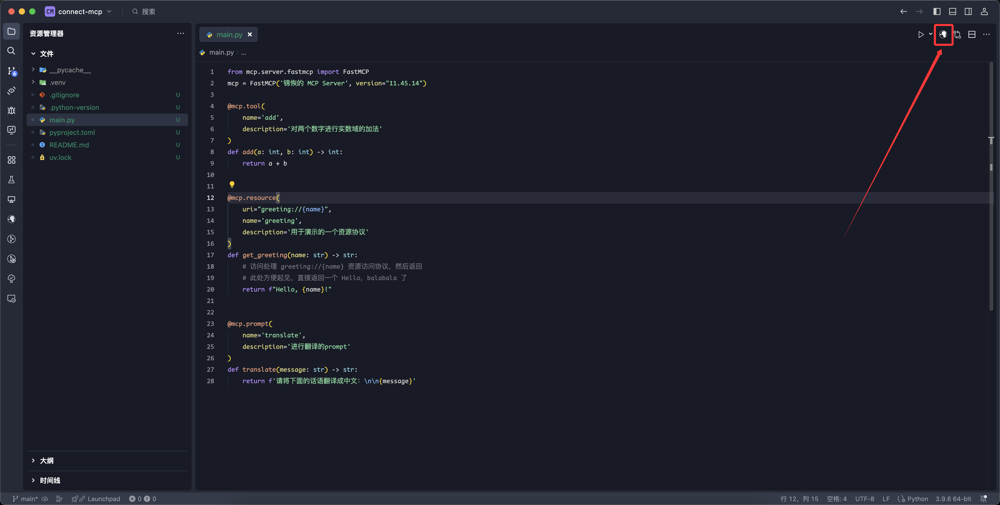
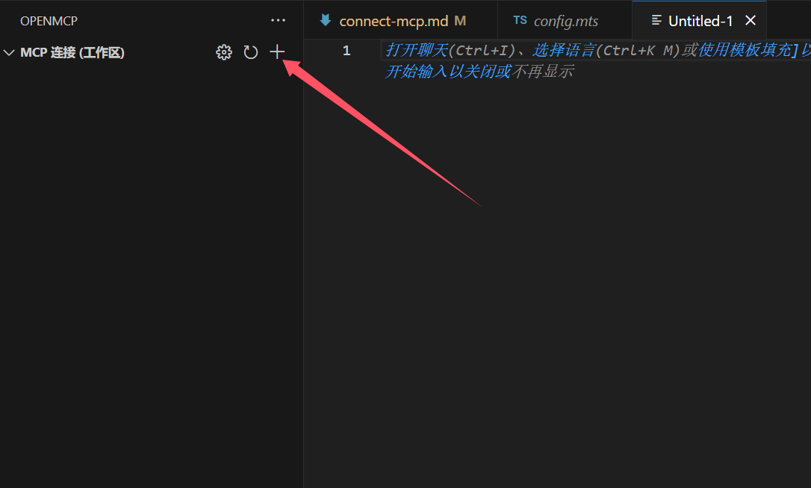
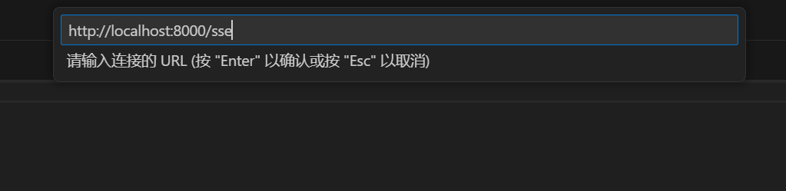

# Connecting to an MCP Server

Unlike Claude Desktop or other MCP client products, OpenMCP offers a **much smoother process** for connecting to MCP servers.

:::info What is an MCP Client?
An **MCP client** is a local application that communicates using the MCP protocol, typically in the form of a chatbot interface (similar to chat.deepseek.com or chat.openai.com). It's usually run as a local application because web pages lack direct file I/O permissions.
:::

To get started, open your VLE (Visual Language Environment). After installing OpenMCP following the steps in [[acquire-openmcp|Getting OpenMCP]], let's use Python to create a simple MCP server and test the connection.

## One-Click Connection with OpenMCP

In the [[first-mcp|Your First MCP]] example, we defined three functions as MCP `tool`, `resource`, and `prompt`. Launching them in OpenMCP is super easy—click the OpenMCP icon in the top-right corner:



Once logged in, if you see a success message like below, your MCP server is now running and connected properly:


## STDIO Connection (Auto-Start)

If you're using **STDIO** as the connection method, OpenMCP offers one-click auto-start support. You don't need to manually run the MCP process—OpenMCP will handle launching and shutting it down.

Currently supported languages and their launch configurations:

| Language | Launch Command           | Root Directory Determination              |
| -------- | ------------------------ | ----------------------------------------- |
| Python   | `uv run mcp run ${file}` | First parent folder with `pyproject.toml` |
| Node.js  | `node ${file}`           | First parent folder with `package.json`   |
| Go       | `go run ${file}`         | First parent folder with `go.mod`         |

## SSE & Streamable HTTP Connection

For **SSE (Server-Sent Events)** and **Streamable HTTP** remote connections, OpenMCP can’t auto-start your server since the port and host may be defined in hidden config files or environment variables. In these cases, **you must manually configure the connection.**

To do this, open the **OpenMCP** plugin from the left sidebar in your VLE and go to **"MCP Connections (Workspace)"**. Click the "+" to create a new connection:



Select the type of communication method:


Then input your MCP Server's endpoint address:



## OpenMCP Plugin Control Panel

On the left sidebar of your VLE, you’ll find the OpenMCP icon. Clicking it opens the control panel:


Previously connected MCP servers for the current workspace will be listed here. That’s because OpenMCP stores connection details in files like:

```
.openmcp/tabs.{server-name}.json
```

Where `{server-name}` is the name of the connected MCP server.

If you'd like to use an MCP server **across all workspaces**, consider adding it to the **"Installed MCP Servers"** section—those servers are globally accessible.

Lastly, check out the **"Getting Started & Help"** section for reference materials to guide your journey.

