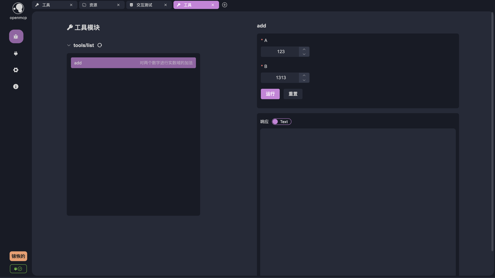
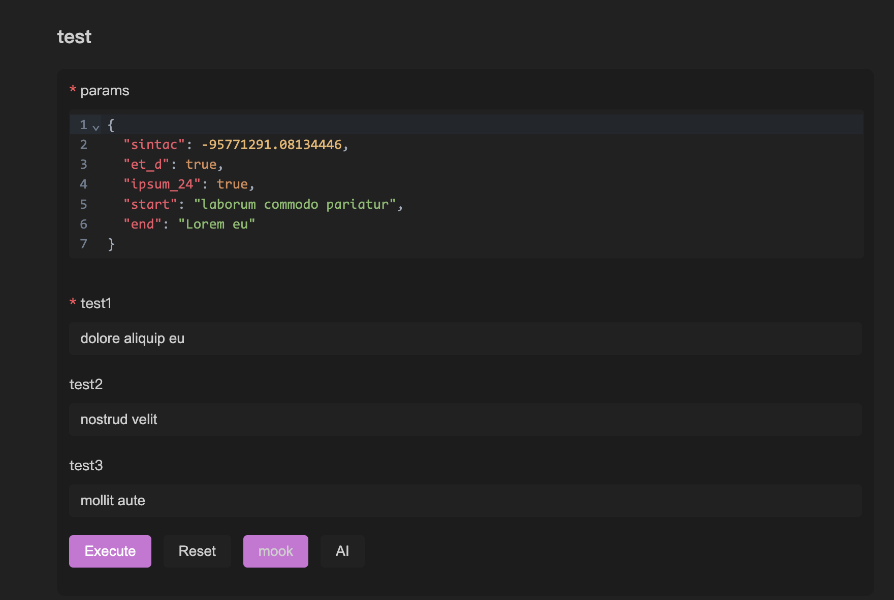
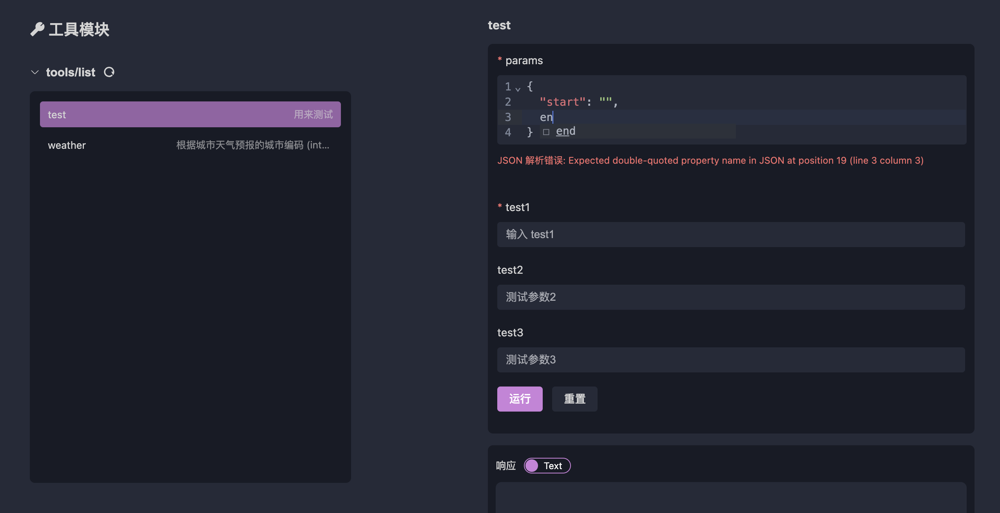

# MCP Basic Debugging

## Basic Debugging

In [[quick-debug.md|Quick Debugging]], we briefly introduced how to debug MCP. This chapter focuses on some features and advanced functionalities of the debugging module in OpenMCP.

## Tabs

OpenMCP uses tabs as the smallest unit for debugging projects. Click the + in the toolbar to create a new tab. The basic usage of OpenMCP's tools, resources, and prompts is similar to the Inspector, but OpenMCP automatically initializes the resource list on the left, whereas this step requires manual completion in the Inspector.

## Auto-Saving Debug Content

OpenMCP features automatic saving of test results. The following actions will trigger OpenMCP to save the tab and its contents:

- Creating a tab and selecting a valid debugging project
- Performing debugging actions on the debugging page (selecting tools, executing tools, querying large models, etc.)

The test data for the current MCP project is saved in `.openmcp/tabs.{server-name}.json`, where `{server-name}` is the name of the successfully connected MCP server.

:::warning
Note: Within the same project, you should not have two MCP servers with identical names. This will cause connection information storage conflicts in `.openmcp/tabs.{server-name}.json`, leading to unknown errors.
:::

## Quick Reproduction in Interactive Testing

During debugging, it's inevitable that the large model may provide unsatisfactory answers due to a tool error. To quickly determine whether the issue lies with the tool, you can click the small airplane icon below.


After clicking, OpenMCP will create a new test tool project and automatically fill the form on the right with the parameters used by the large model at that time:



All you need to do is click "Run" to confirm or rule out an error.

## Mock Data

To quickly test the response of a set of MCP tools, we provide a mock data feature. It allows you to quickly generate usable parameters based on the MCP tool's schema to test the tool's functionality.

We offer two mock methods. The first is the mock button, which automatically generates mock data with no practical meaning but can fill the form. The `mock` button in the image below triggers this function.



We also provide an AI mock feature, which uses AI to generate mock data. This data is more realistic and reliable, but you need to configure your large model in [[connect-llm|Connect Large Model]] first. The `AI` button in the image below triggers this function, and you can also customize the prompt for generating mock data.


## Pydantic Support

When creating tools using Python's FastMCP, you have two methods to declare interface types. One is using Python's default typing library to declare complex data structures, and the other is using Pydantic to declare complex variables. Here's an example:

```python
from mcp.server.fastmcp import FastMCP
from pydantic import BaseModel, Field
from typing import Optional, Union, List, NamedTuple

mcp = FastMCP('Jinhui's MCP Server', version="11.45.14")

class PathParams(BaseModel):
    start: str
    end: str

@mcp.tool(name="test",description="Used for testing")
def test(
    params: PathParams,
    test1: str,
    test2: Union[str, List[str]] = Field("", description="Test parameter 2"),
    test3: Optional[str] = Field(None, description="Test parameter 3")
):
    return [test1, test2, test3, params]
```

Since we have implemented internal conversion for these two declaration methods, OpenMCP supports both. Notably, if the declared variable is an object, such as `PathParams` above, OpenMCP's tool debugging window will generate an "object input box," which supports basic format checks and auto-completion:



:::info What is an object?
Here, an "object" is a concept in JavaScript, referring to the part of serializable data types that excludes basic data types. For example, { "name": "helloworld" } is an object. In Python, objects are more similar to dicts or namedTuples.
:::

:::warning
Although OpenMCP supports as many scenarios as possible, in production environments, we still do not recommend defining MCP tool parameters as objects. Defining them as simple data types can also improve the stability of large models when making tool calls.
:::