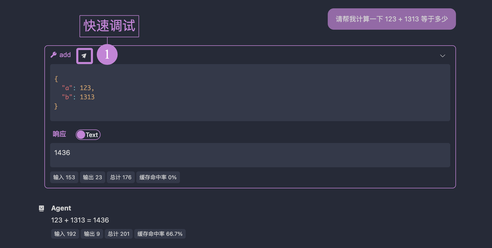

# Debugging Tools, Resources, and Prompts

## Tabs

OpenMCP uses tabs as the smallest unit for debugging items. Click the "+" button in the navigation bar to create a new tab. The basic usage of Tools, Resources, and Prompts in OpenMCP is similar to the Inspector, but OpenMCP automatically initializes the resource list on the left—a step that requires manual effort in the Inspector.

## Auto-Saving Debug Content

OpenMCP features automatic saving of test results. The following actions will trigger OpenMCP to save the tab and its contents:

- Creating a tab and selecting a valid debugging item.
- Performing debugging actions on the debug page (selecting tools, executing tools, querying the large model, etc.).

The test data for the current MCP project is saved in `.openmcp/tabs.{server-name}.json`, where `{server-name}` corresponds to the successfully connected server's name.

:::warning
Note: Within the same project, you should not have two MCP servers with identical names. This will cause conflicts in the `.openmcp/tabs.{server-name}.json` connection information storage, leading to undefined errors.
:::

## Quick Debugging

During debugging, it's common for the large model to provide unsatisfactory responses due to tool errors. To quickly identify whether a tool is the culprit, click the small airplane icon at the bottom:



After clicking, OpenMCP will create a new test tool project and automatically populate the form on the right with the parameters the large model used:


All you need to do is click "Run" to confirm or rule out a potential error.

## Pydantic Support

When creating tools using Python's `fastmcp`, you have two ways to declare interface types:

1. Using Python's built-in `typing` library for complex data structures.
2. Using `pydantic` to define complex variables. Here's an example:

```python
from mcp.server.fastmcp import FastMCP
from pydantic import BaseModel, Field
from typing import Optional, Union, List, NamedTuple

mcp = FastMCP('Jinhui's MCP Server', version="11.45.14")

class PathParams(BaseModel):
    start: str
    end: str

@mcp.tool(name="test", description="Test tool")
def test(
    params: PathParams,
    test1: str,
    test2: Union[str, List[str]] = Field("", description="Test parameter 2"),
    test3: Optional[str] = Field(None, description="Test parameter 3")
):
    return [test1, test2, test3, params]
```

Since we've implemented internal conversion for both declaration methods, OpenMCP supports both. Notably, if you declare a variable as an object (e.g., `PathParams` above), OpenMCP's tool debug window will generate an "Object Input Field" with basic format validation and auto-completion:


:::info What is an "object"?
Here, an "object" refers to the JavaScript concept—serializable data types excluding primitives. For example, `{ "name": "helloworld" }` is an object. In Python, this is more akin to a `dict` or `namedTuple`.
:::

:::warning
Although OpenMCP supports most use cases, we still recommend avoiding object-type parameters for MCP tools in production. Using simple data types improves the stability of tool calls by the large model.
:::