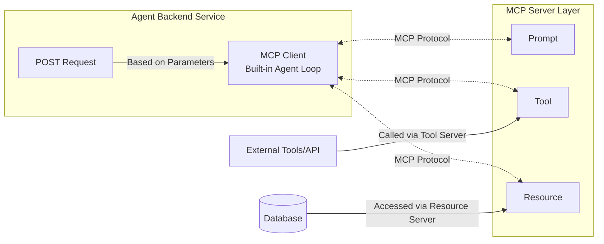

# Exporting MCP Server

After completing the development and validation of your MCP through previous steps, it's time to deploy your MCP to your production environment.

Since Node.js is currently the most popular full-stack development ecosystem globally, this tutorial uses Node.js as an example to introduce the subsequent steps. Other backend languages (Java, Go, Python) are similar.

## Basic Structure of Agent Backend Service

Assuming you have thoroughly read the basic concepts of MCP servers, the following architecture diagram should be familiar to you for an agent service.



Suppose we now need to develop an agent service to help users polish their viral promotional articles for Xiaohongshu. From a backend perspective, this requirement is divided into two parts:

1. Agent Backend Service: Used to accept user requests, maintain user login status, and perform CRUD operations on the database.
2. MCP Server Layer: Executes specific agent functional tasks. In this case, the function is "helping users polish their viral promotional articles for Xiaohongshu and returning them to the user."

## Basic Code Example

For the above example, assuming you, as an experienced backend programmer, have already written the backend POST request for the function "helping users polish their viral promotional articles for Xiaohongshu," the code looks like this:

```ts
@Controller('word')
export class WordController {
    
    @UseGuards(JwtAuthGuard)
    @Sse('make-red-book-word-doc/:id')
    makeRedBookWordDoc(
        @Param('id') id: number,
        @Request() req: ExpressRequest,
    ): Observable<any> {
        const user = req.user as User;
        return new Observable(subscriber => {
            this.wordService.redBookHandler(id, user, subscriber);
        });
    }

}
```

Where `this.wordService.redBookHandler` is the actual business function. So, how do you connect the MCP server debugged in OpenMCP to your above backend code?

It's very simple and involves three steps.

## Step 1: Export mcpconfig.json

In the "Interactive Testing" interface, click the small rocket icon below the toolbar (as shown in position 1️⃣ in the image below), and a window will pop up.


Click copy or export to save the information recorded during the current debugging session (MCP server, large model used, etc.) locally. Assume you save it to `/path/to/mcpconfig.json`.

:::tip

A great feature is that if your current debugging environment uses multiple MCP servers, OpenMCP will also save the configuration information related to these multiple servers intact into mcpconfig.json. You don't need to worry about deploying additional subsidiary MCP servers in your backend program.

> For information on multi-server connections, see [Multi-Server Connections](./multi-server.md)

:::

## Step 2: Install openmcp-sdk

OpenMCP provides a supporting SDK that can be used in Node.js. The installation method is as follows:

::: code-group
```bash [npm]
npm install openmcp-sdk
```

```bash [yarn]
yarn add openmcp-sdk
```

```bash [pnpm]
pnpm add openmcp-sdk
```
:::

The core class `OmAgent` is imported as follows:

```typescript
import { OmAgent } from 'openmcp-sdk/service/sdk';
```

## Step 3: Load mcpconfig Configuration and Easily Implement Your Service

Now, with the following code, you can quickly integrate the MCP server into your backend service:

```ts
@Injectable()
export class SlidesService {

    /**
     * @description Create a markdown task and return intermediate progress
     */
    async redBookHandler(id: number, user: User, subscriber: Subscriber<any>) {
        // Load configuration
        agent.loadMcpConfig('/path/to/mcpconfig.json');

        // Retrieve the current user's content from the document database
        const content = await this.documentService.getContent(id, user);

        // Use redbook_style_prompt to guide the agent
        const prompt = await agent.getPrompt('redbook_style_prompt', { content });    

        // Execute the task loop
        const res = await agent.ainvoke({ messages: prompt });
        
        subscriber.next(toSseData({ done: true, data: res }));
    }

}
```

For more information about openmcp-sdk, please refer to the [openmcp-sdk documentation](../../sdk-tutorial/index.md).