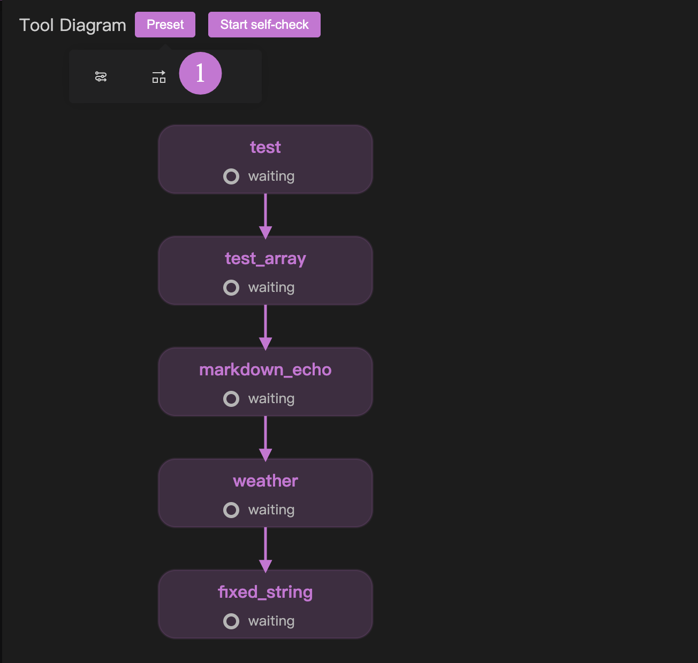
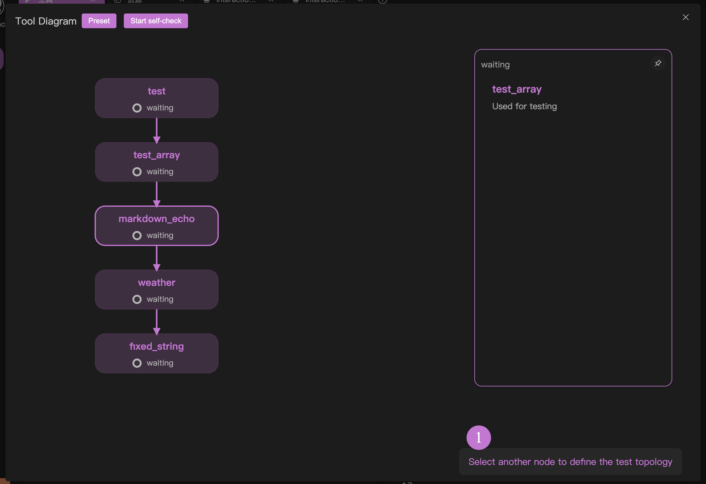

# MCP Tool Self-Check Procedure

In the debugging features, besides using mook to assist with MCP tool testing, there is another method to quickly perform a closed-loop test on all current tools. This is particularly useful during the early stages of MCP server development.

If you plan to practice MCP server development, after writing the initial program and before entering the "interactive testing" phase, we strongly recommend using the self-check procedure to avoid potential issues during interactive testing.

For an overview of the MCP tool self-check procedure, you can watch this video: [OpenMCP 0.1.9 Update Log: Supports self-checking of MCP tools & Custom topology sorting](https://www.youtube.com/watch?v=QoAhHv1IAuw)

## Basic Usage

After creating a "Tool" test project, click the button at position 1 in the image below to enter the self-check procedure.

## Defining Execution Order | Presets

For the automatic detection procedure, it's necessary to define the testing order. This way, the self-check procedure will execute automatically based on the order you set (referred to as the execution topology). This is because, in most cases, your MCP server tools have certain dependencies. For example, if you develop an MCP for creating a PPT, the "Add a Slide" tool must be executed after the "Create PPT" tool.

You can quickly set up your execution topology using the two presets we provide, as shown at position 1 in the image below:

The first preset represents serial execution, where your MCP tools are executed one after another in the declared order.

The second preset represents parallel execution, where all MCP tools have no topological dependencies and will execute in parallel.

## Defining Execution Order | Clicking

For highly customized topological dependencies, you can achieve this through the following simple operations:

1. Click on node A, then select another node B to create a connection from A to B.
2. Click on the connection line between A and B to disconnect the link from A to B.

With these two degrees of freedom, you can easily create a custom execution topology.

It's worth noting that any valid operation you perform will trigger a prompt in the bottom-right corner indicating the next step:

## Executing the Self-Check Procedure

Click to start the self-check procedure, but remember to first configure your large model in [[connect-llm|Connect Large Model]].

After testing is complete, the test results and performance evaluation will be displayed.

