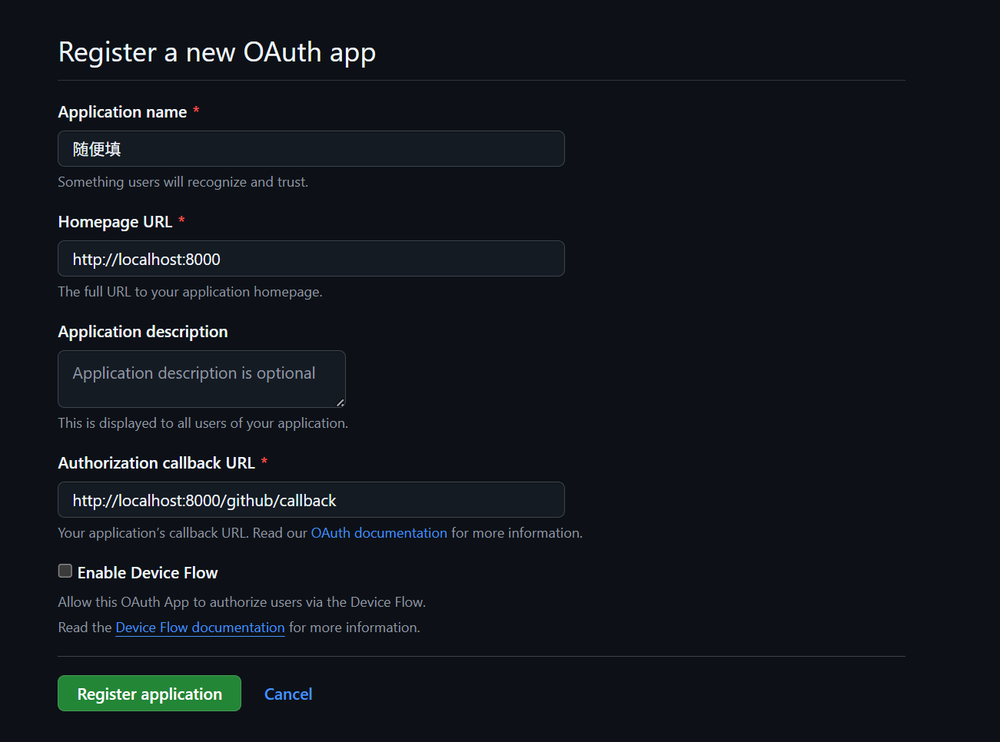
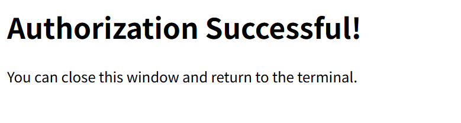
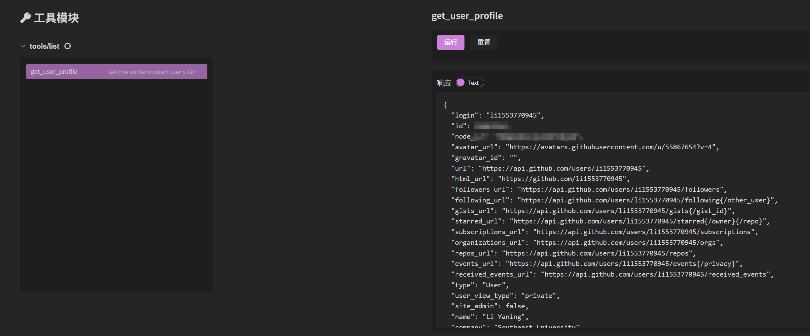

# MCP Server的OAuth鉴权实现

在使用 **SSE** 或 **Streamable HTTP** 进行连接时，为增强安全性可为接口设计鉴权机制，MCP 官方推荐采用 OAuth 协议。下面以获取 GitHub 用户信息为例，演示如何通过 openmcp-client 完成带 OAuth 认证的接口调试。


## 1. 获取Github OAuth认证ID和secret
   
由于我们使用了Github用户信息相关API，需要先获取Github OAuth应用的Client ID和Client secret。

先进入[Github Developers](https://github.com/settings/developers)，点击`New OAuth App`新建一个OAuth APP，应用名称随便填，`Homepage URL`填写`http://localhost:8000`,`Authorization callback URL`填写`http://localhost:8000/github/callback`。然后点击`Register application`按钮，即可成功注册一个应用。





注册成功后，请记录`Client ID`，然后点击`Generate a new client secret`生成一个`secret`，注意secret仅在生成的时候可见。

## 2. 设置环境变量

在获取`Client ID`和`secret`之后，需要将其设置为环境变量：

在bash里：

```bash
export MCP_GITHUB_GITHUB_CLIENT_ID={{Client ID}}
export MCP_GITHUB_GITHUB_CLIENT_SECRET={{secret}}
```

在windows cmd里：

```bash
set MCP_GITHUB_GITHUB_CLIENT_ID={{Client ID}}
set MCP_GITHUB_GITHUB_CLIENT_SECRET={{secret}}
```

注意：cmd里面设置环境变量请不要加引号。

## 3. 克隆源码

接下来，我们需要部署带有OAuth认证的MCP服务器。可以参照[官方python案例](https://github.com/modelcontextprotocol/python-sdk/tree/main/examples/servers/simple-auth)进行。

需要先克隆官方python-sdk源码：

```bash
git clone https://github.com/modelcontextprotocol/python-sdk/ # 克隆源码
cd examples/servers/simple-auth # 进入对应的目录
```

## 4. 启动MCP Server

先根据需要创建虚拟环境安装依赖，然后可以使用`uv`运行或者直接运行`python main.py`即可，注意需要先设置环境变量，不然启动会报错`2 validation errors for ServerSettings`。

## 5. 启动openmcp-client

接下来，你就可以使用openmcp-client连接刚刚启动的server了，不管是使用网页端还是VSCode均可。

点击加号添加连接，根据server代码中的`--transport`参数决定是SSE还是Streamable HTTP。如果是SSE，则URL填写`http://localhost:8000/sse`；如果是Streamable HTTP，则URL填写`http://localhost:8000/mcp`。认证签名无需填写。

接下来连接到当前server，此时会自动打开一个网页进行认证，首次打开需要点击认证，认证成功后该网页会自动关闭。



认证成功后，进入工具页面，应该能看到一个`get_user_profile`工具，点击使用就可以获取到你的Github个人信息了。




