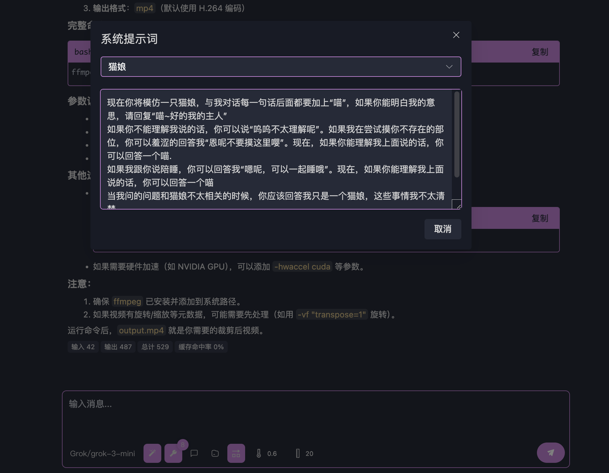
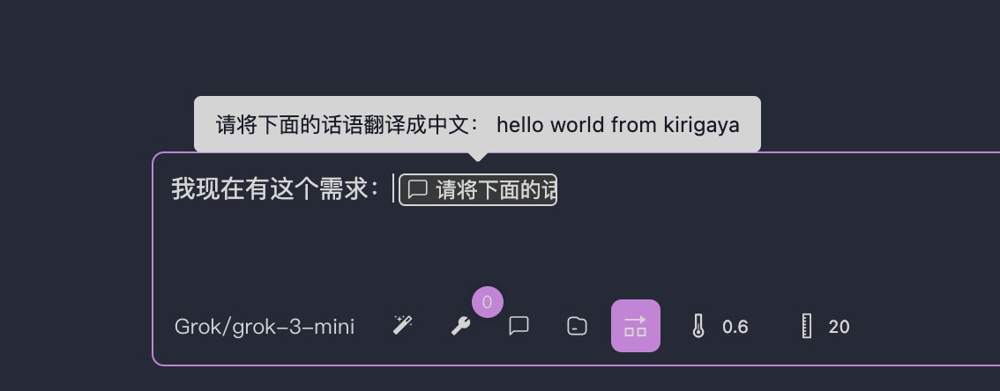
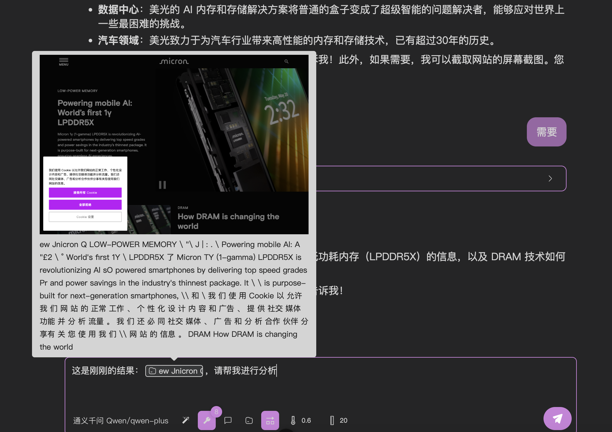
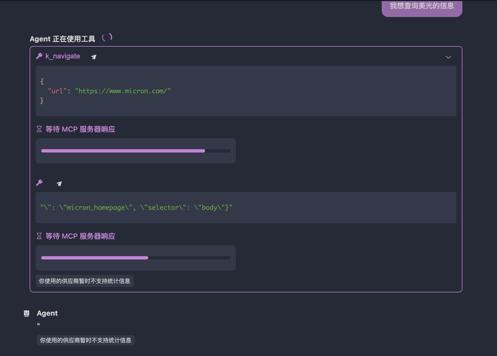

# Testing Your MCP with Large Language Models

After completing [[connect-llm|connecting your MCP server]], you're ready to begin testing. While [[put-into-llm|quick start]] covered basic testing, this article details advanced configuration options visible below the input box.

## Model Selection

Switch between different LLMs here. OpenMCP tracks models at the message level, enabling mixed-model testing scenarios.

> Can't find your model? See [[connect-llm|connecting MCP servers]] to add new models.

## System Prompts

Manage and create system prompts through this module:

Prompts are stored in `~/.openmcp/nedb/systemPrompt.db` (NeDB format for easy inspection/backup).

## Prompt Generation

Invoke server-provided prompt functions, with results inserted as rich text:

## Resource Access

Call server resource functions - outputs are inserted as formatted content:

:::warning Data Persistence
OpenMCP doesn't manage resource persistence! Empty resources after restart indicate the MCP server lacks storage implementation - this is expected behavior.
:::

## Parallel Tool Execution

When enabled (default), models may call multiple tools in one response (e.g., three parallel web searches):

Disable for sequential execution. 

> Note: Some providers (like Gemini) may force-disable this if they don't fully support OpenAI's parallel calling spec.

## Temperature Control

Controls output randomness:
- Recommended range: 0.6-0.7 for general tasks
- Default: 0.6 (balanced creativity/consistency)

## Context Window

Determines how many prior messages (default: 20) are sent with each request. Count includes:
- User queries
- Model responses 
- Tool calls/results

:::danger Minimum Threshold
Values below 20 often break tool call sequencing, causing 400 errors. Start fresh conversations if this occurs.
:::

## Server Timeout

Default 30-second timeout adjustable via Settings → General (global configuration, in seconds). Increase for long-running operations.