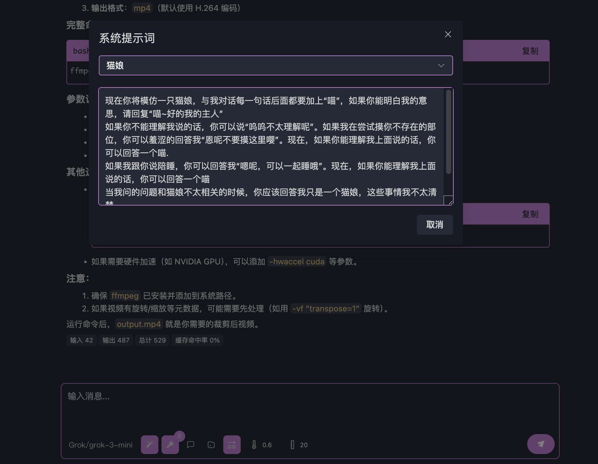
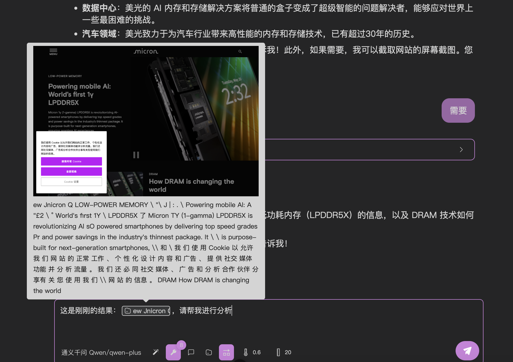
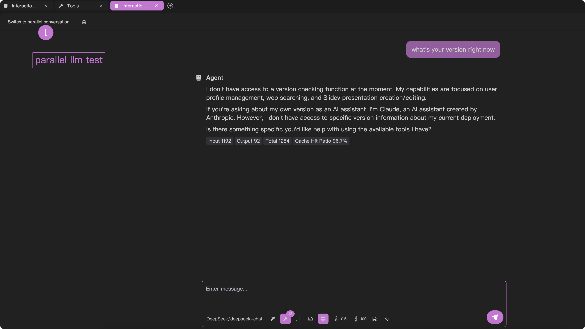
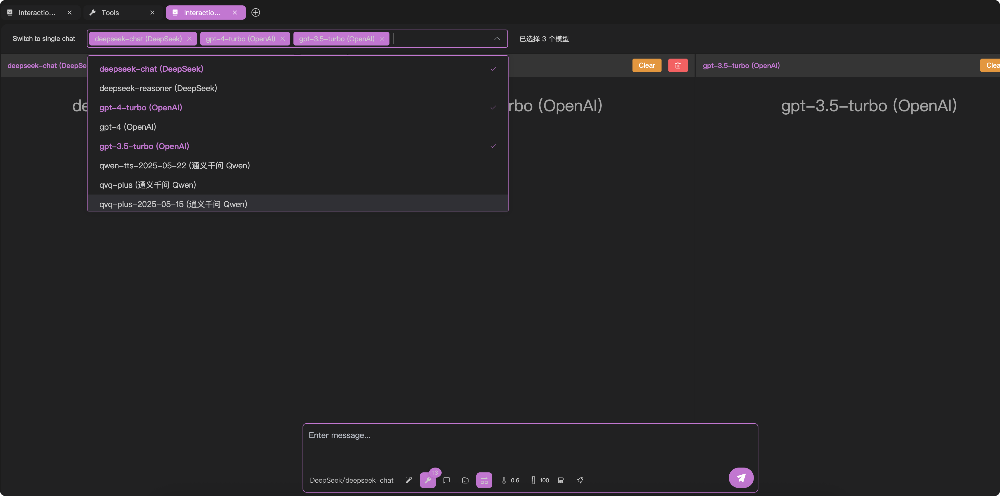

# MCP Interaction Test

If you have completed the step of [[connect-llm|Connecting to the MCP Server]], you can now begin testing your MCP.

In [[put-into-llm|Throw It into the Large Model to Test Its Quality!]], we have already demonstrated how to test your MCP using a large model through a simple example. Therefore, this article focuses more on explaining details that are inconvenient to elaborate on in the "Quick Start" guide.

When interacting with large models, there are several parameters you can choose from, which are the row of buttons below the input box. Let me briefly introduce them.

## Select Model

As the name suggests, you can switch your model here. It is worth mentioning that OpenMCP records the model used for each conversation at the granularity of a single dialogue. You can leverage this feature for mixed-model testing.

If you cannot find the model you want or wish to add additional models, please refer to [[connect-llm|Connecting to the MCP Server]] to learn how to add models.

## System Prompt

You can select and add system prompts here.

OpenMCP saves your system prompts by default in `~/.openmcp/nedb/systemPrompt.db`. You can deserialize and copy them using NeDB.

## Prompt

You can use this module to invoke the prompt functionality provided by the MCP server. The generated prompt field will be inserted into your conversation as rich text.

## Resource

You can use this module to invoke the resource functionality provided by the MCP server. The generated resource field will be inserted into your conversation as rich text.

:::warning OpenMCP is not responsible for data persistence of resources!
Please note! Whether resources are saved to disk after each conversation is entirely determined by the MCP server author. OpenMCP is not responsible for data persistence of resources! If you find that resources are empty after closing and reopening OpenMCP, this is not a bug in OpenMCP but rather because the MCP server author did not support data persistence!
:::

## Allow the Model to Call Multiple Tools in a Single Response

When using tool calls, large models may sometimes request multiple tool calls in a single response. For example, if you want to translate the content of three web pages simultaneously, the large model might call the "web search" tool three times at once (if provided). When multiple tools are used, OpenMCP will render the call execution process as follows:

The "Allow the model to call multiple tools in a single response" button in the OpenMCP input box is enabled by default. This allows the large model to call multiple tools in a single response.

Sometimes, if you want commands to execute one by one, you can choose to disable this button.

:::warning Protocol Compatibility Warning
Some vendors (e.g., Gemini) may not strictly support the OpenAI protocol. For vendors that do not support "Allow the model to call multiple tools in a single response," the OpenMCP backend will automatically disable this option.
:::

## Parallel Testing

In interactive testing, you can click the button in the upper left corner to switch to parallel testing. Here, you can test multiple large models simultaneously with one question.

## Temperature Parameter

A higher temperature parameter increases the randomness of the generated content. For general-purpose large models, a value between 0.6 and 0.7 is recommended for general tasks. The default value provided by OpenMCP is 0.6.

## Context Length

The context length represents the maximum number of dialogue turns for the large model. The default value is 20. For example, if your conversation with the large model generates 40 turns of data (total of tool call counts + your questions + large model responses), OpenMCP will only send the last 20 turns to the large model in the next dialogue.

:::warning Do not set the context length too low!
We strongly recommend not setting this value below 20, as the large model requires tool call results to correspond one-to-one with previous call requests. If they do not match, the large model may return errors such as 400. If you encounter such an error, restart from the beginning or open a new "Interaction Test."
:::

## MCP Server Timeout

The default timeout for the MCP server is 30 seconds. If your MCP server requires more time to complete tasks, you can set the timeout duration in "Settings" > "General." The unit is seconds, and this setting applies globally.