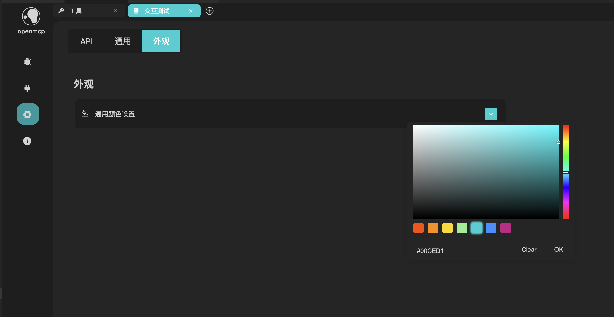
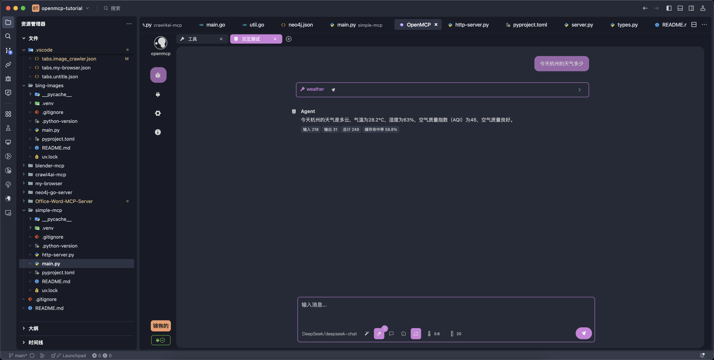

# UI Theme Colors

## OpenMCP Theme Follows VS Code

OpenMCP’s theme color automatically follows your current VS Code theme. If you want to change the appearance of OpenMCP, simply switch the theme in VS Code.

For example, when switching to the popular community theme **One Dark Pro**, OpenMCP will adapt accordingly:

## Switching Theme Colors

You can change OpenMCP’s theme color here (default is pink):

## Special Support for Trae

OpenMCP provides enhanced theme support for **Trae**'s default color schemes. We encourage users to try different visual language environments (VLEs) like VS Code, Cursor, and Trae for the best developer experience.

Most of the examples in the official OpenMCP documentation use **Trae’s default "Deep Blue" theme**:

