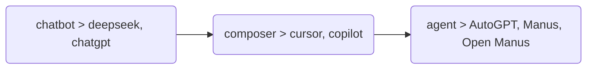
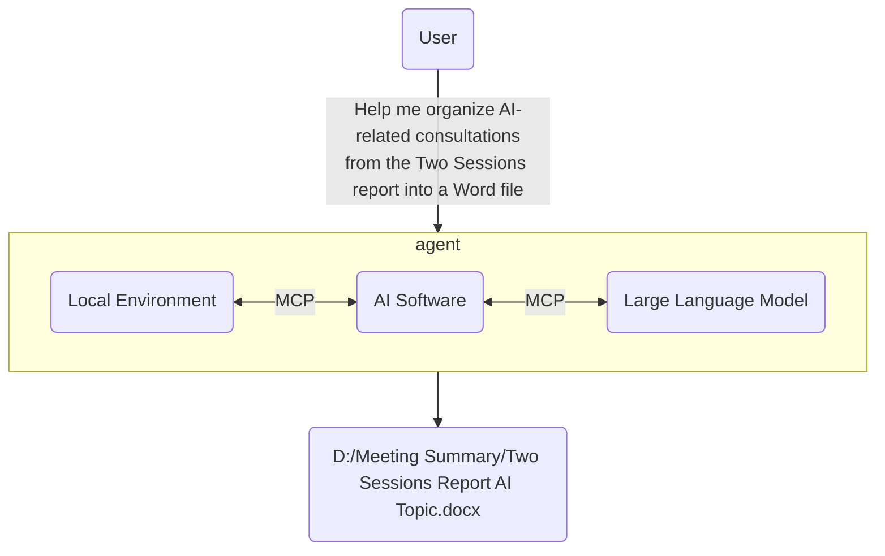
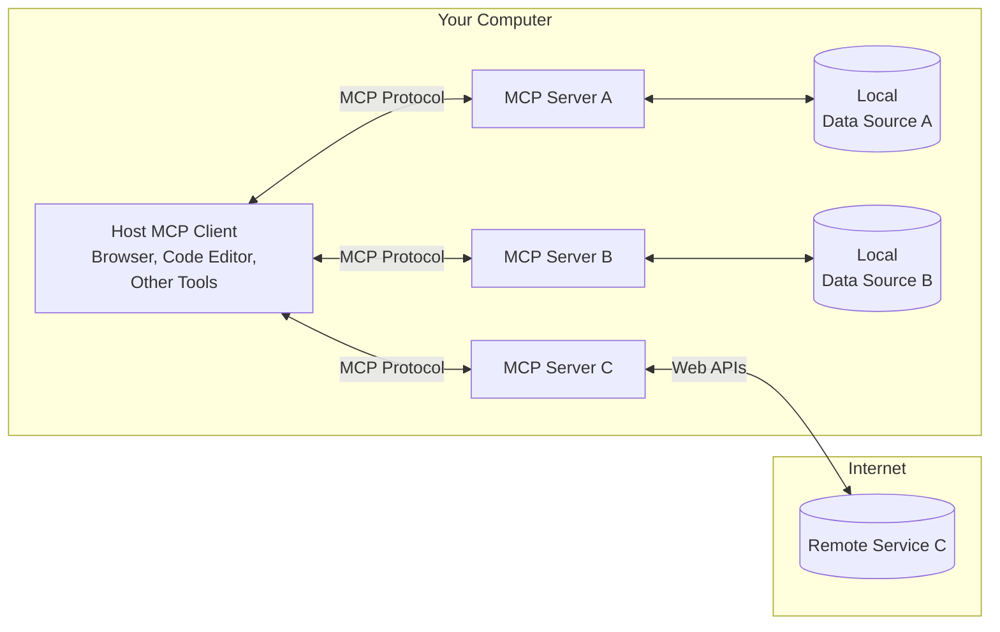
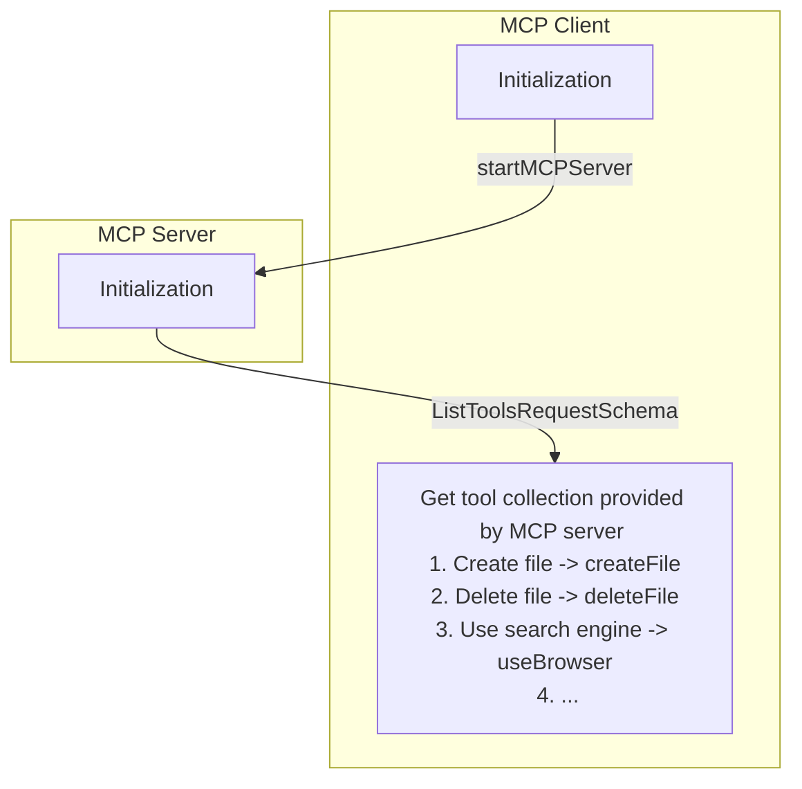
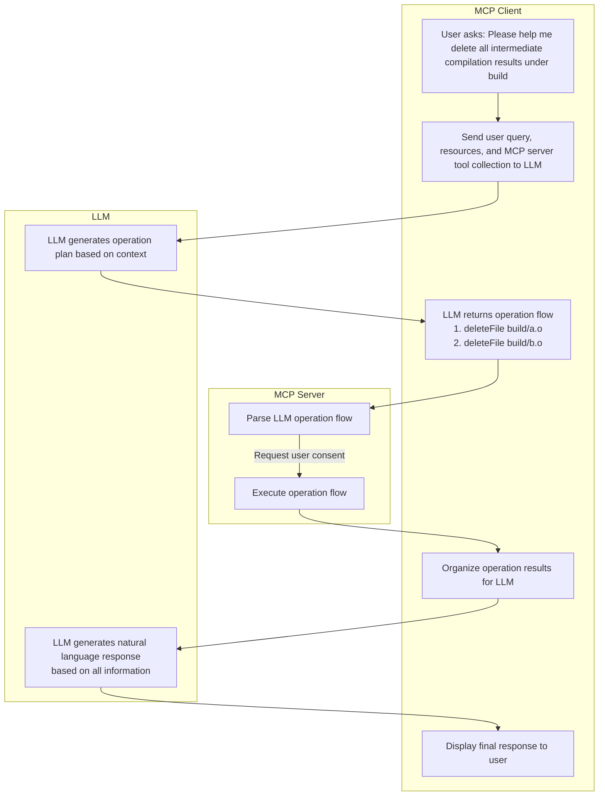

# What is MCP?

MCP (Model Context Protocol) is an open protocol designed to standardize how applications provide context to large language models (LLMs). You can think of MCP as a Type-C interface for AI applications. Just as Type-C provides a standardized way to connect your devices to various peripherals and accessories, MCP provides a standardized way to connect AI models to different data sources and tools.

The MCP protocol was introduced by Anthropic in late November 2024:

- Official documentation: [Introduction](https://modelcontextprotocol.io/introduction)
- GitHub repository: [github.com/modelcontextprotocol](https://github.com/modelcontextprotocol)

## Why do we need MCP?

We all know that from the initial ChatGPT, to later Cursor, Copilot Chatroom, and now the well-known agents, if we observe from the user interaction perspective, we can see the following evolution in current LLM products:

- chatbot
    - Programs that only chat.
    - Workflow: You input a question, it provides a solution, but you need to execute it yourself.
    - Representative works: deepseek, chatgpt
- composer
    - Interns that can help with work, but limited to coding.
    - Workflow: You input a question, it generates code to solve the problem and automatically fills it in the editor's compilation area, you just need to review and confirm.
    - Representative works: cursor, copilot
- agent
    - Personal assistants.
    - Workflow: You input a question, it generates a solution, and after obtaining your consent, executes it automatically.
    - Representative works: AutoGPT, Manus, Open Manus

To implement agents, we need to enable LLMs to flexibly operate all software and even physical world robots, which requires defining a unified context protocol and workflow. MCP (Model Context Protocol) is the fundamental protocol born to solve this problem. An intuitive understanding is as follows:

:::info

Anthropic's explanation for the necessity of MCP: MCP helps you build agents and complex workflows on top of LLMs. LLMs often need to integrate with data and tools, and MCP provides the following support:

- A growing collection of pre-built integrations that your LLM can directly connect to.
- Flexibility to switch between LLM providers and vendors.
- Best practices for protecting data within infrastructure.

:::

## Overall Architecture

The core of MCP adopts a client-server architecture where a host can connect to multiple servers:

- MCP Hosts: Programs that want to access data through MCP, such as Claude Desktop, Integrated Development Environments (IDEs), or other AI tools.
- MCP Clients: Protocol clients that maintain a 1:1 connection with servers, responsible for communicating with MCP servers.
- MCP Servers: Lightweight programs, each exposing specific functionality through the standardized Model Context Protocol.
- Local Data Sources: Computer files, databases, and services that MCP servers can securely access.
- Remote Services: External systems that MCP servers can connect to via the internet (e.g., services accessed through APIs).

## MCP Workflow

In terms of workflow, MCP is very similar to LSP. In fact, like LSP, current MCP also transmits data based on [JSON-RPC 2.0](https://link.zhihu.com/?target=https%3A//www.jsonrpc.org/specification) (via Stdio or SSE). Those who have developed LSP should find MCP very intuitive. I'll use several simple and clear sequence diagrams to help everyone understand how this works.

### Initialization

Assuming our software already supports MCP clients, when the software starts, it goes through the following steps:

### Workflow

Suppose you are a C language engineer and want an agent to automatically compile a project. The execution process would be as follows:

## Open Source Ecosystem

Like LSP, which has many client and server frameworks in the open source community, MCP is the same. Currently, Anthropic has open-sourced an MCP server framework: https://github.com/modelcontextprotocol/servers. Friends who want to explore LLM applications can freely use this framework. This repository also includes many officially recognized MCP servers that can serve as learning references.

In addition, there are many MCP clients and servers developed by the open source community on pulsemcp: https://www.pulsemcp.com/clients