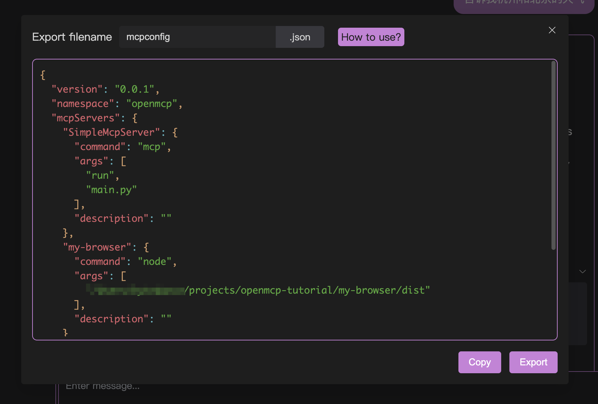

# Rapid Deployment

One of the core features of openmcp-sdk is rapid deployment. Leveraging its synergy with openmcp-client, you can complete the deployment of an MCP Agent in a lightning-fast 10 seconds.

## 1. Export mcpconfig.json from openmcp

First, open your debugged mcp project in openmcp. Assume you've already achieved satisfactory debugging results during interactive testing.

At this point, click the small rocket-like icon on the far right of the dialog toolbar, and you'll see a window like this:



You can obtain an mcpconfig.json file by clicking either copy or export.

## 2. Deploy to openmcp-sdk

Then we create a file main.ts, deploying the above configuration as an agent with just a few simple lines of code:

```typescript
import { OmAgent } from 'openmcp-sdk/service/sdk';

const agent = new OmAgent();
agent.loadMcpConfig('./mcpconfig.json');  
const res = await agent.ainvoke({ messages: 'What is the weather like in Hangzhou today?' });

console.log('⚙️ Agent Response', res);
```

Run it using `npx tsx main.ts`, and you'll get the following result:

```
[2025/6/22 19:05:08] 🚀 [SimpleMcpServer] 1.9.2 connected
[2025/6/22 19:05:11] 🤖 Agent wants to use these tools weather
[2025/6/22 19:05:11] 🔧 using tool weather
[2025/6/22 19:05:11] ✓  use tools success
⚙️ Agent Response The weather in Hangzhou today is light rain, with a temperature of 24.7°C, humidity at 95%, air quality index (AQI) at 26, indicating good air quality.
```