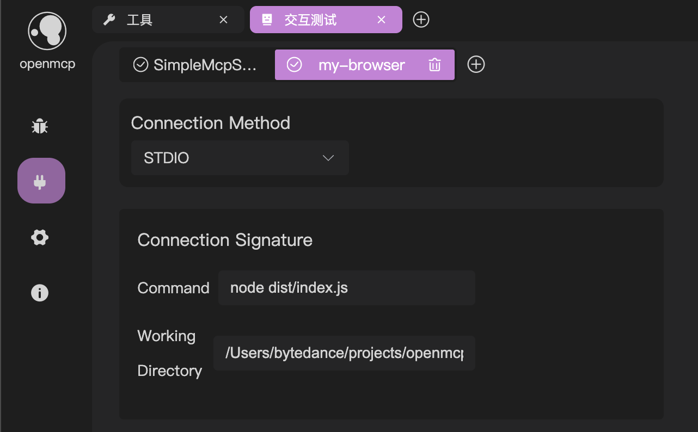

# Connect to Multiple MCP Servers

openmcp-sdk provides two methods to allow you to connect to multiple mcp servers simultaneously on a single agent.

## Method 1: mcpconfig.json (Recommended)

In the openmcp plugin, you can connect to multiple mcp servers and test them using the panel below:



After following the instructions in [Quick Deployment](./fast-deploy.md) to export, the SDK will automatically connect to these multiple servers for you.

## Method 2: addMcpServer

You can also add multiple mcp servers to the agent using the following code:

```typescript
agent.addMcpServer({
    connectionType: 'STDIO',
    commandString: 'uv run main.py',
    cwd: '/path/to/workspace',
});

agent.addMcpServer({
    connectionType: 'STREAMABLE_HTTP',
    url: 'go run /path/to/main.go',
});
```