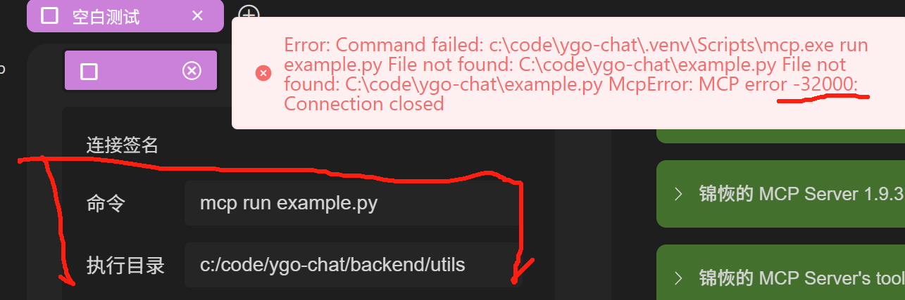
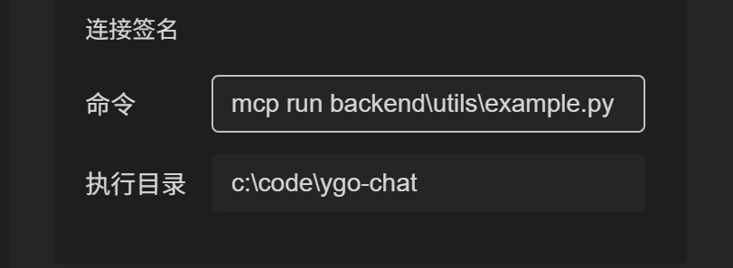

# 虚拟环境与入口文件不在同一目录时的配置方式

## 问题描述

在使用 OpenMCP 时，有时会遇到虚拟环境（venv）与 Python 文件不在同一目录的情况，甚至虚拟环境可能位于项目文件夹之外。这种情况下，点击右上角连接按钮可能会出现 MCP 连接失败（错误代码：32000）的问题。

## 解决方案

### 1. 调整执行目录

在连接选项中，您需要调整执行目录到虚拟环境所在的位置：



### 2. 修改执行命令

同时，需要相应地修改执行命令：



### 3. 直接指定解释器路径

对于特定情况，您可以直接在命令中指定 Python 解释器的完整路径，例如：

```bash
C:\code\ygo-chat\.venv\Scripts\python.exe example.py
```

> 注意：此方法同样适用于 node或者mcp指令的【命令】以及其它mcp client的mcp配置文件。