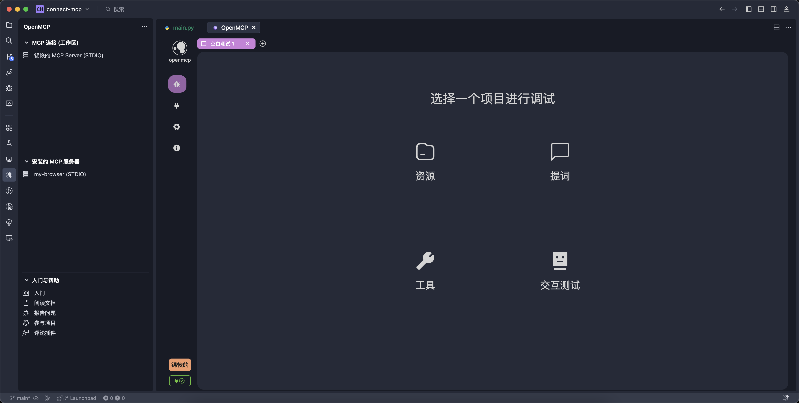
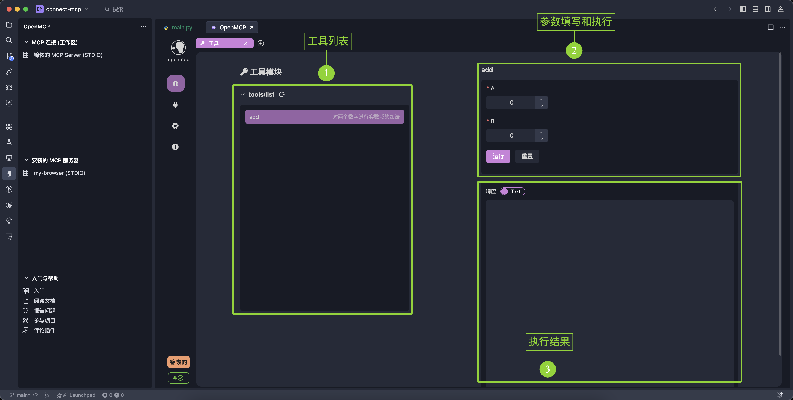
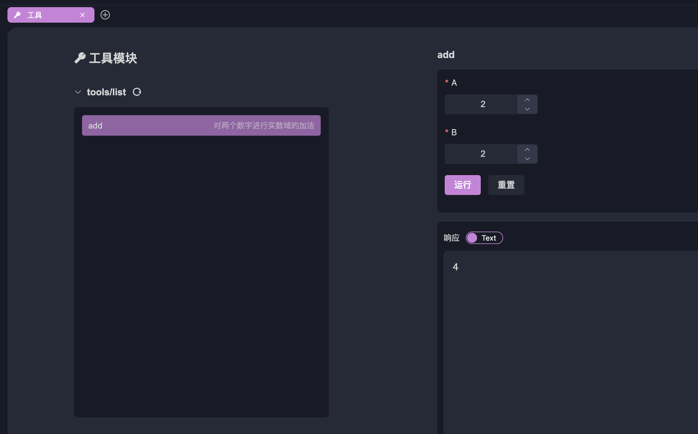
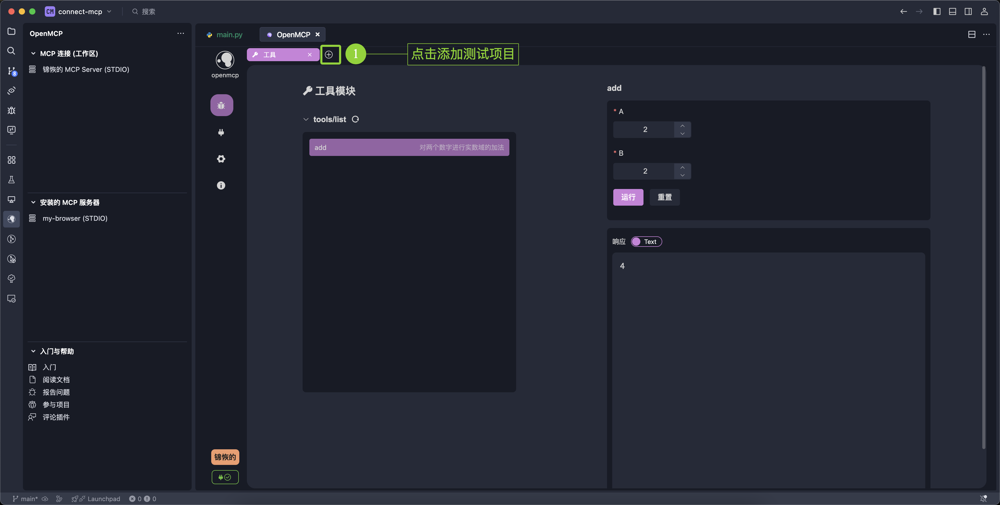
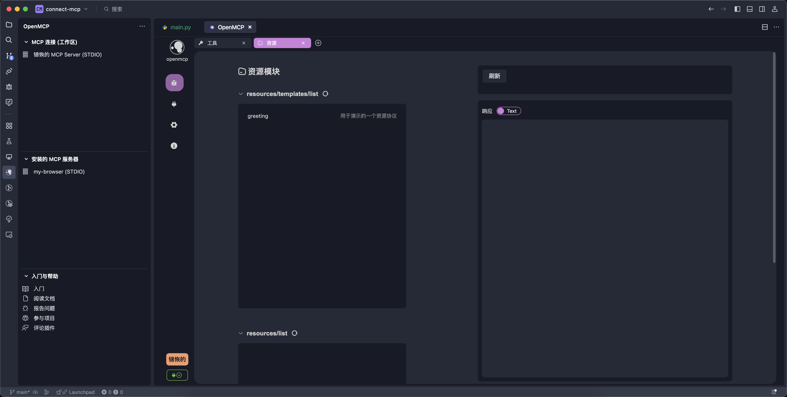
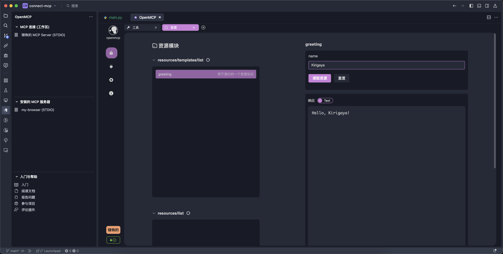

# 快速调试 MCP

在 [[first-mcp|你的第一个 MCP]] 中，我们成功创建了一个 MCP 服务器的最小实例，并且成功使用 openmcp 连接了这个服务器。

接下来，我们可以来调试这个服务器的功能了，毕竟，不是所有人都是 Jeaf Dean，都能一次就写对所有代码。我们写的 MCP 服务器也不总是一开始就自信满满可以上线的，它总是存在着一些我们无法发现的问题。试想一下，如果后面我们把 mcp 连接到大模型进行全链路调试时出了问题，这个时候你就会发现，可能出错的环节非常多：MCP 服务器的问题？大模型厂商的问题？OpenMCP 的问题？把可能的错误进行分类，然后逐一排查，才是符合工程直觉 (Engineering Instuition) 的做法。

## 认识面板

首次进入 openmcp 时，会进入一个面板，上面一共四个按钮，代表四种调试项目：

我们现在需要确认的是 tool，resource 和 prompt 这三个功能是否运行正常，因为在实际项目中，tool 是使用得最多的项目，因此，我们先调试 tool。

## 调试 Tool

为了调试 tool，我们点击面板上的 「工具」 按钮，进入 tool 调试界面。tool 面板的基本介绍如下所示

调试工具，我们需要先在「工具列表」中选择一个工具（如果没有展开需要先展开工具列表，点击右侧的按钮可以刷新），然后在右侧的「参数填写和执行」中，填写需要测试的参数，点击运行，就能看到结果了：

比如我们这边运算最简单的 2 + 2，可以看到结果是 4，这说明我们的 mcp 连接正常还可以正常返回结果。大家未来可以通过简单测试来验证 mcp 服务器的可用性，这在复杂 agent 系统的调试过程中非常重要。可以编码成自检程序的一部分。

## 添加测试项目

测试完成一个项目后，我们可以通过点击上方的 + 来添加额外的测试项目：

这里，我们选择「资源」来进行资源项目的调试工作，「资源」和另外两个项目有点不一样，MCP 协议中的资源访问有两种类型

- resources/templates/list: 模板资源，带有访问参数，比如文件系统 mcp 中的文件访问，输入文件路径，根据资源协议返回文件内容。
- resources/list：普通资源，不带访问参数，比如浏览器 mcp 中的 console，直接返回控制台的 stdio，这种就不需要参数。

`resources/templates/list` 的使用方法和之前的 tool 一样，填入参数点击运行就能看到资源结果

而 `resources/list` 由于没有参数，直接点击左侧的资源就能直接看到内部的数据。

## 总结

在这一章节中，我们主要介绍了如何使用 openmcp 来调试 MCP 服务器，包括如何调试 tool 和 resource，prompt 的方法和这两个类似，大家可以自行尝试。下一章中，我们将开启最激动人心的一章，我们将把开发的 mcp 服务器扔到大模型中进行测试，这样你才知道你写的 mcp 是不是真的好玩，是不是有价值。
