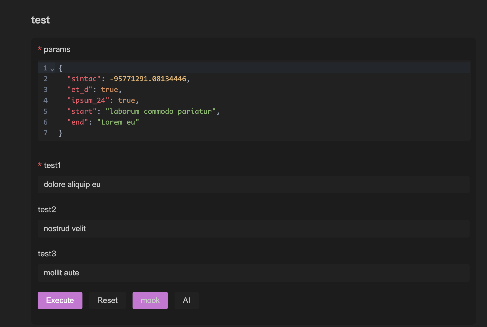
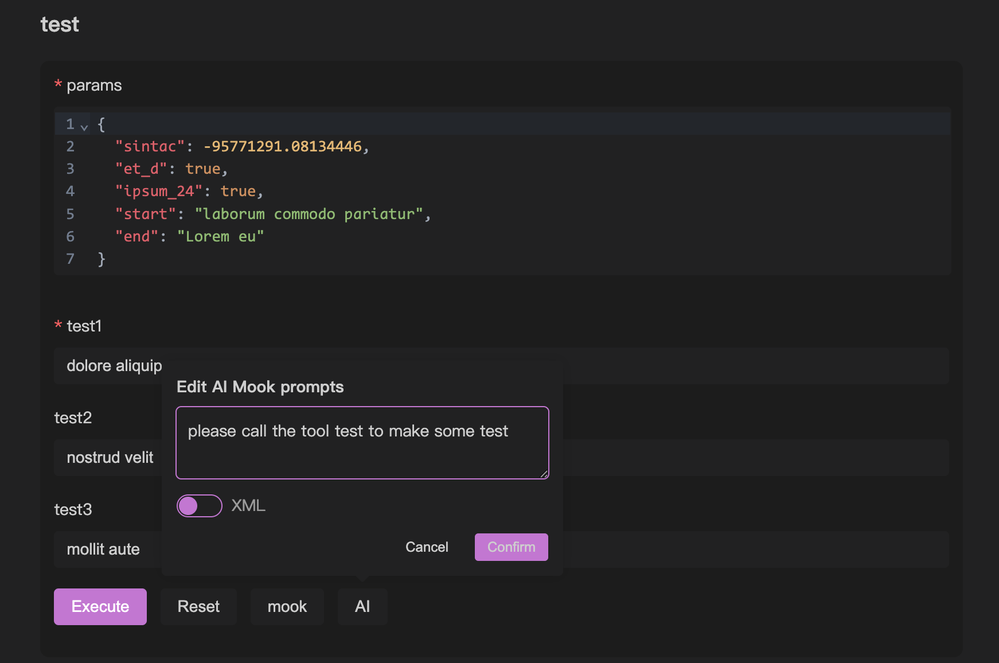

# MCP 基础调试

## 基本调试

在 [[quick-debug.md|快速调试]] 中，已经简单介绍过如何调试 mcp 了。本章节着重介绍，openmcp 中，调试模块的一些特性和高级功能。

## 标签页

openmcp 以标签页作为调试项目的最小单元，点击栏目中的 + 可以创建新的标签页。OpenMCP 的 tools, resources 和 prompts 的基本使用与 Inspector 差不多，但是 OpenMCP 会自动帮您完成左侧资源列表的初始化，Inspector 中这一步需要手动完成。

## 调试内容的自动保存

openmcp 具备自动保存测试结果的功能。如下的行为会触发 openmcp 对标签页及其内容进行保存：

- 创建标签页，并选择一个有效的调试项目
- 在调试页进行调试行为（选择工具，执行工具，询问大模型等）

当前 mcp 项目的测试数据会被保存在 `.openmcp/tabs.{server-name}.json` 中，其中 `{server-name}` 就是 mcp 服务器连接成功的服务器名称。

:::warning
注意，同一个项目中，你不应该有两个名字完全相同的 mcp 服务器，这会导致 `.openmcp/tabs.{server-name}.json` 连接信息存储冲突，发生未知错误。
:::

## 交互测试中快速复现

在我们调试的过程中，难免会出现大模型回答得不好，而且这是因为某个工具出错导致的，为了快速定位是不是工具的问题，可以点击下方的小飞机图标


点击后，OpenMCP 会一个新的测试 tool 的项目，并自动把当时大模型使用的参数自动填充到右侧的表单中：


你要做的，只是点击运行来确定或者排除一个错误选项。

## Mook 数据

为了快速测试一组 mcp tool 的响应，我们提供了 mook data 功能，它允许你快速根据 mcp tool 的 schema 来生成一组可用的参数，从而测试 mcp tool 的功能。

我们提供了两种 mook 方法，第一种就是 mook 按钮，点击后就会自动生成没有实际意义，但是可以填充表单的 mook 数据。下图的 `mook` 按钮就是改功能的触发点。



我们还提供了 ai mook 功能，可以用 AI 来生成 mook 的数据，这个数据更加真实可靠，但是你需要先在 [[connect-llm|连接大模型]] 中配置好你的大模型。下图的 `AI` 按钮就是改功能的触发点，你还可以自定义生成 mook 数据的 prompt。



## pydantic 支持

使用 python 的 fastmcp 进行 tool 的创建时，你有两种方法来申明接口的类型，一种是通过 python 默认的 typing 库来申明复杂数据结构，或者通过 pydantic 来申明一个复杂的变量，下面是一个例子：

```python
from mcp.server.fastmcp import FastMCP
from pydantic import BaseModel, Field
from typing import Optional, Union, List, NamedTuple

mcp = FastMCP('锦恢的 MCP Server', version="11.45.14")

class PathParams(BaseModel):
    start: str
    end: str

@mcp.tool(name="test",description="用来测试")
def test(
    params: PathParams,
    test1: str,
    test2: Union[str, List[str]] = Field("", description="测试参数2"),
    test3: Optional[str] = Field(None, description="测试参数3")
):
    return [test1, test2, test3, params]
```

由于我们对这两种类型的申明方式实现了内部的转换，所以 openmcp 都是支持的。值得一提的是，如果你申明的变量是一个对象，比如上面的 `PathParams`，那么 openmcp 的 tool 调试窗口会生成一个「对象输入框」，这个输入框支持基本的格式检查和自动补全：


:::info 什么是对象？
这里的「对象」是 javascript 中的概念，它指的是可被序列化的数据类型中，除去基本数据类型后，剩下的那部分。比如 { "name": "helloworld" } 就是一个对象。对象在 python 中更加类似于一个 dict 或者 namedTuple。
:::

:::warning
虽然 openmcp 已经做到了尽可能多情况的支持，但是生产场景中，我们仍然不建议您将 mcp tool 的参数定义成对象，尽可能定义成简单数据类型也能更好提高大模型进行工具调用时的稳定性。
:::

