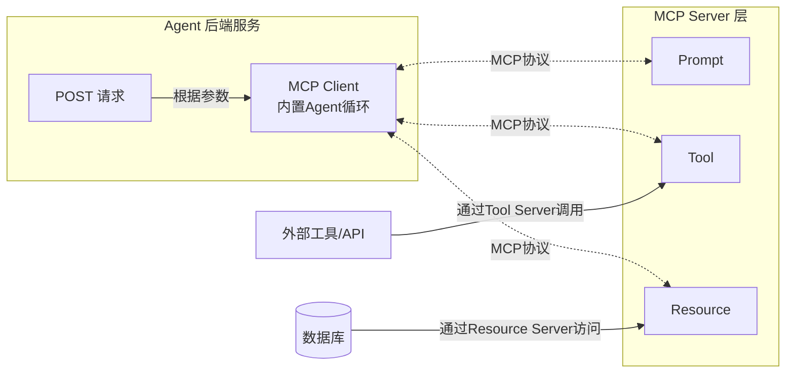
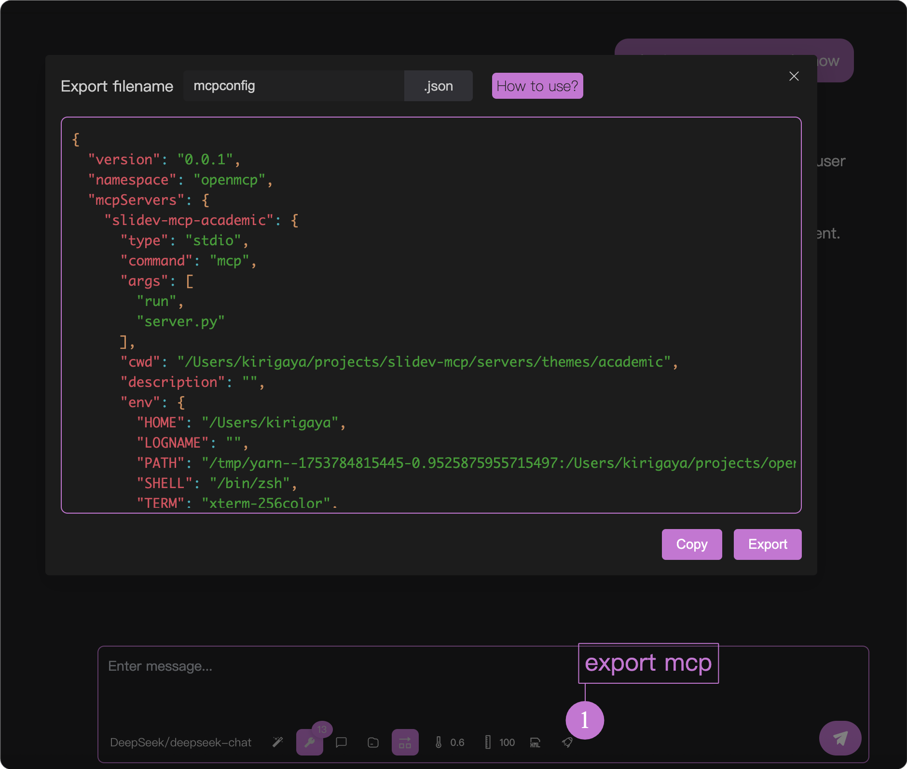

# 导出 mcp 服务器

通过之前的步骤，如果你已经完成了 mcp 的开发和验证，那么是时候把你的 mcp 部署到你的生产环境中了。

由于目前 nodejs 是全球最流行的全栈开发生态，所以本教程以 nodejs 为例进行介绍后续的步骤。其他的后端语言（java，go，python）也类似。


## Agent 后端服务基本结构

假设你已经通读过了 MCP 服务器的基本概念，那么对于一个 agent 服务来说，下面的架构图你也一定不会陌生。



假设我们现在需要开发一个 agent 服务，用于帮助用户润色他的小红书爆款推广文章，那么这个需求在后端的角度分为两个部分：

1. Agent 后端服务：用于接受用户的请求，维护用户登录状态，对数据库进行增删改查。
2. MCP Server 层：执行具体的 Agent 功能任务，在我们的本例中，这个功能就是「帮助用户润色他的小红书爆款推广文章并返回给用户」

## 基本代码案例

对于上面的例子，假设你作为一个老练的后端程序员，已经写好了「帮助用户润色他的小红书爆款推广文章」 这个功能的后端 POST 请求，代码长这个样子：

```ts
@Controller('word')
export class WordController {
    
    @UseGuards(JwtAuthGuard)
    @Sse('make-red-book-word-doc/:id')
    makeRedBookWordDoc(
        @Param('id') id: number,
        @Request() req: ExpressRequest,
    ): Observable<any> {
        const user = req.user as User;
        return new Observable(subscriber => {
            this.wordService.redBookHandler(id, user, subscriber);
        });
    }

}
```

其中 `this.wordService.redBookHandler` 就是真实的业务函数，那么你应该如何把从 openmcp 中调试好的 mcp 服务器连接到你的上述后端代码中呢？

非常简单，分为三步。

## 第一步：导出 mcpconfig.json

在「交互测试」界面，点击工具栏下面的小火箭图标（如下图 1️⃣ 处所示），会弹出一个窗口。



点击复制或者导出，将这份记录了当前调试所有信息（mcp 服务器，使用的大模型等等）保存到本地。假设你保存到了 `/path/to/mcpconfig.json` 中。

:::tip

非常棒的一点是，如果您当前的调试环境中，使用了多个 mcp 服务器，那么 openmcp 也会将这多个服务器相关的配置信息原封不动地保存到 mcpconfig.json 中。您完全不需要在后端程序中为额外使用的附属 mcp 服务器的部署费心。

> 有关多服务器的连接请看 [多服务器连接](./multi-server.md)

:::

## 第二步：安装 openmcp-sdk

openmcp 提供了配套的 sdk，可以在 nodejs 中使用，安装方法如下：

::: code-group
```bash [npm]
npm install openmcp-sdk
```

```bash [yarn]
yarn add openmcp-sdk
```

```bash [pnpm]
pnpm add openmcp-sdk
```
:::

核心类 `OmAgent` 通过如下方法引入：

```typescript
import { OmAgent } from 'openmcp-sdk/service/sdk';
```

## 第三步：载入 mcpconfig 配置，轻松实现你的服务

这下子，通过下面的代码，就能快速将 mcp 服务器接入后端服务了：

```ts
@Injectable()
export class SlidesService {

    /**
     * @description 创建 markdown 任务，并返回中途进度
     */
    async redBookHandler(id: number, user: User, subscriber: Subscriber<any>) {
        // 载入配置
        agent.loadMcpConfig('/path/to/mcpconfig.json');

        // 从文档数据库中拿当前用户的 content
        const content = await this.documentService.getContent(id, user);

        // 使用 redbook_style_prompt 引导 agent
        const prompt = await agent.getPrompt('redbook_style_prompt', { content });    

        // 执行任务循环
        const res = await agent.ainvoke({ messages: prompt });
        
        subscriber.next(toSseData({ done: true, data: res }));
    }

}
```

有关 openmcp-sdk 的更多信息，请查看 [openmcp-sdk 文档](../../sdk-tutorial/index.md)。