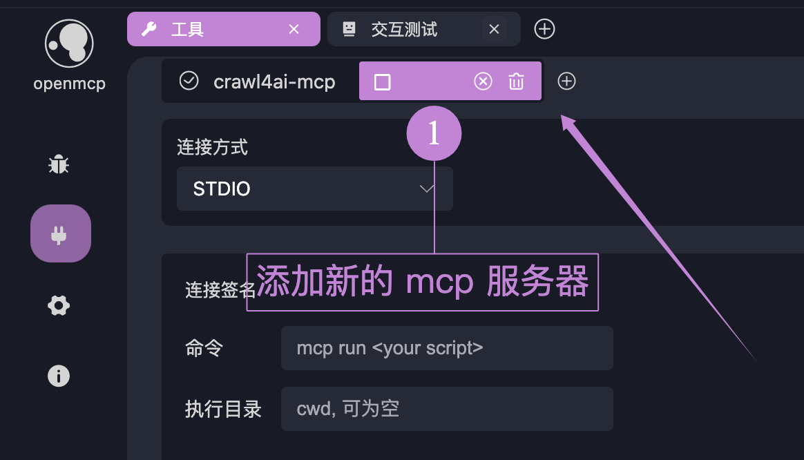
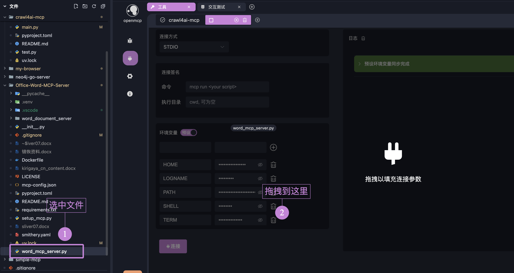

# 连接多个 MCP 服务器

openmcp 支持连接多个 MCP 服务器。

假设你现在想要实现一个可以自动查阅资料并且整理成 word 文档的 agent，你可以这样做：

1. 找到能进行网络搜索的 mcp：[crawl4ai mcp](https://github.com/LSTM-Kirigaya/openmcp-tutorial/tree/main/crawl4ai-mcp)
2. 找到能进行 word 操作的 mcp：[Office-Word-MCP-Server](https://github.com/GongRzhe/Office-Word-MCP-Server)
3. 在 openmcp 中把它们组合起来。
4. 自动完成你的任务！

假设，我们已经连接了第一个 mcp，也就是 crawl4ai mcp，我们可以添加额外的 mcp 服务器：

## 添加方法一：拖拽

直接把需要加入的 mcp 服务器的文件，按住 shift 点击拖拽进入 openmcp 界面就能自动完成参数的填充。

:::warning
自动填充的命令不一定总是准确的，在 [STDIO 连接的启动](http://localhost:5173/openmcp/plugin-tutorial/usage/connect-mcp.html#stdio-%E8%BF%9E%E6%8E%A5%E7%9A%84%E5%90%AF%E5%8A%A8) 中我们说过这一点。具体的连接方法请阅读 [附录：关于 uv 启动 mcp 你必须知道的](http://localhost:5173/openmcp/plugin-tutorial/quick-start/first-mcp.html#%E9%99%84%E5%BD%95-%E5%85%B3%E4%BA%8E-uv-%E5%90%AF%E5%8A%A8-mcp-%E4%BD%A0%E5%BF%85%E9%A1%BB%E7%9F%A5%E9%81%93%E7%9A%84) 后自行判断。
:::

## 添加方法二：手动填写参数

手动填写参数，没啥好说的。

## 使用多服务器

多服务器连接后的使用和单服务器没有太大的区别，openmcp 内部会自动完成工具的调度和选择。唯一需要注意的是，多服务器的 tool name 一定不要重名，否则会出现冲突。

如果您认为 tool 重名有存在的必要性，请通过 [issue](https://github.com/LSTM-Kirigaya/openmcp-client/issues) 让我们知道您的场景和想法，根据讨论，我们会支持。