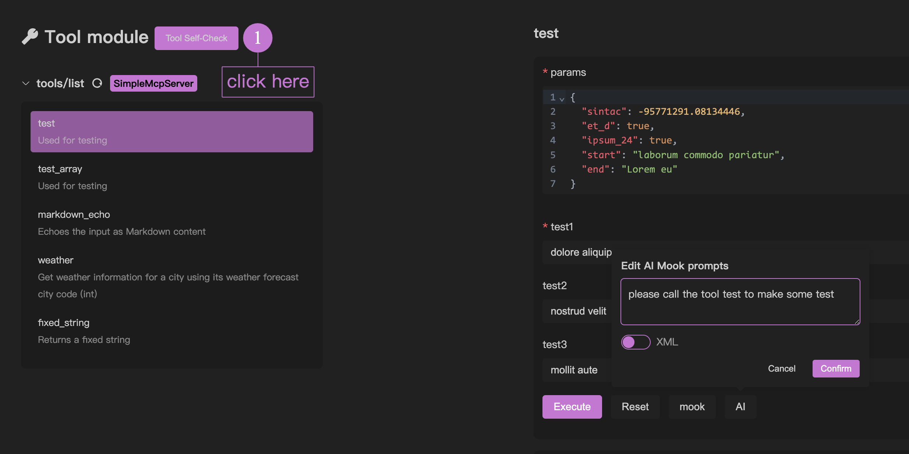
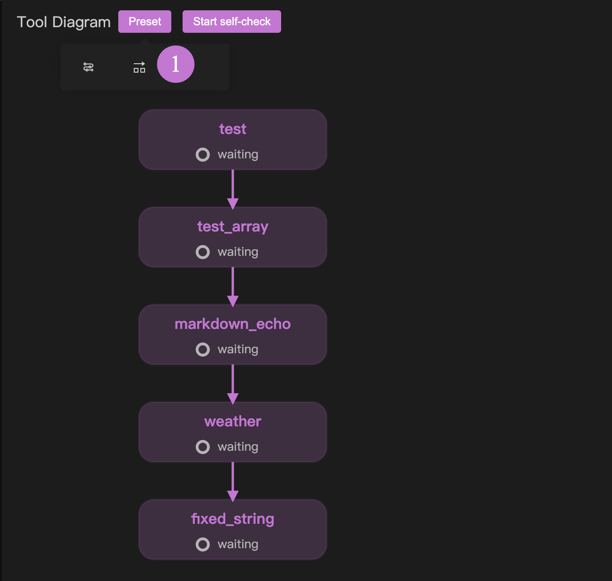
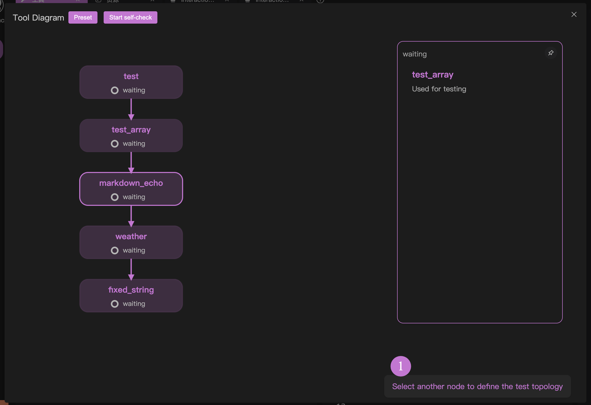

# MCP 工具自检程序

在调试功能中，除了使用 mook 来辅助您进行 mcp tool 的测试外，还有一种方法可以快速对当前所有的 tool 做一次闭环测试，这在 mcp 服务器开发初期会非常有用。

如果您打算实践一次 mcp 服务器的开发，在第一次编写好程序，并准备进入 「交互测试」 之前，我们都强烈推荐您使用自检程序来规避交互测试中可能遇到的问题。

MCP 工具自检程序的概览，可以查看这个视频： [OpenMCP 0.1.9 更新日志 | 支持 MCP 工具自检 & 自定义拓扑排序](https://www.bilibili.com/video/BV1YpGHzcEs4/?spm_id_from=333.1387.homepage.video_card.click&vd_source=3f248073d6ebdb61308992901b606f24)

## 基本使用

创建「工具」测试项目后，点击下图中 1 的位置的按钮即可进入自检程序。

## 定义执行顺序 | 预设

对于自动检测程序，您有必要来定义测试顺序，这样，自检程序才会根据你设置的测试顺序（我们后面会称为执行拓扑）来自动执行。这么做是因为大部分情况下，你的 mcp 服务器的工具往往存在一定的依赖关系，比如我们开发了一个创建 ppt 的 mcp，那么「添加一页」这个工具一定需要在「创建 ppt」这个工具之后执行。

你可以通过我们提供的两组预设来快速布置你的执行拓扑，如下图 1 的地方所示：

第一个预设代表串行执行，它会按照申明的顺序把你的 mcp 工具一个接着一个执行。

第二个预设代表并行执行，它会让所有的 mcp 工具之间不存在任何拓扑依赖，这样就会并行执行。

## 定义执行顺序 | 点击

需要高度自定义拓扑依赖，可以通过下面的简单操作来实现：

1. 点击一个节点 A，然后选中另一个节点 B，可以创建 A 到 B 的连接
2. 点击 A 到 B 之间的连接线，可以断开 A 到 B 的连接

通过这两个自由度的操作，你就可以轻松创建自定义的执行拓扑。

值得一提的是，你的任何合法操作，我们都会在右下角给出下一步的执行提示：

## 执行自检程序

点击开启自检程序，然后就可以进行自检程序，不过记得你需要先在 [[connect-llm|连接大模型]] 中配置好你的大模型。

测试完成后，会显示测试结果和性能评估。

